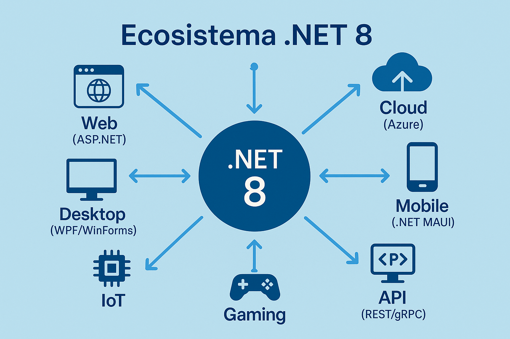

<style>
img {
  max-width: 70% !important;
  max-height: 50vh !important;
  object-fit: contain !important;
  height: auto !important;
  display: block !important;
  margin: 0 auto !important;
}
section {
  font-size: 20px;
  overflow: hidden;
}
section h1 {
  font-size: 1.8em;
}
section h2 {
  font-size: 1.4em;
}
section h3 {
  font-size: 1.2em;
}
section ul, section ol {
  font-size: 0.9em;
  margin-left: 1em;
}
section li {
  margin-bottom: 0.3em;
}
section pre {
  font-size: 0.7em;
  max-height: 60vh;
  overflow-y: auto;
}
section code {
  font-size: 0.85em;
}
section p {
  margin: 0.5em 0;
}
</style>


# Clase 1: Introducción a C# y .NET
## El ecosistema Microsoft para desarrollo moderno

**IF0100 - Lenguaje de Programación OO II**
*4° Semestre - Ingeniería Informática*

---

## Objetivos de la Clase

Al finalizar esta clase, el estudiante será capaz de:

1. **Comprender** la historia y evolución de C# y .NET
2. **Diferenciar** entre .NET Framework, .NET Core y .NET 8
3. **Configurar** el entorno de desarrollo con Visual Studio 2022
4. **Crear** su primera aplicación en C#
5. **Identificar** la estructura básica de un programa C#

**Duración:** 90 minutos

---

## Agenda

1. ¿Qué es C#? Historia y características (15 min)
2. El ecosistema .NET (15 min)
3. Instalación y configuración de Visual Studio (15 min)
4. Estructura de un programa C# (20 min)
5. Práctica: "Hola Mundo" y conceptos básicos (25 min)

---

## 1. ¿Qué es C#?

### Definición

> **C# (C Sharp)** es un lenguaje de programación moderno, orientado a objetos y type-safe desarrollado por Microsoft como parte de su plataforma .NET.

```
┌─────────────────────────────────────────────────────────┐
│                    C# ES...                             │
├─────────────────────────────────────────────────────────┤
│ ✅ Orientado a objetos (POO puro)                       │
│ ✅ Type-safe (seguridad de tipos)                       │
│ ✅ Moderno (actualizado constantemente)                 │
│ ✅ Multiplataforma (Windows, Linux, macOS)              │
│ ✅ Versátil (web, desktop, móvil, cloud, IoT)           │
│ ✅ Potente (usado por empresas globales)                │
└─────────────────────────────────────────────────────────┘
```

---

## Historia de C#

### Evolución del lenguaje

```
2000        2005        2010        2015        2020        2024
  │           │           │           │           │           │
  ▼           ▼           ▼           ▼           ▼           ▼
┌────┐    ┌──────┐    ┌──────┐    ┌──────┐    ┌──────┐    ┌──────┐
│C#  │    │ C# 2 │    │ C# 5 │    │ C# 6 │    │ C# 9 │    │ C# 12│
│1.0 │    │Generics│   │async/ │    │.NET  │    │.NET 5│    │.NET 8│
│    │    │      │    │await  │    │Core   │    │      │    │      │
└────┘    └──────┘    └──────┘    └──────┘    └──────┘    └──────┘
  │           │           │           │           │           │
  ▼           ▼           ▼           ▼           ▼           ▼
 Nace      Genéricos    Programación   .NET Core    Unificación    Actual
 Microsoft  (List<T>)    asíncrona      (open source)  de .NET      LTS
```

---

## Creadores de C#

### Anders Hejlsberg - El arquitecto principal

```
┌─────────────────────────────────────────────┐
│                                             │
│     👤 Anders Hejlsberg                     │
│                                             │
│     • Creador de C# (2000)                  │
│     • Creador de TypeScript (2012)          │
│     • Diseñador de Delphi (Borland)         │
│     • Chief Architect at Microsoft          │
│                                             │
│     "C# es el lenguaje que siempre          │
│      quise tener para desarrollo            │
│      empresarial"                           │
│                                             │
└─────────────────────────────────────────────┘
```

---

## 2. El Ecosistema .NET

### ¿Qué es .NET?

> **.NET** es una plataforma de desarrollo unificada para construir cualquier tipo de aplicación: web, móvil, desktop, cloud, IoT, AI.

{: style="max-width: 60%; max-height: 400px; display: block; margin: 0 auto;"}

---

### Representación ASCII:
┌────────────────────────────────────────────────────────────┐
│                      .NET 8 (2024)                         │
│                    ┌──────────────────┐                    │
│                    │   UNIFICADO      │                    │
│                    │   Una sola       │                    │
│                    │   plataforma     │                    │
│                    └────────┬─────────┘                    │
│                             │                              │
├─────────────────────────────┼──────────────────────────────┤
│                             ▼                              │
│  ┌──────────┐  ┌──────────┐  ┌──────────┐  ┌──────────┐   │
│  │  Web     │  │ Desktop  │  │  Mobile  │  │  Cloud   │   │
│  │ASP.NET   │  │WPF/WinForms│ │  .NET MAUI│  │  Azure   │   │
│  └──────────┘  └──────────┘  └──────────┘  └──────────┘   │
│  ┌──────────┐  ┌──────────┐  ┌──────────┐  ┌──────────┐   │
│  │   API    │  │   IoT    │  │ Machine  │  │  Gaming  │   │
│  │REST/gRPC │  │Raspberry │  │ Learning │  │Unity/Unreal│  │
│  └──────────┘  └──────────┘  └──────────┘  └──────────┘   │
└────────────────────────────────────────────────────────────┘
```

---

## Evolución de .NET

### Las tres eras de .NET

| Era | Período | Características |
|-----|---------|-----------------|
| **.NET Framework** | 2002-2024 | Windows-only, monolítico, cerrado |
| **.NET Core** | 2016-2020 | Open source, multiplataforma, modular |
| **.NET 5+** | 2020-presente | Unificación, una sola plataforma |

```
.NET Framework              .NET Core                .NET 5+
     │                          │                        │
     │  ┌────────────────┐      │                        │
     └──┤  CONVERGENCIA  ├──────┘                        │
        └────────────────┘                               │
                 │                                       │
                 └───────────────────────────────────────┘
                                         │
                                    ┌────┴────┐
                                    │  .NET 8 │
                                    │  (LTS)  │
                                    └─────────┘
```

---

## Arquitectura de .NET

### Componentes principales

```
┌─────────────────────────────────────────────────────────────┐
│                    APLICACIÓN C#                            │
├─────────────────────────────────────────────────────────────┤
│                  Base Class Library (BCL)                   │
│     (System.String, System.Collections, System.IO...)      │
├─────────────────────────────────────────────────────────────┤
│                    Common Language Runtime (CLR)            │
│  ┌─────────────┐  ┌─────────────┐  ┌─────────────────────┐ │
│  │   JIT       │  │   Garbage   │  │   Type Safety      │ │
│  │ Compiler    │  │ Collector   │  │   Security         │ │
│  │             │  │             │  │   Exception Hand.  │ │
│  └─────────────┘  └─────────────┘  └─────────────────────┘ │
├─────────────────────────────────────────────────────────────┤
│                 Sistema Operativo                           │
│              (Windows / Linux / macOS)                      │
└─────────────────────────────────────────────────────────────┘
```

---

## Common Language Runtime (CLR)

### El motor de ejecución

```csharp
// Tu código C#
string nombre = "UNAULA";
Console.WriteLine($"Hola, {nombre}!");

         ↓ Compilación (csc.exe)

// CIL (Common Intermediate Language) - Código intermedio
IL_0000: ldstr "UNAULA"
IL_0005: stloc.0
IL_0006: ldstr "Hola, {0}!"
IL_000b: ldloc.0
IL_000c: call string.Format
IL_0011: call Console.WriteLine

         ↓ JIT Compiler (en tiempo de ejecución)

// Código máquina nativo (x64, ARM, etc.)
// Ejecutado por el procesador
```

---

## 3. Visual Studio 2022

### El IDE oficial para desarrollo .NET

```
┌─────────────────────────────────────────────────────────────┐
│  🛠️ VISUAL STUDIO 2022 - Ediciones                          │
├─────────────────────────────────────────────────────────────┤
│                                                             │
│  ┌──────────────┐  ┌──────────────┐  ┌──────────────┐      │
│  │  Community   │  │ Professional │  │  Enterprise  │      │
│  │   (Gratis)   │  │   ($$)       │  │   ($$$)      │      │
│  │              │  │              │  │              │      │
│  │ ✅ Estudiantes│  │ ✅ Profesionales│  │ ✅ Grandes    │  │
│  │ ✅ Open source│  │ ✅ Small teams │  │    empresas   │  │
│  │ ✅ Individual │  │              │  │              │      │
│  └──────────────┘  └──────────────┘  └──────────────┘      │
│                                                             │
│  💡 Usaremos: Visual Studio 2022 Community (gratuita)      │
└─────────────────────────────────────────────────────────────┘
```

---

## Instalación de Visual Studio 2022

### Pasos y workloads necesarios

```
1. Descargar desde: https://visualstudio.microsoft.com/

2. Ejecutar el instalador (Visual Studio Installer)

3. Seleccionar Workloads:
   
   ☑️ Desarrollo de ASP.NET y web
      ├─ ASP.NET
      ├─ HTML/JavaScript
      └─ Herramientas de desarrollo web
   
   ☑️ Almacenamiento y procesamiento de datos
      ├─ SQL Server Data Tools
      └─ Conectividad de datos

4. Pestaña "Componentes individuales":
   ☑️ .NET 8 SDK
   ☑️ Git para Windows
```

---

## 4. Estructura de un Programa C#

### Anatomía de una aplicación console

```csharp
// 1. DIRECTIVAS USING - Importar namespaces
using System;                    // Funcionalidad básica
using System.Collections.Generic; // Colecciones

// 2. DECLARACIÓN DE NAMESPACE - Organización
namespace MiPrimeraApp
{
    // 3. DECLARACIÓN DE CLASE
    class Program
    {
        // 4. MÉTODO MAIN - Punto de entrada
        static void Main(string[] args)
        {
            // 5. CUERPO DEL PROGRAMA
            Console.WriteLine("¡Hola, UNAULA!");
        }
    }
}
```

---

## Namespace (Espacio de Nombres)

### Organización jerárquica

```
System                          ← Nivel raíz
├── System.Console              ← Console.WriteLine
├── System.String               ← Cadena de texto
├── System.Collections          ← Colecciones
│   ├── System.Collections.Generic  ← List<T>, Dictionary<K,V>
│   └── System.Collections          ← ArrayList (legacy)
├── System.IO                   ← Archivos y streams
├── System.Data                 ← ADO.NET
│   └── System.Data.SqlClient   ← SQL Server
└── System.Net                  ← Red e Internet
    └── System.Net.Http         ← HttpClient

// Usando using
using System;
using System.Collections.Generic;
```

---

## Tipos de Proyectos en C#

### ¿Qué podemos crear?

```
┌─────────────────────────────────────────────────────────────┐
│                    TIPOS DE PROYECTO                        │
├─────────────────────────────────────────────────────────────┤
│                                                             │
│  🖥️ APLICACIONES DE ESCRITORIO                              │
│     • Console App        → Aplicaciones de línea de comandos│
│     • WPF (Windows Presentation Foundation) → Modernas      │
│     • WinForms           → Tradicionales Windows            │
│                                                             │
│  🌐 APLICACIONES WEB                                        │
│     • ASP.NET Core Web App      → Páginas web dinámicas     │
│     • ASP.NET Core Web API      → Servicios REST            │
│     • Blazor Web Assembly       → SPA con C# en navegador   │
│                                                             │
│  📱 OTRAS                                                   │
│     • .NET MAUI          → Multiplataforma (iOS, Android)   │
│     • Class Library      → Bibliotecas reutilizables        │
│     • Unit Test Project  → Pruebas unitarias                │
│                                                             │
└─────────────────────────────────────────────────────────────┘
```

---

## Sintaxis Básica de C#

### Comparación con Java y Python

```csharp
// C# - Nuestro lenguaje
string nombre = "Juan";
int edad = 20;
Console.WriteLine($"Hola {nombre}, tienes {edad} años");
```

```java
// Java - Similar a C#
String nombre = "Juan";
int edad = 20;
System.out.println("Hola " + nombre + ", tienes " + edad + " años");
```

```python
# Python - Más simple
nombre = "Juan"
edad = 20
print(f"Hola {nombre}, tienes {edad} años")
```

**C# se siente familiar si conoces Java o C++**

---

## Variables y Tipos de Datos

### Sistema de tipos de C#

```csharp
// TIPOS DE VALOR (almacenados en stack)
int entero = 42;                    // Entero 32-bit
long grande = 9999999999L;          // Entero 64-bit
double decimal = 3.14159;           // Punto flotante
bool logico = true;                 // Booleano
char caracter = 'A';                // Carácter Unicode

// TIPOS DE REFERENCIA (almacenados en heap)
string texto = "Hola Mundo";        // Cadena de texto
object cualquiera = 123;            // Tipo base de todos

// INFERENCIA DE TIPO (var)
var nombre = "UNAULA";   // El compilador infiere: string
var edad = 20;           // El compilador infiere: int
```

---

## 5. Práctica: Crear Primera Aplicación

### Ejercicio en clase (25 min)

**Objetivo:** Crear una aplicación de consola que calcule el área de un rectángulo

```csharp
using System;

namespace CalculadoraArea
{
    class Program
    {
        static void Main(string[] args)
        {
            Console.WriteLine("=== CALCULADORA DE ÁREA ===");
            
            // Entrada de datos
            Console.Write("Ingrese la base: ");
            double baseRect = double.Parse(Console.ReadLine());
            
            Console.Write("Ingrese la altura: ");
            double altura = double.Parse(Console.ReadLine());
            
            // Cálculo
            double area = baseRect * altura;
            
            // Salida
            Console.WriteLine($"El área es: {area:F2}");
            
            // Esperar antes de cerrar
            Console.WriteLine("\nPresione cualquier tecla...");
            Console.ReadKey();
        }
    }
}
```

---

## Ejercicio Propuesto en Clase

### Calculadora de Promedio Estudiantil

```csharp
// Ejercicio: Calcular promedio de 3 notas
// El programa debe:
// 1. Pedir nombre del estudiante
// 2. Pedir 3 notas (decimal)
// 3. Calcular promedio
// 4. Mostrar si aprobó (>= 3.0) o reprobó

// Ejemplo de salida:
// ================================
//   SISTEMA DE CALIFICACIONES
// ================================
// Estudiante: María López
// Nota 1: 4.5
// Nota 2: 3.8
// Nota 3: 4.2
// -------------------------------
// Promedio: 4.17
// Estado: ✅ APROBADO
// ================================
```

---

## Atajos de Visual Studio Útiles

### Productividad

| Atajo | Acción |
|-------|--------|
| `Ctrl + K, Ctrl + C` | Comentar selección |
| `Ctrl + K, Ctrl + U` | Descomentar selección |
| `Ctrl + .` | Quick Actions (corregir errores) |
| `F5` | Ejecutar con debugging |
| `Ctrl + F5` | Ejecutar sin debugging |
| `Tab` | Autocompletar (IntelliSense) |
| `Ctrl + Space` | Forzar IntelliSense |
| `F12` | Ir a definición |
| `Ctrl + R, Ctrl + R` | Renombrar refactoring |

---

## Resumen de la Clase

| Concepto | Descripción |
|----------|-------------|
| **C#** | Lenguaje moderno, orientado a objetos, type-safe |
| **.NET 8** | Plataforma unificada, multiplataforma, open source |
| **CLR** | Common Language Runtime, máquina virtual de .NET |
| **Visual Studio** | IDE oficial para desarrollo .NET |
| **Namespace** | Organización jerárquica del código |
| **Main()** | Punto de entrada de la aplicación |

---

## Tarea para la Próxima Clase

### Preparación (individual)

1. **Instalar** Visual Studio 2022 Community
   - Workloads: ASP.NET y desarrollo web
   - Componente: .NET 8 SDK

2. **Crear** una aplicación de consola que:
   - Pida el nombre de un estudiante
   - Pida 3 notas
   - Calcule el promedio
   - Muestre el resultado con 2 decimales
   - Indique si aprobó o reprobó

3. **Subir** el código a un repositorio Git (GitHub/GitLab)

---

## Recursos de Aprendizaje

### Documentación oficial

- **Microsoft Learn:** https://learn.microsoft.com/es-es/dotnet/csharp/
- **Documentación C#:** https://docs.microsoft.com/es-es/dotnet/csharp/
- **Descargas .NET:** https://dotnet.microsoft.com/download

### Libros recomendados (PDF oficial)

1. "Programación Orientada a Objetos en C#" - Pérez Chaves, Roger
2. "C# and the .NET Platform" - Troelsen, Andrew
3. "Así es Microsoft Visual Studio .NET" - Microsoft Corporation

---

## Próxima Clase

### Clase 2: Clases, Objetos y Encapsulamiento

- Programación Orientada a Objetos en C#
- Creación de clases y objetos
- Atributos y métodos
- Encapsulamiento: propiedades y modificadores de acceso
- Constructores

**¡Traigan Visual Studio instalado!**

---

# ¡Gracias!
## ¿Preguntas?

**Contacto:** [Tu correo institucional]
**Repositorio:** [Enlace al repo del curso]

**UNAULA - Ingeniería Informática - 2026-I**
