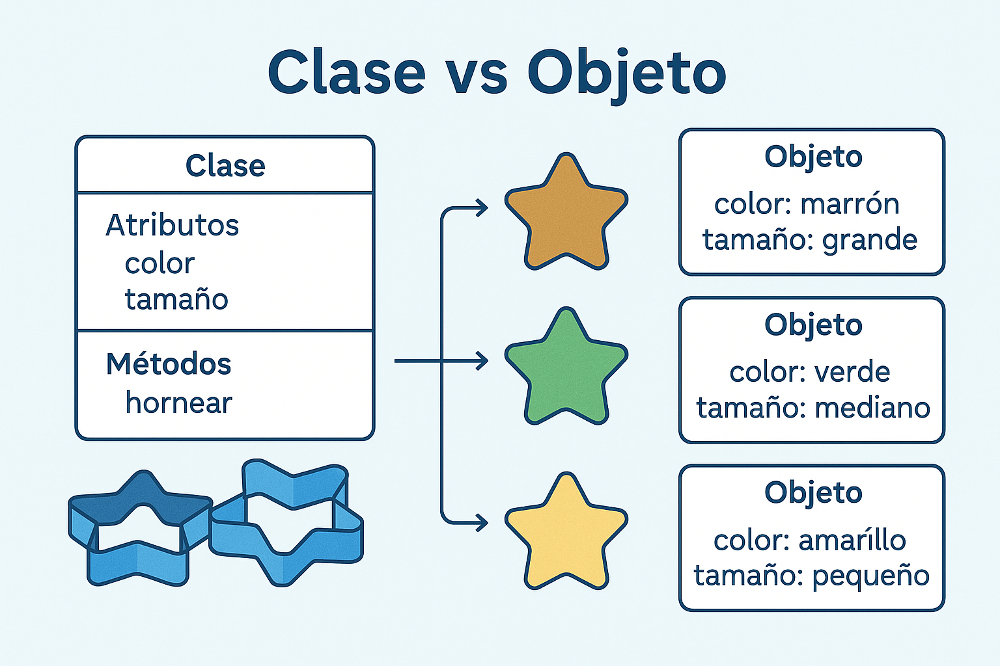
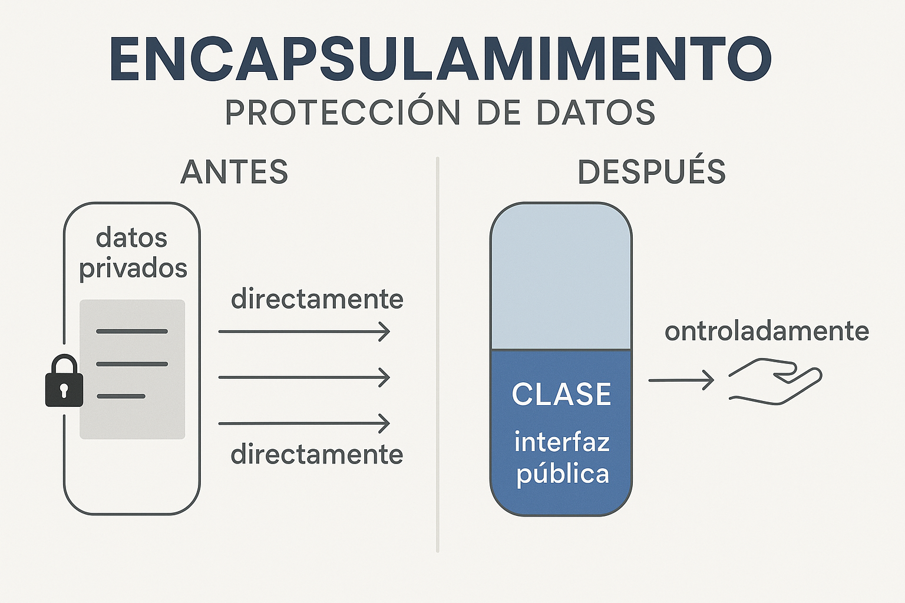

# Clase 2: Clases, Objetos y Encapsulamiento
## Los pilares de la Programación Orientada a Objetos

**IF0100 - Lenguaje de Programación OO II**
*4° Semestre - Ingeniería Informática*

---

## Objetivos de la Clase

Al finalizar esta clase, el estudiante será capaz de:

1. **Definir** clases y crear objetos en C#
2. **Aplicar** el principio de encapsulamiento
3. **Utilizar** propiedades (getters/setters) correctamente
4. **Implementar** constructores y sobrecarga de constructores
5. **Distinguir** entre campos, propiedades y métodos

**Duración:** 90 minutos

---

## Agenda

1. Repaso: ¿Qué es POO? (10 min)
2. Clases y Objetos en C# (20 min)
3. Encapsulamiento y Modificadores de Acceso (20 min)
4. Propiedades en C# (20 min)
5. Constructores (15 min)
6. Práctica: Clase Estudiante (5 min)

---

## 1. Repaso: ¿Qué es POO?

### Programación Orientada a Objetos

```
┌─────────────────────────────────────────────────────────────┐
│                  PILARES DE LA POO                          │
├─────────────────────────────────────────────────────────────┤
│                                                             │
│    ┌─────────────┐    ┌─────────────┐    ┌─────────────┐   │
│    │ENCAPSULAMIENTO│   │  HERENCIA   │    │POLIMORFISMO │   │
│    │    (Hoy)    │    │  (Clase 3)  │    │  (Clase 3)  │   │
│    └─────────────┘    └─────────────┘    └─────────────┘   │
│                                                             │
│    Ocultar datos      Reutilizar código    Un interfaz,   │
│    internos           existente            múltiples       │
│                                            formas          │
│                                                             │
└─────────────────────────────────────────────────────────────┘
```

---

## Clase vs Objeto

### Analogía: Molde vs Producto



---

### Representación ASCII:
┌─────────────────────────────────────────────────────────────┐
│                                                             │
│     MOLDE (Clase)              GALLETAS (Objetos)          │
│                                                             │
│    ┌───────────┐              ┌───┐ ┌───┐ ┌───┐ ┌───┐      │
│    │  Galleta  │              │ 🍪 │ │ 🍪 │ │ 🍪 │ │ 🍪 │      │
│    │           │    crea →    └───┘ └───┘ └───┘ └───┘      │
│    │ - forma   │              Cada una es INDEPENDIENTE     │
│    │ - sabor   │              pero comparten el MOLDE      │
│    │ - tamaño  │                                             │
│    └───────────┘              Cada una puede tener         │
│                               diferente decoración          │
│                                                             │
└─────────────────────────────────────────────────────────────┘

   CLASE = Definición / Plantilla
   OBJETO = Instancia concreta en memoria
```

---

## 2. Clases en C#

### Sintaxis de declaración

```csharp
// ESTRUCTURA BÁSICA DE UNA CLASE

[modificador] class NombreClase
{
    // CAMPOS (atributos/variables de instancia)
    [modificador] tipo nombreCampo;
    
    // PROPIEDADES (encapsulamiento)
    [modificador] tipo NombrePropiedad { get; set; }
    
    // CONSTRUCTORES
    [modificador] NombreClase([parámetros])
    {
        // inicialización
    }
    
    // MÉTODOS (comportamientos)
    [modificador] tipoRetorno NombreMetodo([parámetros])
    {
        // código
    }
}
```

---

## Ejemplo: Clase Estudiante

### Primera versión (campos públicos)

```csharp
using System;

namespace Universidad
{
    // DECLARACIÓN DE LA CLASE
    public class Estudiante
    {
        // CAMPOS (fields) - Variables de instancia
        public string nombre;
        public string codigo;
        public int edad;
        public double promedio;
        
        // MÉTODO
        public void MostrarInfo()
        {
            Console.WriteLine($"Nombre: {nombre}");
            Console.WriteLine($"Código: {codigo}");
            Console.WriteLine($"Edad: {edad}");
            Console.WriteLine($"Promedio: {promedio}");
        }
    }
}
```

---

## Creación de Objetos

### Instanciación con new

```csharp
using System;
using Universidad;  // Namespace de la clase

class Program
{
    static void Main(string[] args)
    {
        // CREAR OBJETO (instanciar)
        Estudiante est1 = new Estudiante();
        
        // ASIGNAR VALORES A LOS CAMPOS
        est1.nombre = "María López";
        est1.codigo = "2024001";
        est1.edad = 20;
        est1.promedio = 4.2;
        
        // USAR MÉTODOS
        est1.MostrarInfo();
        
        // CREAR MÁS OBJETOS (independientes)
        Estudiante est2 = new Estudiante();
        est2.nombre = "Carlos Ruiz";
        // ...
    }
}
```

---

## Diagrama de Memoria

### ¿Qué ocurre en memoria?

```
STACK (variables)              HEAP (objetos)
┌─────────────┐                ┌─────────────────────┐
│  est1       │──referencia──→│  Objeto Estudiante  │
│  (dirección)│                │  ├─ nombre: "María" │
└─────────────┘                │  ├─ codigo: "2024.."│
                               │  ├─ edad: 20        │
┌─────────────┐                │  └─ promedio: 4.2   │
│  est2       │──referencia──→└─────────────────────┘
│  (dirección)│                ┌─────────────────────┐
└─────────────┘                │  Objeto Estudiante  │
                               │  ├─ nombre: "Carlos"│
                               │  ├─ codigo: null    │
                               │  ├─ edad: 0         │
                               │  └─ promedio: 0.0   │
                               └─────────────────────┘
```

---

## 3. Encapsulamiento



### Problema con campos públicos

```csharp
// ❌ PROBLEMA: Campos públicos
public class CuentaBancaria
{
    public double saldo;  // Cualquiera puede modificarlo
}

// En algún lugar del código...
CuentaBancaria cuenta = new CuentaBancaria();
cuenta.saldo = 1000000;  // ¡Creé dinero de la nada!
cuenta.saldo = -5000;    // ¡Saldo negativo válido!
```

**El encapsulamiento protege la integridad de los datos**

---

## Encapsulamiento: Solución

### Modificadores de acceso

```csharp
┌─────────────────────────────────────────────────────────────┐
│              MODIFICADORES DE ACCESO EN C#                  │
├───────────────┬─────────────────────────────────────────────┤
│ Modificador   │ Alcance                                     │
├───────────────┼─────────────────────────────────────────────┤
│ public        │ Accesible desde cualquier lugar             │
│ private       │ Solo dentro de la misma clase               │
│ protected     │ Dentro de la clase y sus hijas (herencia)   │
│ internal      │ Dentro del mismo ensamblado/proyecto        │
│ protected     │ Combinación: proyecto + herencia            │
│ internal      │                                             │
└───────────────┴─────────────────────────────────────────────┘
```

---

## Aplicando Encapsulamiento

### Campos privados, acceso controlado

```csharp
public class CuentaBancaria
{
    // Campo PRIVADO (nadie fuera de la clase puede verlo)
    private double saldo;
    
    // MÉTODOS PÚBLICOS para acceder/modificar
    public double ObtenerSaldo()
    {
        return saldo;  // Solo lectura
    }
    
    public void Depositar(double cantidad)
    {
        if (cantidad > 0)
            saldo += cantidad;  // Validación incluida
    }
    
    public bool Retirar(double cantidad)
    {
        if (cantidad > 0 && cantidad <= saldo)
        {
            saldo -= cantidad;
            return true;
        }
        return false;  // No se pudo retirar
    }
}
```

---

## 4. Propiedades en C#

### Sintaxis moderna de C#

```csharp
// FORMA TRADICIONAL (Java, C++ antiguo)
private string nombre;
public string GetNombre() { return nombre; }
public void SetNombre(string value) { nombre = value; }

// FORMA MODERNA C# - PROPIEDADES
public string Nombre 
{ 
    get { return nombre; }
    set { nombre = value; }
}

// USO (más limpio)
estudiante.Nombre = "María";     // set
Console.WriteLine(estudiante.Nombre);  // get
```

**Las propiedades parecen campos, pero son métodos disfrazados**

---

## Tipos de Propiedades

### Diferentes configuraciones

```csharp
public class Producto
{
    // 1. Propiedad de lectura/escritura completa
    private string nombre;
    public string Nombre
    {
        get { return nombre; }
        set { nombre = value; }  // 'value' es palabra clave
    }
    
    // 2. Propiedad de solo lectura (calculada)
    public double PrecioFinal 
    { 
        get { return Precio * (1 + IVA); }
    }
    
    // 3. Propiedad de solo escritura (raro)
    private string clave;
    public string Clave
    {
        set { clave = value; }
    }
    
    // 4. Propiedad AUTOIMPLEMENTADA (sintaxis corta)
    public double Precio { get; set; }
    public double IVA { get; set; } = 0.19;  // valor por defecto
}
```

---

## Propiedades con Validación

### El poder del encapsulamiento

```csharp
public class Estudiante
{
    private string nombre;
    private int edad;
    private double promedio;
    
    public string Nombre
    {
        get { return nombre; }
        set 
        { 
            if (!string.IsNullOrWhiteSpace(value))
                nombre = value;
            else
                throw new ArgumentException("Nombre inválido");
        }
    }
    
    public int Edad
    {
        get { return edad; }
        set 
        { 
            if (value >= 0 && value <= 120)
                edad = value;
            else
                throw new ArgumentOutOfRangeException("Edad inválida");
        }
    }
    
    public double Promedio
    {
        get { return promedio; }
        set 
        { 
            if (value >= 0.0 && value <= 5.0)
                promedio = value;
            else
                throw new ArgumentOutOfRangeException("Promedio debe ser 0-5");
        }
    }
}
```

---

## Propiedades de Solo Lectura (C# Moderno)

### Inicialización en constructores

```csharp
public class Estudiante
{
    // Propiedad de solo lectura (desde fuera)
    public string Codigo { get; }
    public DateTime FechaIngreso { get; }
    
    // Propiedad con setter privado
    public int SemestreActual { get; private set; }
    
    public Estudiante(string codigo)
    {
        Codigo = codigo;           // Se asigna una sola vez
        FechaIngreso = DateTime.Now;
        SemestreActual = 1;
    }
    
    public void AvanzarSemestre()
    {
        SemestreActual++;  // Puede modificarse dentro de la clase
    }
}

// Uso
var est = new Estudiante("2024001");
// est.Codigo = "otro";  // ❌ ERROR: es de solo lectura
```

---

## 5. Constructores

### Inicialización de objetos

```csharp
public class Estudiante
{
    public string Nombre { get; set; }
    public string Codigo { get; set; }
    public int Edad { get; set; }
    
    // CONSTRUCTOR POR DEFECTO (sin parámetros)
    public Estudiante()
    {
        Nombre = "Sin nombre";
        Codigo = "0000000";
        Edad = 18;
    }
    
    // CONSTRUCTOR PARAMETRIZADO
    public Estudiante(string nombre, string codigo, int edad)
    {
        Nombre = nombre;
        Codigo = codigo;
        Edad = edad;
    }
    
    // CONSTRUCTOR CON PARÁMETROS OPCIONALES
    public Estudiante(string nombre, string codigo)
    {
        Nombre = nombre;
        Codigo = codigo;
        Edad = 18;  // valor por defecto
    }
}
```

---

## Sobrecarga de Constructores

### Múltiples formas de crear objetos

```csharp
// Uso de diferentes constructores

// 1. Constructor por defecto
Estudiante e1 = new Estudiante();
// Nombre="Sin nombre", Codigo="0000000", Edad=18

// 2. Constructor con 2 parámetros
Estudiante e2 = new Estudiante("María", "2024001");
// Nombre="María", Codigo="2024001", Edad=18

// 3. Constructor con 3 parámetros
Estudiante e3 = new Estudiante("Carlos", "2024002", 22);
// Nombre="Carlos", Codigo="2024002", Edad=22

// 4. Sintaxis simplificada (C# 9.0+)
Estudiante e4 = new();  // Target-typed new
var e5 = new Estudiante { Nombre = "Ana", Edad = 20 };  // Object initializer
```

---

## Inicialización de Objetos

### Object Initializers (Sintaxis moderna)

```csharp
// FORMA TRADICIONAL
Estudiante est = new Estudiante("María", "2024001", 20);

// OBJECT INITIALIZER (C# moderno)
Estudiante est = new Estudiante
{
    Nombre = "María López",
    Codigo = "2024001",
    Edad = 20,
    Promedio = 4.5
};

// CONSTRUCTOR + INITIALIZER COMBINADOS
Estudiante est = new Estudiante("María", "2024001")
{
    Edad = 20,           // Propiedad adicional
    Promedio = 4.5
};
```

---

## Clase Estudiante Completa

### Versión final con buenas prácticas

```csharp
public class Estudiante
{
    // Propiedades autoimplementadas
    public string Nombre { get; set; }
    public string Codigo { get; set; }
    public int Edad { get; set; }
    public double Promedio { get; set; }
    
    // Constructor por defecto
    public Estudiante()
    {
        Nombre = "Sin nombre";
        Codigo = "0000000";
        Edad = 18;
        Promedio = 0.0;
    }
    
    // Constructor parametrizado
    public Estudiante(string nombre, string codigo, int edad)
    {
        Nombre = nombre;
        Codigo = codigo;
        Edad = edad;
        Promedio = 0.0;
    }
    
    // Métodos
    public bool Aprobo()
    {
        return Promedio >= 3.0;
    }
    
    public string ObtenerEstado()
    {
        return Aprobo() ? "APROBADO" : "REPROBADO";
    }
    
    public void MostrarInfo()
    {
        Console.WriteLine($"📚 {Nombre} ({Codigo})");
        Console.WriteLine($"   Edad: {Edad} años");
        Console.WriteLine($"   Promedio: {Promedio:F2}");
        Console.WriteLine($"   Estado: {(Aprobo() ? "✅" : "❌")} {ObtenerEstado()}");
    }
}
```

---

## 6. Práctica en Clase

### Ejercicio: Sistema de Gestión Estudiantil

```csharp
// 1. Crear la clase Estudiante (completa arriba)

// 2. Crear programa principal
class Program
{
    static void Main(string[] args)
    {
        // Crear lista de estudiantes
        List<Estudiante> estudiantes = new List<Estudiante>();
        
        // Agregar estudiantes
        estudiantes.Add(new Estudiante("María López", "2024001", 20) 
        { 
            Promedio = 4.2 
        });
        
        estudiantes.Add(new Estudiante("Carlos Ruiz", "2024002", 22) 
        { 
            Promedio = 2.8 
        });
        
        estudiantes.Add(new Estudiante("Ana Martínez", "2024003", 19) 
        { 
            Promedio = 3.5 
        });
        
        // Mostrar información
        Console.WriteLine("=== LISTA DE ESTUDIANTES ===\n");
        foreach (var est in estudiantes)
        {
            est.MostrarInfo();
            Console.WriteLine();
        }
    }
}
```

---

## Resumen de la Clase

| Concepto | Descripción |
|----------|-------------|
| **Clase** | Plantilla/blueprint para crear objetos |
| **Objeto** | Instancia concreta de una clase |
| **Campo** | Variable de instancia (dato) |
| **Propiedad** | Encapsulamiento con get/set |
| **Método** | Comportamiento/acción del objeto |
| **Constructor** | Método especial para inicializar objetos |
| **Encapsulamiento** | Ocultar implementación, exponer interfaz |

---

## Ejercicios Propuestos

### Para practicar en casa

**Ejercicio 1: Clase Producto**
Crear una clase `Producto` con:
- Código (solo lectura, asignado en constructor)
- Nombre (propiedad con validación: no vacío)
- Precio (propiedad con validación: > 0)
- Cantidad en stock (>= 0)
- Método `CalcularValorInventario()` que retorne Precio * Stock

**Ejercicio 2: Clase CuentaBancaria**
Crear una clase con:
- Número de cuenta (solo lectura)
- Saldo (privado, acceso solo mediante métodos)
- Métodos: Depositar(), Retirar(), ConsultarSaldo()
- Validar que no se pueda retirar más del saldo disponible

---

## Próxima Clase

### Clase 3: Herencia y Polimorfismo

- Herencia: clase base y clase derivada
- Palabra clave `base`
- Polimorfismo: virtual, override, abstract
- Clases y métodos abstractos
- Principio de sustitución de Liskov

**¡Nos vemos!**

---

# ¡Gracias!
## ¿Preguntas?

**UNAULA - Ingeniería Informática - 2026-I**
