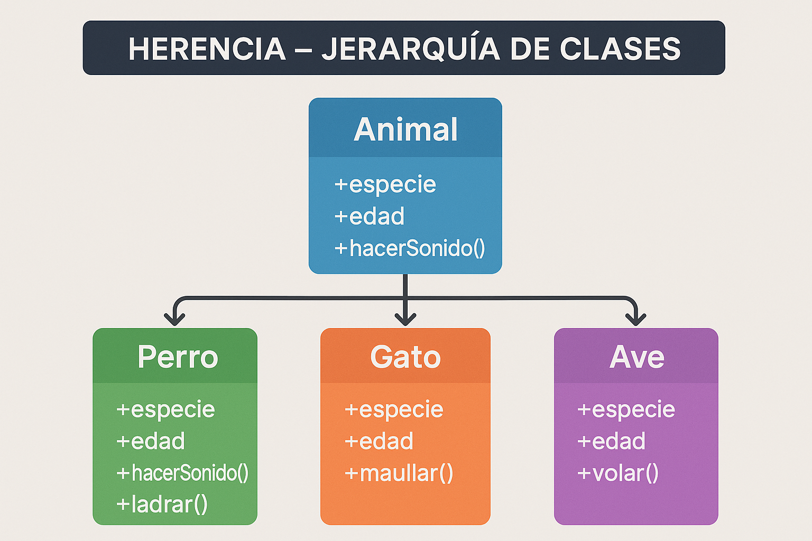
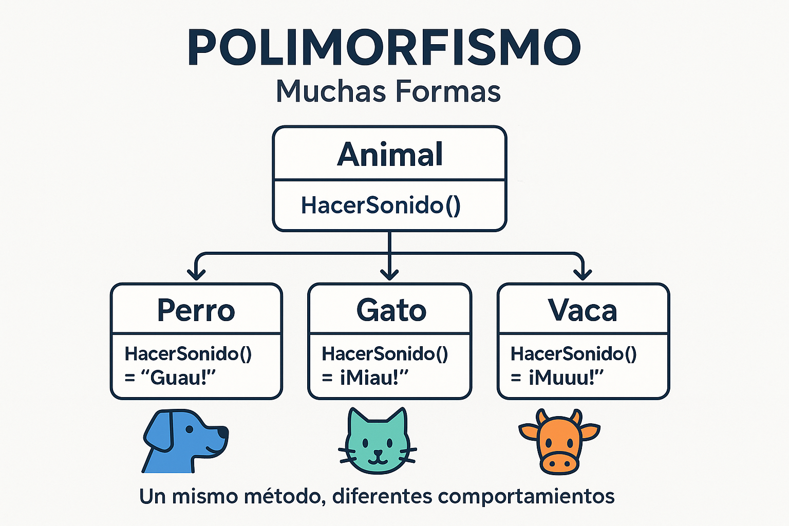

<style>
img {
  max-width: 70% !important;
  max-height: 50vh !important;
  object-fit: contain !important;
  height: auto !important;
  display: block !important;
  margin: 0 auto !important;
}
section {
  font-size: 20px;
  overflow: hidden;
}
section h1 {
  font-size: 1.8em;
}
section h2 {
  font-size: 1.4em;
}
section h3 {
  font-size: 1.2em;
}
section ul, section ol {
  font-size: 0.9em;
  margin-left: 1em;
}
section li {
  margin-bottom: 0.3em;
}
section pre {
  font-size: 0.7em;
  max-height: 60vh;
  overflow-y: auto;
}
section code {
  font-size: 0.85em;
}
section p {
  margin: 0.5em 0;
}
/* Estilos para tablas responsivas */
section table {
  width: 100%;
  max-width: 100%;
  font-size: 0.85em;
  border-collapse: collapse;
  margin: 0.5em auto;
  table-layout: auto;
}
section th {
  background-color: #1e40af;
  color: white;
  padding: 0.4em 0.6em;
  text-align: left;
  font-size: 0.9em;
  border: 1px solid #ddd;
}
section td {
  padding: 0.4em 0.6em;
  border: 1px solid #ddd;
  vertical-align: top;
  word-wrap: break-word;
  font-size: 0.85em;
}
section tbody tr:nth-child(even) {
  background-color: #f8f9fa;
}
section tbody tr:hover {
  background-color: #e9ecef;
}
/* Asegurar que el contenido no desborde */
section {
  padding: 1em 2em;
  box-sizing: border-box;
}
/* Responsividad para tablas anchas */
@media screen and (max-width: 1280px) {
  section table {
    font-size: 0.75em;
  }
  section th, section td {
    padding: 0.3em 0.4em;
  }
}
</style>


<!--
[2026-01-31] - Clase enriquecida con infografías

IMÁGENES GENERADAS:
- clase-03-herencia.png: Diagrama visual de jerarquía de herencia en POO
- clase-03-polimorfismo.png: Diagrama explicativo de polimorfismo con animales
-->

# Clase 3: Herencia y Polimorfismo
## Reutilización de código y comportamientos flexibles

**IF0100 - Lenguaje de Programación OO II**
*4° Semestre - Ingeniería Informática*

---

## Objetivos de la Clase

Al finalizar esta clase, el estudiante será capaz de:

1. **Aplicar** el concepto de herencia entre clases
2. **Utilizar** la palabra clave `base` para acceder a la clase padre
3. **Implementar** polimorfismo con `virtual`, `override` y `abstract`
4. **Distinguir** entre clases abstractas e interfaces
5. **Aplicar** el principio de sustitución de Liskov

**Duración:** 90 minutos

---

## Agenda

1. Herencia: Conceptos fundamentales (20 min)
2. Polimorfismo: virtual y override (20 min)
3. Clases y métodos abstractos (20 min)
4. La palabra clave `sealed` (10 min)
5. Principio de sustitución de Liskov (10 min)
6. Ejemplo práctico: Sistema de figuras geométricas (10 min)

---

## 1. Herencia

### ¿Qué es la herencia?

> **Herencia** es un mecanismo que permite crear nuevas clases basadas en clases existentes, reutilizando código y estableciendo relaciones jerárquicas.

{: style="max-width: 60%; max-height: 400px; display: block; margin: 0 auto;"}

---

### Representación ASCII:
```
┌─────────────────────────────────────────────────────────────┐
│                    JERARQUÍA DE HERENCIA                    │
├─────────────────────────────────────────────────────────────┤
│                                                             │
│                    ┌───────────────┐                        │
│                    │   Persona     │  ← CLASE BASE          │
│                    │  (base class) │    (padre/super)       │
│                    │  - Nombre     │                        │
│                    │  - Edad       │                        │
│                    └───────┬───────┘                        │
│                            │                                │
│           ┌────────────────┼────────────────┐               │
│           │                │                │               │
│           ▼                ▼                ▼               │
│     ┌──────────┐     ┌──────────┐     ┌──────────┐         │
│     │Estudiante│     │ Profesor │     │Administrativo│      │
│     │(derivada)│     │(derivada)│     │  (derivada)  │      │
│     │- Carrera │     │- Salario │     │  - Departamento│     │
│     │- Semestre│     │- Materias│     │  - Cargo       │     │
│     └──────────┘     └──────────┘     └──────────┘         │
│                                                             │
│     CLASES DERIVADAS heredan de PERSONA + atributos propios │
│                                                             │
└─────────────────────────────────────────────────────────────┘
```

---

## Sintaxis de Herencia en C#

### La palabra clave `:``

```csharp
// CLASE BASE (Padre)
public class Persona
{
    public string Nombre { get; set; }
    public int Edad { get; set; }
    public string Identificacion { get; set; }
    
    public void Saludar()
    {
        Console.WriteLine($"Hola, soy {Nombre}");
    }
}

// CLASE DERIVADA (Hija) - sintaxis: ":"
public class Estudiante : Persona  // Estudiante HEREDA de Persona
{
    public string Codigo { get; set; }      // Atributo propio
    public string Carrera { get; set; }     // Atributo propio
    public int Semestre { get; set; }       // Atributo propio
    
    public void Estudiar()
    {
        Console.WriteLine($"{Nombre} está estudiando");
    }
}
```

---

## Acceso a Miembros Heredados

### ¿Qué se hereda?

```csharp
public class Program
{
    static void Main(string[] args)
    {
        Estudiante est = new Estudiante();
        
        // Miembros HEREDADOS de Persona
        est.Nombre = "María López";     // ✅ Heredado
        est.Edad = 20;                   // ✅ Heredado
        est.Saludar();                   // ✅ Heredado
        
        // Miembros PROPIOS de Estudiante
        est.Codigo = "2024001";          // ✅ Propio
        est.Carrera = "Ingeniería";      // ✅ Propio
        est.Estudiar();                  // ✅ Propio
    }
}
```

**¿Qué NO se hereda?**
- ❌ Constructores (pero se pueden llamar con `base`)
- ❌ Miembros `private` de la clase base

---

## Modificadores de Acceso y Herencia

### Visibilidad en la jerarquía

```csharp
public class Persona
{
    public string Nombre { get; set; }      // Todos pueden ver
    private string password;                // SOLO esta clase
    protected double salario;               // Esta clase + hijas
    internal string direccion;              // Mismo proyecto
    protected internal string codigoInterno; // Proyecto + hijas
}

public class Empleado : Persona
{
    public void MetodoEjemplo()
    {
        Console.WriteLine(Nombre);       // ✅ public
        // Console.WriteLine(password);  // ❌ private
        Console.WriteLine(salario);      // ✅ protected
        Console.WriteLine(direccion);    // ✅ internal (mismo proyecto)
        Console.WriteLine(codigoInterno);// ✅ protected internal
    }
}
```

---

## Llamando al Constructor Base

### La palabra clave `base`

```csharp
public class Persona
{
    public string Nombre { get; set; }
    public int Edad { get; set; }
    
    // Constructor de Persona
    public Persona(string nombre, int edad)
    {
        Nombre = nombre;
        Edad = edad;
    }
}

public class Estudiante : Persona
{
    public string Codigo { get; set; }
    
    // Constructor de Estudiante llama a base
    public Estudiante(string nombre, int edad, string codigo) 
        : base(nombre, edad)  // ← Llama constructor de Persona
    {
        Codigo = codigo;  // Inicializa lo propio
    }
}

// Uso
Estudiante est = new Estudiante("María", 20, "2024001");
// Primero: Persona("María", 20)
// Luego: Estudiante asigna Codigo
```

---

## Herencia Multinivel

### Jerarquías más profundas

```csharp
// NIVEL 1: Clase base
public class Persona 
{ 
    public string Nombre { get; set; }
}

// NIVEL 2: Hereda de Persona
public class Empleado : Persona 
{ 
    public string CodigoEmpleado { get; set; }
}

// NIVEL 3: Hereda de Empleado (y transitivamente de Persona)
public class Profesor : Empleado 
{ 
    public string Especialidad { get; set; }
    public List<string> Materias { get; set; }
}

// Uso
Profesor prof = new Profesor();
prof.Nombre = "Carlos";           // De Persona
prof.CodigoEmpleado = "EMP001";   // De Empleado
prof.Especialidad = "Programación"; // De Profesor
```

---

## 2. Polimorfismo

### Un nombre, múltiples formas

> **Polimorfismo** permite que objetos de diferentes clases respondan al mismo mensaje (método) de manera específica.

{: style="max-width: 60%; max-height: 400px; display: block; margin: 0 auto;"}

---

### Representación ASCII:

```
┌─────────────────────────────────────────────────────────────┐
│              POLIMORFISMO EN ACCIÓN                         │
├─────────────────────────────────────────────────────────────┤
│                                                             │
│   Mismo mensaje: CalcularArea()                            │
│                                                             │
│        ┌─────────────────┐                                  │
│        │   Figura        │ ← Clase abstracta               │
│        │ CalcularArea()  │   (define el contrato)          │
│        └────────┬────────┘                                  │
│                 │                                           │
│     ┌───────────┼───────────┬───────────┐                  │
│     ▼           ▼           ▼           ▼                  │
│  ┌──────┐   ┌──────┐   ┌────────┐   ┌──────────┐          │
│  │Círculo│   │Rectángulo│ │ Triángulo│ │  Trapecio  │          │
│  │π*r²   │   │b*h       │ │(b*h)/2   │ │(B+b)*h/2   │          │
│  └──────┘   └──────┘   └────────┘   └──────────┘          │
│                                                             │
│  Cada clase implementa CalcularArea() a su manera           │
│                                                             │
└─────────────────────────────────────────────────────────────┘
```

---
## Virtual y Override
---
## Virtual y Override
### Sobrescritura de métodos

```csharp
public class Animal
{
    public string Nombre { get; set; }
    
    // Método VIRTUAL: puede ser sobrescrito
    public virtual void HacerSonido()
    {
        Console.WriteLine("El animal hace un sonido");
    }
    
    public virtual void Moverse()
    {
        Console.WriteLine("El animal se mueve");
    }
}

public class Perro : Animal
{
    // OVERRIDE: sobrescribe el método de la clase base
    public override void HacerSonido()
    {
        Console.WriteLine("¡Guau guau! 🐕");
    }
    
    public override void Moverse()
    {
        Console.WriteLine("El perro corre en 4 patas");
    }
}

public class Gato : Animal
{
    public override void HacerSonido()
    {
        Console.WriteLine("¡Miau miau! 🐈");
    }
}
```
---

## Polimorfismo en Acción

### Uso con referencias de clase base

```csharp
class Program
{
    static void Main(string[] args)
    {
        // Referencias de tipo Animal, objetos de tipo específico
        Animal animal1 = new Perro() { Nombre = "Rex" };
        Animal animal2 = new Gato() { Nombre = "Michi" };
        Animal animal3 = new Animal() { Nombre = "Genérico" };
        
        // Mismo método, diferente comportamiento
        animal1.HacerSonido();  // "¡Guau guau! 🐕"
        animal2.HacerSonido();  // "¡Miau miau! 🐈"
        animal3.HacerSonido();  // "El animal hace un sonido"
        
        // Colección polimórfica
        List<Animal> animales = new List<Animal> 
        { 
            new Perro(), 
            new Gato(), 
            new Perro() 
        };
        
        foreach (Animal a in animales)
        {
            a.HacerSonido();  // Cada uno hace su sonido
        }
    }
}
```

---
## Llamando al Método Base
---
## Llamando al Método Base
### Preservando comportamiento padre

```csharp
public class Empleado
{
    public string Nombre { get; set; }
    public decimal SalarioBase { get; set; }
    
    public virtual decimal CalcularSalario()
    {
        return SalarioBase;
    }
    
    public virtual void MostrarInfo()
    {
        Console.WriteLine($"Empleado: {Nombre}");
        Console.WriteLine($"Salario: {CalcularSalario():C}");
    }
}

public class Vendedor : Empleado
{
    public decimal Comision { get; set; }
    
    public override decimal CalcularSalario()
    {
        // Llamar al método base + agregar comportamiento
        return base.CalcularSalario() + Comision;
    }
    
    public override void MostrarInfo()
    {
        Console.WriteLine("=== VENDEDOR ===");
        base.MostrarInfo();  // Reutiliza código del padre
        Console.WriteLine($"Comisión: {Comision:C}");
    }
}
```
---

## 3. Clases y Métodos Abstractos

### Forzando la implementación

```csharp
// CLASE ABSTRACTA: No se puede instanciar directamente
public abstract class Figura
{
    public string Nombre { get; set; }
    public string Color { get; set; }
    
    // MÉTODO ABSTRACTO: Sin implementación, las hijas DEBEN implementarlo
    public abstract double CalcularArea();
    
    // MÉTODO ABSTRACTO
    public abstract double CalcularPerimetro();
    
    // MÉTODO CONCRETO: Tiene implementación, las hijas pueden heredarlo
    public void MostrarInfo()
    {
        Console.WriteLine($"Figura: {Nombre}");
        Console.WriteLine($"Color: {Color}");
        Console.WriteLine($"Área: {CalcularArea():F2}");
        Console.WriteLine($"Perímetro: {CalcularPerimetro():F2}");
    }
}
```

---
## Implementando Clases Abstractas
---
## Implementando Clases Abstractas
### Clases concretas que heredan

```csharp
public class Circulo : Figura
{
    public double Radio { get; set; }
    
    // DEBE implementar CalcularArea (es abstracto)
    public override double CalcularArea()
    {
        return Math.PI * Radio * Radio;
    }
    
    // DEBE implementar CalcularPerimetro
    public override double CalcularPerimetro()
    {
        return 2 * Math.PI * Radio;
    }
}

public class Rectangulo : Figura
{
    public double Base { get; set; }
    public double Altura { get; set; }
    
    public override double CalcularArea()
    {
        return Base * Altura;
    }
    
    public override double CalcularPerimetro()
    {
        return 2 * (Base + Altura);
    }
}

// Uso
// Figura f = new Figura();  // ❌ ERROR: no se puede instanciar abstracta
Figura f = new Circulo { Radio = 5 };  // ✅ Sí se puede
f.CalcularArea();  // Llama a la implementación de Circulo
```
---

## Diferencias: Virtual vs Abstract

| Característica | `virtual` | `abstract` |
| ---------------- | ----------- | ------------ |
| Implementación | Tiene implementación por defecto | Sin implementación |
| Obligatoriedad | Las hijas PUEDEN sobrescribir | Las hijas DEBEN sobrescribir |
| Clase | Puede estar en clase normal | Solo en clases abstractas |
| Instanciación | Clase se puede instanciar | Clase NO se puede instanciar |

```csharp
// Clase normal con virtual
public class Animal 
{
    public virtual void Hablar() { Console.WriteLine("Sonido"); }
}

// Clase abstracta con abstract
public abstract class Figura 
{
    public abstract double CalcularArea();  // Sin cuerpo
}
```

---

## 4. La Palabra Clave `sealed`

### Impidiendo la herencia

```csharp
// sealed: Nadie puede heredar de esta clase
public sealed class SeguridadSocial
{
    public string Numero { get; set; }
    public decimal Saldo { get; set; }
}

// public class HackeoSS : SeguridadSocial { }  // ❌ ERROR

// sealed en método: Nadie puede sobrescribir más
public class Impuestos
{
    public virtual decimal Calcular() { return 0; }
}

public class ImpuestosColombia : Impuestos
{
    // Este método ya no puede ser sobrescrito más
    public sealed override decimal Calcular() 
    { 
        return base.Calcular() + 0.19m; 
    }
}

// public class ImpuestosBogota : ImpuestosColombia
// {
//     public override decimal Calcular() { }  // ❌ ERROR
// }
```

---

## 5. Principio de Sustitución de Liskov

### Diseño correcto de herencia

> **Principio LSP (Liskov Substitution Principle):** Una clase hija debe poder sustituir a su clase padre sin alterar el comportamiento correcto del programa.

```
✅ EJEMPLO CORRECTO:

   Animal a = new Perro();  // Perro ES UN Animal
   a.HacerSonido();         // Funciona correctamente


❌ EJEMPLO INCORRECTO (violación LSP):

   class Rectangulo { virtual void SetAncho(int w) { ... } }
   
   class Cuadrado : Rectangulo  // Cuadrado ES UN Rectángulo?
   {
       override void SetAncho(int w) 
       { 
           ancho = alto = w;  // ¡Cambia alto también!
       }
   }
   
   Rectangulo r = new Cuadrado();
   r.SetAncho(5);
   r.SetAlto(10);
   // ¡Esperaba área 50, pero es 100! (5x5 o 10x10)
```

---

## Reglas del Principio LSP

### Indicadores de herencia incorrecta

```
❌ "ES UN" no funciona:
   • Un Cuadrado ES UN Rectángulo? (matemáticamente sí, OO no)
   
❌ Violación de precondiciones:
   • Padre acepta null, hijo lanza excepción
   
❌ Cambio de comportamiento inesperado:
   • Mismo método, resultados incompatibles
   
✅ BUENA HERENCIA:
   • Estudiante ES UNA Persona ✅
   • Perro ES UN Animal ✅
   • Círculo ES UNA Figura ✅
   
❌ MALA HERENCIA:
   • Avión ES UN Vehículo? (tiene motor, pero vuela)
   • Reloj ES UN Círculo? (forma física ≠ concepto)
```

---
## 6. Ejemplo Práctico: Sistema de Figuras
---
## 6. Ejemplo Práctico: Sistema de Figuras
### Implementación completa

```csharp
// CLASE ABSTRACTA BASE
public abstract class Figura
{
    public string Nombre { get; set; }
    public string Color { get; set; }
    
    public abstract double CalcularArea();
    public abstract double CalcularPerimetro();
    
    public virtual void MostrarInfo()
    {
        Console.WriteLine($"\n📐 {Nombre} ({Color})");
        Console.WriteLine($"   Área: {CalcularArea():F2} cm²");
        Console.WriteLine($"   Perímetro: {CalcularPerimetro():F2} cm");
    }
}

// CÍRCULO
public class Circulo : Figura
{
    public double Radio { get; set; }
    
    public override double CalcularArea() => Math.PI * Radio * Radio;
    public override double CalcularPerimetro() => 2 * Math.PI * Radio;
}

// RECTÁNGULO
public class Rectangulo : Figura
{
    public double Base { get; set; }
    public double Altura { get; set; }
    
    public override double CalcularArea() => Base * Altura;
    public override double CalcularPerimetro() => 2 * (Base + Altura);
}
```
---

## Uso del Sistema de Figuras

```csharp
class Program
{
    static void Main(string[] args)
    {
        // Colección polimórfica
        List<Figura> figuras = new List<Figura>
        {
            new Circulo { Nombre = "Círculo 1", Color = "Rojo", Radio = 5 },
            new Rectangulo { Nombre = "Rectángulo 1", Color = "Azul", Base = 4, Altura = 6 },
            new Circulo { Nombre = "Círculo 2", Color = "Verde", Radio = 3 }
        };
        
        double areaTotal = 0;
        
        Console.WriteLine("=== SISTEMA DE FIGURAS ===\n");
        
        foreach (Figura f in figuras)
        {
            f.MostrarInfo();
            areaTotal += f.CalcularArea();
        }
        
        Console.WriteLine($"\n📊 Área total de todas las figuras: {areaTotal:F2} cm²");
    }
}
```

---

## Resumen de la Clase

| Concepto | Descripción |
| ---------- | ------------- |
| **Herencia** | `:` permite crear jerarquías de clases |
| **base** | Llama a miembros de la clase padre |
| **protected** | Visible en clase y derivadas |
| **virtual** | Método que PUEDE ser sobrescrito |
| **override** | Sobrescribe método virtual/abstract |
| **abstract** | Sin implementación, obliga a sobrescribir |
| **sealed** | Impide herencia o sobrescritura |
| **Polimorfismo** | Un interfaz, múltiples implementaciones |

---

## Ejercicios Propuestos

### Para practicar en casa

**Ejercicio 1: Sistema Bancario**
Crear una jerarquía:
- `CuentaBancaria` (abstracta): Numero, Saldo, Depositar(), Retirar(), CalcularInteres() (abstracto)
- `CuentaAhorros` : Hereda de CuentaBancaria, interés 3% anual
- `CuentaCorriente` : Hereda de CuentaBancaria, interés 0%, permite sobregiro

**Ejercicio 2: Empleados Universitarios**
- `EmpleadoUniversidad` (abstracta): Nombre, Identificacion, CalcularSalario() (abstracto)
- `Profesor`: Salario base + valor hora * horas dictadas
- `Administrativo`: Salario base fijo
- `Monitor`: Valor hora * horas (sin salario base)

Crear una lista de empleados y calcular la nómina total.

---

## Próxima Clase

### Clase 4: Sobrecarga, Sobreescritura y Modelamiento de Bases de Datos

- Sobrecarga de métodos (overloading)
- Sobrecarga de operadores
- Sobrescritura vs Sobrecarga
- Introducción al modelamiento de bases de datos
- Relaciones: 1-1, 1-N, N-N

**¡Nos vemos!**

---

# ¡Gracias!
## ¿Preguntas?

**UNAULA - Ingeniería Informática - 2026-I**
