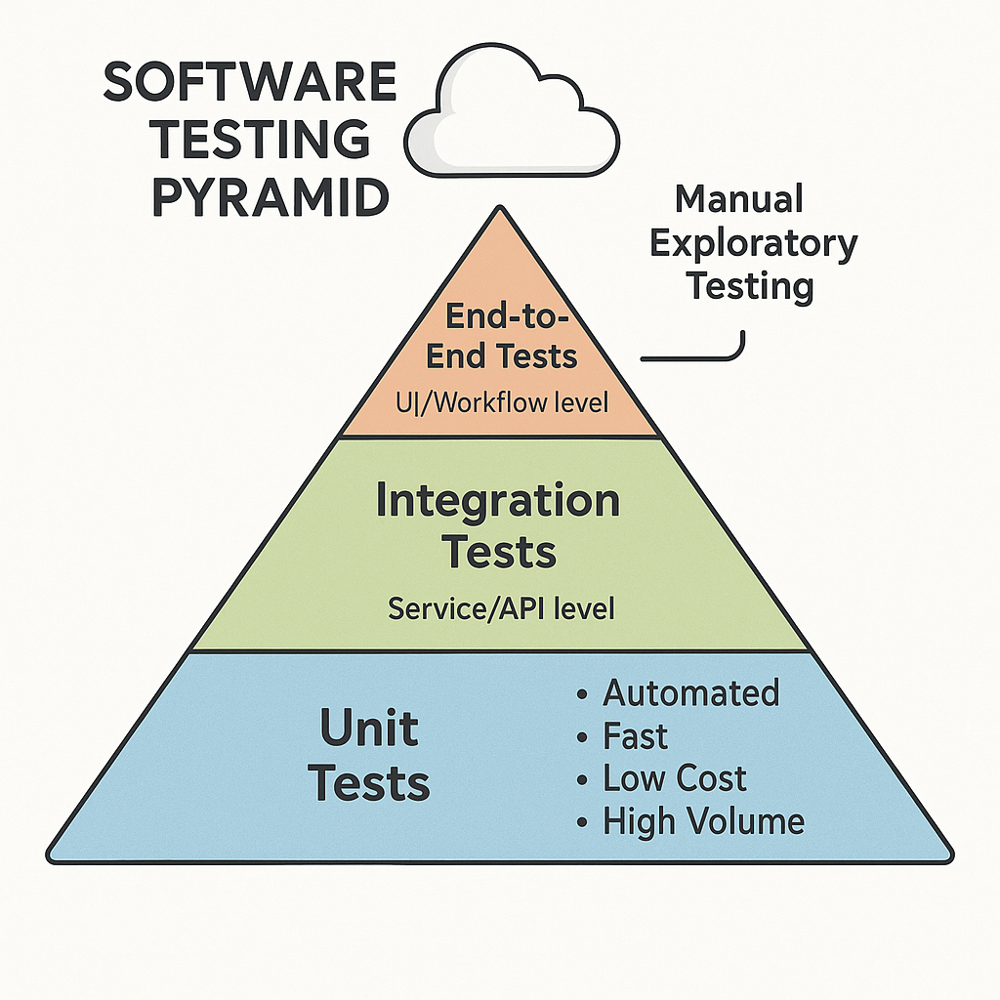
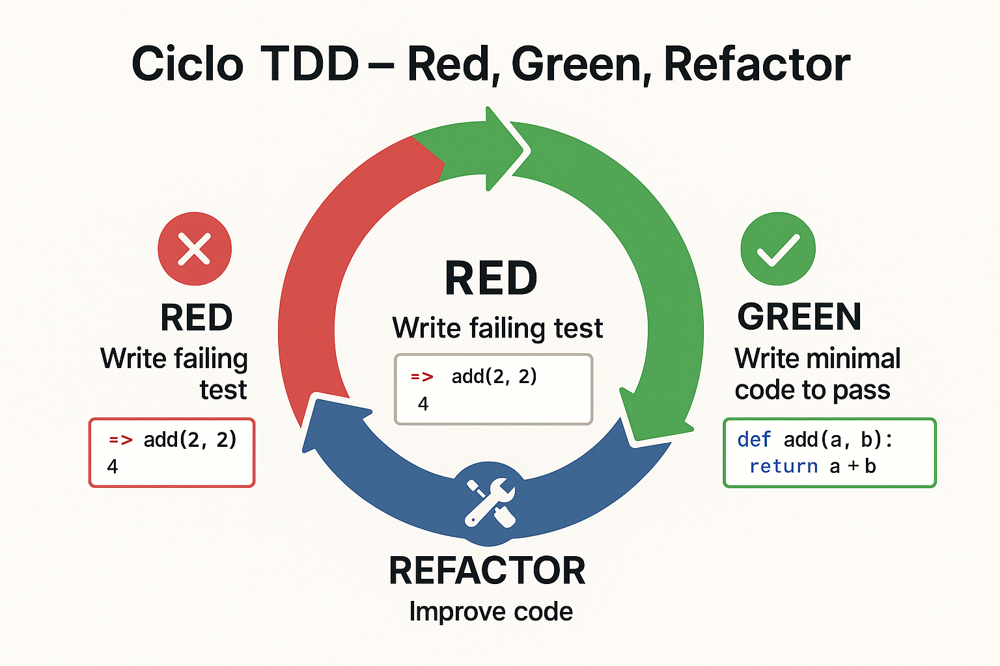

<style>
img {
  max-width: 65% !important;
  max-height: 45vh !important;
  object-fit: contain !important;
  height: auto !important;
}
section {
  font-size: 24px;
}
</style>


<!--
[2026-01-31] - Clase enriquecida con infografías

IMÁGENES GENERADAS:
- clase-05-tdd-ciclo.png: Diagrama del ciclo Red-Green-Refactor de TDD
-->

# Clase 5: Test Driven Development (TDD)
## Desarrollo guiado por pruebas con xUnit

**IF0100 - Lenguaje de Programación OO II**
*4° Semestre - Ingeniería Informática*

---

## Objetivos de la Clase

Al finalizar esta clase, el estudiante será capaz de:

1. **Comprender** la filosofía y ciclo de TDD
2. **Escribir** pruebas unitarias con xUnit en C#
3. **Aplicar** el ciclo Red-Green-Refactor
4. **Identificar** casos de prueba efectivos
5. **Medir** cobertura de código con herramientas

**Duración:** 90 minutos

---

## Agenda

1. ¿Por qué probar el código? (10 min)
2. Fundamentos de TDD (15 min)
3. xUnit: Framework de pruebas para .NET (15 min)
4. Estructura de pruebas unitarias (15 min)
5. Ciclo Red-Green-Refactor en práctica (20 min)
6. Buenas prácticas y casos de prueba (15 min)

---

## 1. ¿Por qué Probar el Código?

### El problema del desarrollo tradicional

```
┌─────────────────────────────────────────────────────────────┐
│              DESARROLLO TRADICIONAL (SIN TDD)               │
├─────────────────────────────────────────────────────────────┤
│                                                             │
│   1. Escribir código          ← Semanas de desarrollo       │
│           ↓                                                 │
│   2. Escribir código          ← Más funcionalidades         │
│           ↓                                                 │
│   3. Escribir código          ← Más código...               │
│           ↓                                                 │
│   4. Probar manualmente       ← "Parece funcionar"          │
│           ↓                                                 │
│   5. Entregar a producción    ← ¡Deploy! 🚀                 │
│           ↓                                                 │
│   6. 💥 ERROR CRÍTICO         ← Usuario reporta bug         │
│           ↓                                                 │
│   7. Debuggear desesperadamente                              │
│      "¿Quién tocó esto?"                                    │
│           ↓                                                 │
│   8. Hotfix urgente a las 3 AM                              │
│                                                             │
└─────────────────────────────────────────────────────────────┘
```

---

## Costo de los Errores

### Cuanto más tarde se detecta, más cuesta

```
┌─────────────────────────────────────────────────────────────┐
│          COSTO DE CORREGIR UN ERROR SEGÚN FASE              │
├─────────────────────────────────────────────────────────────┤
│                                                             │
│   $1        $10        $100        $1,000        $10,000    │
│    │          │          │           │              │       │
│    ▼          ▼          ▼           ▼              ▼       │
│  ┌────┐    ┌────┐    ┌────┐     ┌──────┐      ┌────────┐  │
│  │Diseño│    │Cod │    │Test│     │Integr│      │Producción│  │
│  │    │    │    │    │    │     │ación │      │        │  │
│  └────┘    └────┘    └────┘     └──────┘      └────────┘  │
│                                                             │
│  Catching bugs early saves money and sanity!               │
│                                                             │
└─────────────────────────────────────────────────────────────┘
```

**Estudios (IBM, NIST):** El costo de corregir un error en producción es 100x más que en desarrollo.

---

## Tipos de Pruebas

### Pirámide de pruebas

{: style="max-width: 80%; max-height: 500px; display: block; margin: 0 auto;"}

---

## 2. Fundamentos de TDD

### Test Driven Development

> **TDD** es una metodología de desarrollo donde se escriben las pruebas ANTES de escribir el código de producción.

{: style="max-width: 80%; max-height: 500px; display: block; margin: 0 auto;"}

---

### Representación ASCII del ciclo:
```
┌─────────────────────────────────────────────────────────────┐
│                  CICLO TDD (MANTRA)                         │
├─────────────────────────────────────────────────────────────┤
│                                                             │
│              ┌─────────────┐                                │
│              │    RED      │                                │
│              │  (falla)    │                                │
│              └──────┬──────┘                                │
│                     │                                       │
│         ┌───────────┘                                       │
│         │                                                   │
│         ▼                                                   │
│  ┌─────────────┐    Escribe    ┌─────────────┐             │
│  │   GREEN     │ ←── prueba ───│ Escribe     │             │
│  │  (pasa)     │    mínima     │ código      │             │
│  └──────┬──────┘    para pasar │ mínimo      │             │
│         │                       └─────────────┘             │
│         │                                                   │
│         │ Mejora                                            │
│         │ código                                            │
│         ▼                                                   │
│  ┌─────────────┐                                            │
│  │  REFACTOR   │                                            │
│  │ (mejora)    │                                            │
│  └──────┬──────┘                                            │
│         │                                                   │
│         └───────────────────────────────────┐               │
│                                             │               │
│                                             ▼               │
│              ┌─────────────┐                                │
│              │   REPEAT    │                                │
│              │  (siguiente │                                │
│              │   prueba)   │                                │
│              └─────────────┘                                │
│                                                             │
│         RED → GREEN → REFACTOR → REPEAT                    │
│                                                             │
└─────────────────────────────────────────────────────────────┘
```

---

## Las Tres Leyes de TDD

### Por Robert C. Martin (Uncle Bob)

```
┌─────────────────────────────────────────────────────────────┐
│               LAS TRES LEYES DE TDD                         │
├─────────────────────────────────────────────────────────────┤
│                                                             │
│  1️⃣ PRIMERA LEY                                             │
│     "No escribirás código de producción hasta haber         │
│      escrito una prueba unitaria que falle"                 │
│                                                             │
│  2️⃣ SEGUNDA LEY                                             │
│     "No escribirás más de una prueba unitaria suficiente    │
│      para fallar, y no compilar es fallar"                  │
│                                                             │
│  3️⃣ TERCERA LEY                                             │
│     "No escribirás más código de producción del            │
│      necesario para pasar la prueba actual"                 │
│                                                             │
├─────────────────────────────────────────────────────────────┤
│                                                             │
│  Resultado: Pruebas muy pequeñas, incrementos pequeños,     │
│  código siempre probado, diseño emergente                   │
│                                                             │
└─────────────────────────────────────────────────────────────┘
```

---

## Beneficios de TDD

### ¿Por qué usarlo?

```
┌─────────────────────────────────────────────────────────────┐
│               BENEFICIOS DE TDD                             │
├─────────────────────────────────────────────────────────────┤
│                                                             │
│  ✅ SEGURIDAD                                               │
│     • Cambios sin miedo                                     │
│     • Refactorización segura                                │
│     • Detección temprana de errores                         │
│                                                             │
│  ✅ DISEÑO                                                  │
│     • Código más modular                                    │
│     • Bajo acoplamiento, alta cohesión                      │
│     • APIs más usables                                      │
│                                                             │
│  ✅ DOCUMENTACIÓN VIVA                                      │
│     • Las pruebas documentan el comportamiento              │
│     • Ejemplos de uso reales                                │
│     • Siempre actualizada                                   │
│                                                             │
│  ✅ MENOS DEBUGGING                                         │
│     • Problemas detectados inmediatamente                   │
│     • Menos tiempo en debugger                              │
│     • Flujo de trabajo continuo                             │
│                                                             │
└─────────────────────────────────────────────────────────────┘
```

---

## 3. xUnit: Framework de Pruebas

### El estándar para .NET

```
┌─────────────────────────────────────────────────────────────┐
│                  FRAMEWORKS DE PRUEBA .NET                  │
├─────────────────────────────────────────────────────────────┤
│                                                             │
│  ┌─────────────┐  ┌─────────────┐  ┌─────────────┐         │
│  │    MSTest   │  │    NUnit    │  │    xUnit    │         │
│  │  (Microsoft)│  │  (Clásico)  │  │  (Moderno)  │         │
│  └─────────────┘  └─────────────┘  └──────┬──────┘         │
│                                           │                 │
│                                           ▼                 │
│  USAREMOS: xUnit (más moderno, flexible, usado por .NET)   │
│                                                             │
│  Características xUnit:                                     │
│  • Atributos [Fact] y [Theory]                              │
│  • Inyección de dependencias nativa                         │
│  • Paralelismo por defecto                                  │
│  • Sin atributos [Setup]/[Teardown] (usa constructor)       │
│  • Extensible con fixtures                                  │
│                                                             │
└─────────────────────────────────────────────────────────────┘
```

---

## Configuración de xUnit

### Crear proyecto de pruebas

```bash
# Opción 1: CLI de .NET
dotnet new xunit -n MiProyecto.Tests
dotnet add reference ../MiProyecto/MiProyecto.csproj

# Opción 2: Visual Studio
# 1. Click derecho en solución → Agregar → Nuevo proyecto
# 2. Seleccionar "xUnit Test Project"
# 3. Nombrar: NombreProyecto.Tests
# 4. Framework: .NET 8.0
```

```xml
<!-- Estructura del csproj -->
<Project Sdk="Microsoft.NET.Sdk">
  <PropertyGroup>
    <TargetFramework>net8.0</TargetFramework>
    <IsPackable>false</IsPackable>
  </PropertyGroup>

  <ItemGroup>
    <PackageReference Include="Microsoft.NET.Test.Sdk" Version="17.8.0" />
    <PackageReference Include="xunit" Version="2.6.2" />
    <PackageReference Include="xunit.runner.visualstudio" Version="2.5.4" />
    <PackageReference Include="coverlet.collector" Version="6.0.0" />
  </ItemGroup>

  <ItemGroup>
    <ProjectReference Include="..\MiProyecto\MiProyecto.csproj" />
  </ItemGroup>
</Project>
```

---

## Estructura de Pruebas xUnit

### Convenciones y organización

```
MiProyecto/
├── src/
│   └── Calculadora/
│       ├── Calculadora.csproj
│       └── Calculadora.cs       ← Código de producción
└── tests/
    └── Calculadora.Tests/
        ├── Calculadora.Tests.csproj
        └── CalculadoraTests.cs  ← Pruebas unitarias
```

```csharp
// Archivo: CalculadoraTests.cs
using Xunit;           // Framework xUnit
using Calculadora;     // Referencia al proyecto

namespace Calculadora.Tests
{
    public class CalculadoraTests
    {
        // [Fact] indica un test sin parámetros
        [Fact]
        public void Sumar_DosNumeros_RetornaSuma()
        {
            // Arrange (Preparar)
            var calc = new Calculadora();
            int a = 5;
            int b = 3;

            // Act (Actuar)
            int resultado = calc.Sumar(a, b);

            // Assert (Verificar)
            Assert.Equal(8, resultado);
        }
    }
}
```

---

## 4. Estructura de Pruebas Unitarias

### Patrón AAA: Arrange, Act, Assert

```csharp
[Fact]
public void Dividir_DivisorCero_LanzaExcepcion()
{
    // ╔═══════════════════════════════════════════════════════╗
    // ║  ARRANGE - Configurar el escenario                    ║
    // ║  Preparar datos, instanciar objetos, configurar Mocks ║
    // ╚═══════════════════════════════════════════════════════╝
    var calc = new Calculadora();
    int dividendo = 10;
    int divisor = 0;

    // ╔═══════════════════════════════════════════════════════╗
    // ║  ACT - Ejecutar la acción a probar                    ║
    // ║  Llamar al método, realizar la operación              ║
    // ╚═══════════════════════════════════════════════════════╝
    Action accion = () => calc.Dividir(dividendo, divisor);

    // ╔═══════════════════════════════════════════════════════╗
    // ║  ASSERT - Verificar el resultado                      ║
    // ║  Comprobar que el resultado es el esperado            ║
    // ╚═══════════════════════════════════════════════════════╝
    Assert.Throws<DivideByZeroException>(accion);
}
```

---

## Asserts Comunes en xUnit

### Verificaciones fundamentales

```csharp
// IGUALDAD
Assert.Equal(expected, actual);           // Son iguales?
Assert.NotEqual(unexpected, actual);      // Son diferentes?

// BOOLEANOS
Assert.True(condicion);                   // Es verdadero?
Assert.False(condicion);                  // Es falso?

// NULOS
Assert.Null(objeto);                      // Es null?
Assert.NotNull(objeto);                   // No es null?

// EXCEPCIONES
Assert.Throws<TipoExcepcion>(() => codigo);  // Lanza excepción?

// COLECCIONES
Assert.Contains(elemento, coleccion);     // Contiene elemento?
Assert.DoesNotContain(elemento, coleccion); // No contiene?
Assert.Empty(coleccion);                  // Está vacía?
Assert.NotEmpty(coleccion);               // No está vacía?

// TIPOS
Assert.IsType<TipoEsperado>(objeto);      // Es de tipo específico?
Assert.IsAssignableFrom<TipoBase>(objeto); // Hereda de tipo?

// RANGOS
Assert.InRange(valor, min, max);          // Dentro de rango?
Assert.NotInRange(valor, min, max);       // Fuera de rango?

// STRINGS
Assert.StartsWith("inicio", texto);
Assert.EndsWith("fin", texto);
Assert.Contains("subcadena", texto);
Assert.Matches(@"regex", texto);
```

---

## Pruebas Parametrizadas

### [Theory] para múltiples casos

```csharp
// [Theory] ejecuta el test con diferentes datos
[Theory]
[InlineData(1, 1, 2)]      // a=1, b=1, esperado=2
[InlineData(5, 3, 8)]      // a=5, b=3, esperado=8
[InlineData(-1, 1, 0)]     // a=-1, b=1, esperado=0
[InlineData(0, 0, 0)]      // a=0, b=0, esperado=0
public void Sumar_VariosNumeros_RetornaSumaCorrecta(int a, int b, int esperado)
{
    // Arrange
    var calc = new Calculadora();

    // Act
    int resultado = calc.Sumar(a, b);

    // Assert
    Assert.Equal(esperado, resultado);
}

// También se puede usar [ClassData] o [MemberData] para datos complejos
```

---

## 5. Ciclo Red-Green-Refactor

### Ejemplo práctico paso a paso

```
REQUISITO: Crear una calculadora que sume dos números
```

**PASO 1: RED (Escribir prueba que falle)**

```csharp
[Fact]
public void Sumar_DosNumeros_RetornaSuma()
{
    // Arrange
    var calc = new Calculadora();  // ← No existe aún
    
    // Act
    int resultado = calc.Sumar(2, 3);  // ← No existe aún
    
    // Assert
    Assert.Equal(5, resultado);
}

// Resultado: ❌ ERROR DE COMPILACIÓN
// La clase Calculadora no existe
```

---

## Ciclo Red-Green-Refactor (2)

**PASO 2: GREEN (Código mínimo para pasar)**

```csharp
// Crear clase mínima (sin preocuparse por diseño perfecto)
public class Calculadora
{
    public int Sumar(int a, int b)
    {
        return 5;  // ← Hardcoded para pasar el test
    }
}

// Resultado: ✅ TEST PASA
// Pero es código feo, solo queremos que pase
```

---

## Ciclo Red-Green-Refactor (3)

**PASO 3: REFACTOR (Mejorar código manteniendo tests verdes)**

```csharp
// Agregar más tests para forzar implementación real
[Theory]
[InlineData(2, 3, 5)]
[InlineData(5, 5, 10)]
[InlineData(0, 0, 0)]
public void Sumar_DosNumeros_RetornaSuma(int a, int b, int esperado)
{
    var calc = new Calculadora();
    Assert.Equal(esperado, calc.Sumar(a, b));
}

// Ahora implementar correctamente
public class Calculadora
{
    public int Sumar(int a, int b)
    {
        return a + b;  // ← Implementación real
    }
}

// Resultado: ✅ TODOS LOS TESTS PASAN
```

---

## Ejemplo Completo: Clase Estudiante

### Desarrollo con TDD

```csharp
// PRUEBA 1: El estudiante debe aprobar con promedio >= 3.0
[Fact]
public void Aprobo_PromedioMayorIgual3_RetornaTrue()
{
    // Arrange
    var estudiante = new Estudiante { Promedio = 3.5 };
    
    // Act
    bool aprobo = estudiante.Aprobo();
    
    // Assert
    Assert.True(aprobo);
}
```

```csharp
// Código mínimo para pasar
public class Estudiante
{
    public double Promedio { get; set; }
    
    public bool Aprobo()
    {
        return true;  // Hardcoded
    }
}
```

---

## Ejemplo Completo (2)

### Segunda prueba para forzar implementación

```csharp
// PRUEBA 2: El estudiante debe reprobar con promedio < 3.0
[Fact]
public void Aprobo_PromedioMenor3_RetornaFalse()
{
    var estudiante = new Estudiante { Promedio = 2.5 };
    
    bool aprobo = estudiante.Aprobo();
    
    Assert.False(aprobo);
}

// Resultado: ❌ FALLA (siempre retorna true)
// Ahora debemos implementar correctamente
```

```csharp
// REFACTOR: Implementación correcta
public class Estudiante
{
    public double Promedio { get; set; }
    
    public bool Aprobo()
    {
        return Promedio >= 3.0;  // Lógica real
    }
}

// Resultado: ✅ AMBOS TESTS PASAN
```

---

## 6. Buenas Prácticas

### Reglas para pruebas efectivas

```
┌─────────────────────────────────────────────────────────────┐
│                BUENAS PRÁCTICAS DE PRUEBAS                  │
├─────────────────────────────────────────────────────────────┤
│                                                             │
│  📋 INDEPENDIENTES                                          │
│     • Cada prueba debe poder ejecutarse sola                │
│     • No depender del orden de ejecución                    │
│     • No compartir estado entre pruebas                     │
│                                                             │
│  ⚡ RÁPIDAS                                                 │
│     • Deben ejecutarse en milisegundos                      │
│     • Sin acceso a BD, red, archivo                         │
│     • Usar mocks para dependencias                          │
│                                                             │
│  🎯 FOCUSDAS                                                │
│     • Una prueba = un concepto                              │
│     • Nombre descriptivo: Metodo_Escenario_Resultado        │
│                                                             │
│  🔁 REPETIBLES                                              │
│     • Mismo resultado siempre                               │
│     • Sin valores aleatorios                                │
│     • Sin dependencia de fecha/hora                         │
│                                                             │
│  📖 LEGIBLES                                                │
│     • Arrange-Act-Assert claro                              │
│     • Sin lógica compleja                                   │
│     • Datos en línea (inline)                               │
│                                                             │
└─────────────────────────────────────────────────────────────┘
```

---

## Nomenclatura de Pruebas

### Convención: Metodo_Escenario_Resultado

```csharp
// ❌ Nombres malos
[Fact]
public void Test1() { }

[Fact]
public void CalculadoraPrueba() { }

// ✅ Nombres buenos
[Fact]
public void Sumar_DosNumerosPositivos_RetornaSuma()
{
    // Method: Sumar
    // Scenario: Dos numeros positivos
    // Result: Retorna suma
}

[Fact]
public void Dividir_DivisorCero_LanzaDivideByZeroException()
{
    // Method: Dividir
    // Scenario: Divisor es cero
    // Result: Lanza DivideByZeroException
}

[Fact]
public void Constructor_SinParametros_InicializaValoresPorDefecto()
{
    // Method: Constructor
    // Scenario: Sin parametros
    // Result: Inicializa valores por defecto
}
```

---

## Cobertura de Código

### Herramientas y métricas

```bash
# Instalar herramienta de cobertura
dotnet tool install -g dotnet-reportgenerator-globaltool

# Ejecutar pruebas con cobertura
dotnet test --collect:"XPlat Code Coverage"

# Generar reporte HTML
reportgenerator -reports:"**/coverage.cobertura.xml" -targetdir:"coveragereport"
```

```
┌─────────────────────────────────────────────────────────────┐
│                  MÉTRICAS DE COBERTURA                      │
├─────────────────────────────────────────────────────────────┤
│                                                             │
│  Cobertura de Líneas: 85%   ████████████████████░░         │
│  Cobertura de Ramas:  70%   ██████████████░░░░░░░░         │
│  Cobertura de Métodos: 90%  ███████████████████░░░         │
│                                                             │
│  Meta recomendada: > 80% de cobertura de líneas            │
│                                                             │
│  ⚠️  100% de cobertura ≠ código sin bugs                   │
│  ⚠️  Cobertura mide QUÉ se ejecuta, no QUÉ se prueba       │
│                                                             │
│  Es mejor: 80% con buenas aserciones                       │
│  Que: 100% con pruebas sin sentido                         │
│                                                             │
└─────────────────────────────────────────────────────────────┘
```

---

## Ejecutar Pruebas

### En Visual Studio y CLI

```bash
# Ejecutar todas las pruebas
dotnet test

# Ejecutar con verbosidad detallada
dotnet test --verbosity normal

# Ejecutar pruebas específicas por nombre
dotnet test --filter "FullyQualifiedName~Calculadora"

# Ejecutar pruebas por categoría (usando traits)
dotnet test --filter "Category=Unit"

# Ejecutar hasta que falle una
dotnet test --stop-on-failure

# Ejecutar en paralelo (por defecto en xUnit)
dotnet test --parallel
```

```csharp
// En Visual Studio:
// Test → Run All Tests (Ctrl+R, A)
// Test → Test Explorer (Ctrl+E, T)
```

---

## Resumen de la Clase

| Concepto | Descripción |
|----------|-------------|
| **TDD** | Escribir pruebas ANTES del código |
| **Red-Green-Refactor** | Ciclo: prueba falla → pasa → mejora |
| **xUnit** | Framework de pruebas para .NET |
| **[Fact]** | Prueba sin parámetros |
| **[Theory]** | Prueba parametrizada |
| **AAA** | Arrange, Act, Assert |
| **Assert** | Verificaciones de resultado |
| **Cobertura** | Porcentaje de código probado |

---

## Ejercicio Práctico

### Taller: Desarrollar con TDD

**Ejercicio:** Crear una clase `Billetera` con TDD

```
Requisitos:
1. La billetera tiene un saldo inicial de 0
2. Puede agregar dinero (monto positivo)
3. Puede retirar dinero si hay saldo suficiente
4. No permite retirar más del saldo disponible
5. Puede consultar el saldo actual

Ciclo TDD:
1. Escribir prueba para SaldoInicial_EsCero
2. Implementar código mínimo
3. Escribir prueba para AgregarDinero_AumentaSaldo
4. Implementar
5. Escribir prueba para RetirarDinero_DisminuyeSaldo
6. Implementar
7. Escribir prueba para Retirar_MasDelSaldo_LanzaExcepcion
8. Implementar
9. Refactorizar si es necesario
```

---

## Preparación Próxima Clase

### Behavior Driven Development (BDD)

```
PRÓXIMA CLASE: BDD

• Historias de usuario
• Lenguaje Gherkin (Given-When-Then)
• SpecFlow para .NET
• Pruebas de comportamiento vs pruebas unitarias

INSTALAR:
- Extensión SpecFlow para Visual Studio
  (o usar NuGet: SpecFlow.xUnit)
```

---

## Recursos Adicionales

### Documentación y libros

- **xUnit Documentation:** https://xunit.net/
- **Microsoft Testing:** https://docs.microsoft.com/dotnet/core/testing/
- **Libro:** "Test Driven Development: By Example" - Kent Beck
- **Libro:** "Unit Testing Principles, Practices, and Patterns" - Vladimir Khorikov

### Comandos útiles

```bash
# Crear proyecto de pruebas
dotnet new xunit -n MiApp.Tests
dotnet add reference ../MiApp/MiApp.csproj
dotnet add package FluentAssertions  # Assertions más legibles
dotnet add package NSubstitute       # Mocks
```

---

# ¡Gracias!
## ¿Preguntas?

**Recuerda:** "Si no está probado, no funciona"

**UNAULA - Ingeniería Informática - 2026-I**
