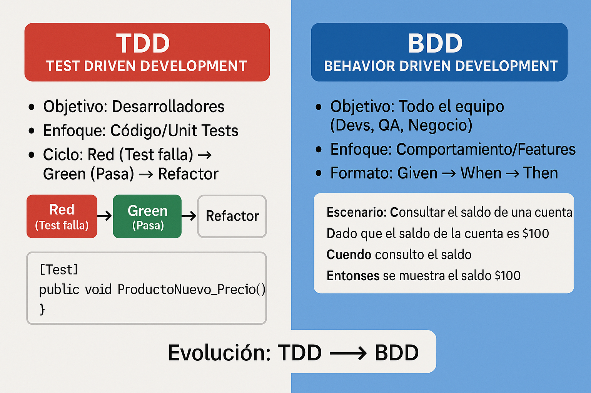
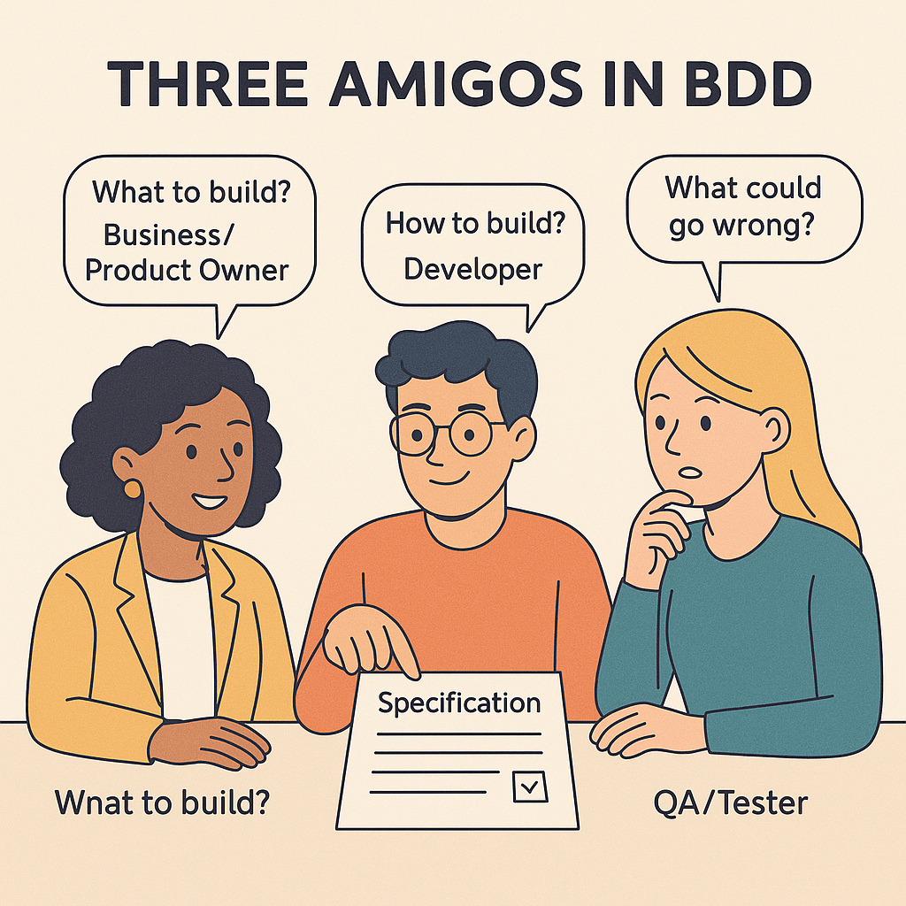
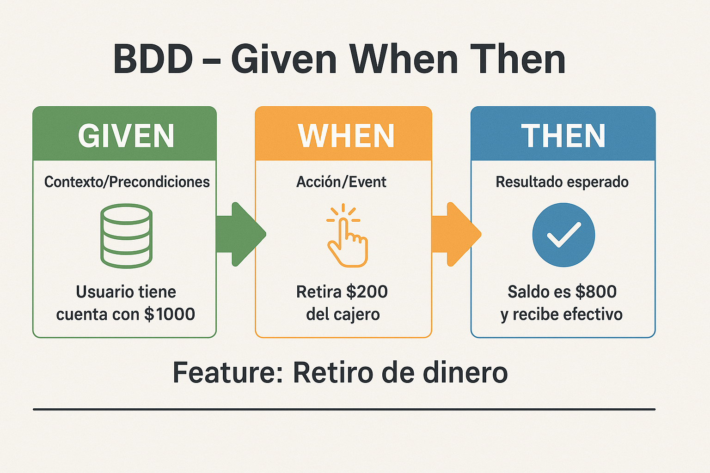

<style>
section {
  font-size: 20px;
  overflow: hidden;
}
img {
  max-width: 70% !important;
  max-height: 50vh !important;
  object-fit: contain !important;
  height: auto !important;
  display: block !important;
  margin: 0 auto !important;
}
section h1 { font-size: 1.8em; }
section h2 { font-size: 1.4em; }
section h3 { font-size: 1.2em; }
section ul, section ol { font-size: 0.9em; margin-left: 1em; }
section li { margin-bottom: 0.3em; }
section pre { font-size: 0.7em; max-height: 60vh; overflow-y: auto; }
section code { font-size: 0.85em; }
section p { margin: 0.5em 0; }
section table { width: 100%; font-size: 0.85em; border-collapse: collapse; margin: 0.5em auto; }
section th { background-color: #1e40af; color: white; padding: 0.4em 0.6em; text-align: left; font-size: 0.9em; border: 1px solid #ddd; }
section td { padding: 0.4em 0.6em; border: 1px solid #ddd; vertical-align: top; word-wrap: break-word; font-size: 0.85em; }
section tbody tr:nth-child(even) { background-color: #f8f9fa; }
section tbody tr:hover { background-color: #e9ecef; }
</style>

---

# BDD - Behavior-Driven Development

<!--
[2026-01-31] - Clase enriquecida con infografías

IMÁGENES GENERADAS:
- clase-06-bdd-given-when-then.png: Diagrama Given-When-Then para BDD
- clase-06-tdd-vs-bdd.png: Comparación TDD vs BDD
-->

**IF0100 - Lenguaje de Programación OO II**
*4° Semestre - Ingeniería Informática*

---

## Objetivos de la Clase

Al finalizar esta clase, el estudiante será capaz de:

1. **Distinguir** entre TDD y BDD
2. **Escribir** escenarios en lenguaje Gherkin
3. **Implementar** pruebas de comportamiento con SpecFlow
4. **Aplicar** el formato Given-When-Then
5. **Comunicar** requisitos de forma comprensible para todos

**Duración:** 90 minutos

---

## Agenda

1. TDD vs BDD: ¿Cuál es la diferencia? (15 min)
2. Gherkin: Lenguaje de especificación (15 min)
3. SpecFlow para .NET (10 min)
4. Escribiendo escenarios BDD (20 min)
5. Implementación de Step Definitions (20 min)
6. Buenas prácticas BDD (10 min)

---

## 1. TDD vs BDD

### Dos enfoques complementarios

{: style="max-width: 60%; max-height: 400px; display: block; margin: 0 auto;"}

---
```
┌─────────────────────────────────────────────────────────────┐
│                    TDD vs BDD                               │
├─────────────────────────────────────────────────────────────┤
│                                                             │
│         TDD (Test Driven Development)                       │
│         ─────────────────────────────                       │
│                                                             │
│   • Enfoque: TÉCNICO                                       │
│   • Audiencia: DESARROLLADORES                             │
│   • Lenguaje: Código (C#, Java)                            │
│   • Prueba: Unidades pequeñas                              │
│   • Pregunta: "¿El código funciona?"                       │
│                                                             │
│   [Fact]
│   public void Sumar_DosNumeros_RetornaSuma()               │
│   {                                                         │
│       Assert.Equal(5, calc.Sumar(2,3));                    │
│   }                                                         │
│                                                             │
├─────────────────────────────────────────────────────────────┤
│                                                             │
│         BDD (Behavior Driven Development)                   │
│         ─────────────────────────────────                   │
│                                                             │
│   • Enfoque: NEGOCIO/COMPORTAMIENTO                        │
│   • Audiencia: TODOS (devs, QA, clientes)                  │
│   • Lenguaje: Natural (español/inglés)                     │
│   • Prueba: Comportamiento del sistema                     │
│   • Pregunta: "¿El sistema hace lo que el usuario espera?" │
│                                                             │
│   Escenario: Sumar dos números                             │
│     Dado que ingreso los números 2 y 3                     │
│     Cuando solicito la suma                                │
│     Entonces el resultado debe ser 5                       │
│                                                             │
└─────────────────────────────────────────────────────────────┘
```

---

## BDD: Concepto Fundamental

### Definición


> **BDD** es una metodología de desarrollo de software que fomenta la colaboración entre desarrolladores, QA y equipos de negocio, utilizando un lenguaje compartido y comprensible para todos.

```
┌─────────────────────────────────────────────────────────────┐
│                  PRINCIPIOS FUNDAMENTALES BDD               │
├─────────────────────────────────────────────────────────────┤
│                                                             │
│  1. LENGUAJE UBIQUO                                         │
│     Un lenguaje compartido entre técnicos y negocio         │
│                                                             │
│  2. ESPECIFICACIÓN EJECUTABLE                               │
│     Los requisitos son pruebas automatizadas                │
│                                                             │
│  3. COMPORTAMIENTO ANTES QUE IMPLEMENTACIÓN                 │
│     "¿Qué debe hacer?" antes de "¿Cómo lo hace?"           │
│                                                             │
│  4. COLABORACIÓN                                            │
│     Three Amigos: Dev + QA + Business                       │
│                                                             │
│  5. DOCUMENTACIÓN VIVA                                      │
│     Las especificaciones siempre están actualizadas         │
│                                                             │
└─────────────────────────────────────────────────────────────┘
```

---

## Los Tres Amigos

### Colaboración clave en BDD

{: style="max-width: 60%; max-height: 400px; display: block; margin: 0 auto;"}

| Rol | Perspectiva | Pregunta clave |
| ----- | ------------- | ---------------- |
| **Negocio (PO)** | Valor | ¿Qué problema resolvemos? |
| **Desarrollador** | Solución | ¿Cómo lo construimos? |
| **Tester (QA)** | Calidad | ¿Qué podría fallar? |

---
### Origen y evolución


```
2003 ──────────────────────────────────────────────────────────────►
  │
  ▼
Dan North crea BDD
como evolución de TDD
para mejorar la comunicación
con stakeholders
  │
  ▼
2006-2008
JBehave (Java), RSpec (Ruby)
primeras herramientas BDD
  │
  ▼
2010-2015
Cucumber (Ruby → multiplataforma)
SpecFlow (.NET)
Behat (PHP)
  │
  ▼
2020+
Gherkin se convierte en estándar
de facto para BDD
Integración con CI/CD pipelines
Living Documentation
```

---
### Origen y evolución


**Dan North:** "BDD is using examples at multiple levels to create a shared understanding and surface uncertainty to deliver software that matters."

---
### Colaboración para definir comportamiento
El triángulo de los tres amigos facilita la comunicación entre QA, desarrollo y negocio.
┌─────────────────────────────────────────────────────────────┐
│                    THE THREE AMIGOS                         │
├─────────────────────────────────────────────────────────────┤
│                                                             │
│                    ┌─────────────┐                          │
│                    │   NEGOCIO   │                          │
│                    │   (PO/BA)   │                          │
│                    │             │                          │
│                    │ "¿Qué valor │                          │
│                    │  entrega?"  │                          │
│                    └──────┬──────┘                          │
│                           │                                 │
│            ┌──────────────┼──────────────┐                 │
│            │              │              │                 │
│            ▼              │              ▼                 │
│     ┌─────────────┐       │       ┌─────────────┐         │
│     │     QA      │◄──────┴──────►│   DESARROLLO│         │
│     │   (Tester)  │               │   (Dev)     │         │
│     │             │               │             │         │
│     │ "¿Cómo lo   │               │ "¿Cómo lo   │         │
│     │  probamos?" │               │  construimos?"│        │
│     └─────────────┘               └─────────────┘         │
│                                                             │
│  REUNIÓN: Discutir historias de usuario antes de desarrollo │
│  RESULTADO: Comprensión compartida, ejemplos concretos      │
│                                                             │
└─────────────────────────────────────────────────────────────┘
```

---

## Palabras Clave de Gherkin
### Vocabulario básico

| Español | Inglés | Propósito |
| --------- | -------- | ----------- |
| `Característica` | `Feature` | Agrupa escenarios relacionados |
| `Antecedentes` | `Background` | Pasos comunes a todos los escenarios |
| `Escenario` | `Scenario` | Caso de prueba específico |
| `Esquema del escenario` | `Scenario Outline` | Plantilla con datos variables |
| `Dado` | `Given` | Precondiciones/contexto inicial |
| `Cuando` | `When` | Acción/evento principal |
| `Entonces` | `Then` | Resultado esperado/verificación |
| `Y` | `And` | Continúa paso anterior |
| `Pero` | `But` | Excepción/alternativa |
| `Ejemplos` | `Examples` | Tabla de datos para esquemas |

---

## Formato Given-When-Then Visual

{: style="max-width: 60%; max-height: 400px; display: block; margin: 0 auto;"}

---
# language: es


```gherkin
Característica: Operaciones matemáticas básicas
  Como usuario de la calculadora
  Quiero realizar operaciones matemáticas
  Para obtener resultados precisos

  Antecedentes:
    Dado que tengo una calculadora

  Escenario: Sumar dos números positivos
    Dado que ingreso el número 5
    Y que ingreso el número 3
    Cuando selecciono la operación suma
    Entonces el resultado debe ser 8

  Escenario: Dividir entre cero
    Dado que ingreso el número 10
    Y que ingreso el número 0
    Cuando selecciono la operación división
    Entonces debe mostrar un error "No se puede dividir entre cero"

  Escenario: Multiplicar números negativos
    Dado que ingreso el número -4
    Y que ingreso el número -3
    Cuando selecciono la operación multiplicación
    Entonces el resultado debe ser 12
```

---
# language: es


---
# language: es


```gherkin
Característica: Retiro de dinero desde cajero automático
  Como cliente del banco
  Quiero retirar dinero desde un cajero
  Para tener efectivo disponible

  Escenario: Retiro exitoso con saldo suficiente
    Dado que tengo una cuenta con saldo de $1000
    Y mi tarjeta está activa
    Cuando intento retirar $200
    Entonces el cajero debe entregarme $200
    Y el saldo de mi cuenta debe ser $800
    Y debo recibir un recibo de la transacción

  Escenario: Retiro fallido por saldo insuficiente
    Dado que tengo una cuenta con saldo de $100
    Cuando intento retirar $200
    Entonces el cajero debe mostrar "Saldo insuficiente"
    Y no debe entregarme dinero
    Y el saldo de mi cuenta debe seguir siendo $100

---
# language: es


  Escenario: Retiro fallido por tarjeta bloqueada
    Dado que tengo una cuenta con saldo de $1000
    Pero mi tarjeta está bloqueada
    Cuando intento retirar $100
    Entonces el cajero debe retener la tarjeta
    Y mostrar "Tarjeta bloqueada. Contacte al banco"
```

---

## Esquema de Escenario con Ejemplos

### Parametrización en Gherkin

```gherkin
# language: es
Característica: Cálculo de descuento
  Como vendedor
  Quiero calcular descuentos automáticamente
  Para ofrecer precios competitivos

  Esquema del escenario: Aplicar descuento según categoría
    Dado un producto con precio <precio>
    Y el cliente es de categoría <categoria>
    Cuando calculo el precio final
    Entonces el descuento debe ser <descuento>%
    Y el precio final debe ser <precio_final>

    Ejemplos:
| precio | categoria | descuento | precio_final |
| 100 | "normal" | 0 | 100 |
| 100 | "frecuente" | 5 | 95 |
| 100 | "vip" | 10 | 90 |
| 200 | "vip" | 10 | 180 |
| 500 | "frecuente" | 5 | 475 |

  # Equivalente a escribir 5 escenarios separados
```

---

## Buenas Prácticas Gherkin

### Escenarios efectivos

```gherkin
✅ HACER:
  • Ser específico y concreto
    "Dado que tengo una cuenta con saldo de $1000"
  
  • Usar lenguaje del dominio de negocio
    "Dado que el cliente tiene estado 'Activo'"
  
  • Un concepto por escenario
    No mezclar "retiro" con "transferencia"
  
  • Datos realistas
    Usar valores que tengan sentido de negocio

❌ EVITAR:
  • Ser demasiado técnico
    "Dado que el campo 'saldo' tiene valor 1000"
  
  • Dependencias entre escenarios
    No asumir que el anterior modificó datos
  
  • Escenarios muy largos
    Más de 10 pasos es señal de alerta
  
  • Lógica de programación
    No usar "if", "for", variables
```

---
# O manualmente


```bash
dotnet new specflowproject -n MiApp.Specs --framework xunit

dotnet new classlib -n MiApp.Specs
dotnet add package SpecFlow.xUnit
dotnet add package SpecFlow.Tools.MsBuild.Generation
dotnet add package FluentAssertions
dotnet add reference ../MiApp/MiApp.csproj
```

```xml
<!-- MiApp.Specs.csproj -->
<Project Sdk="Microsoft.NET.Sdk">
  <PropertyGroup>
    <TargetFramework>net8.0</TargetFramework>
  </PropertyGroup>

  <ItemGroup>
    <PackageReference Include="SpecFlow.xUnit" Version="3.9.74" />
    <PackageReference Include="SpecFlow.Tools.MsBuild.Generation" Version="3.9.74" />
    <PackageReference Include="FluentAssertions" Version="6.12.0" />
    <PackageReference Include="xunit" Version="2.6.2" />
  </ItemGroup>

---
# O manualmente


  <ItemGroup>
    <ProjectReference Include="..\MiApp\MiApp.csproj" />
  </ItemGroup>
</Project>
```

---

## Estructura SpecFlow

### Archivos y carpetas

```
MiApp.Specs/
├── Features/                    ← Archivos .feature (Gherkin)
│   ├── Calculadora.feature
│   └── RetiroCajero.feature
│
├── StepDefinitions/             ← C# que implementa pasos
│   ├── CalculadoraSteps.cs
│   └── RetiroCajeroSteps.cs
│
├── Hooks/                       ← Configuración global
│   └── Hooks.cs
│
├── Drivers/                     ← Helpers y utilidades
│   └── CalculadoraDriver.cs
│
└── MiApp.Specs.csproj
```

---
## 4. Escribiendo Escenarios BDD
---
# language: es

```gherkin
Característica: Gestión de calificaciones estudiantiles
  Como profesor
  Quiero registrar y consultar calificaciones
  Para llevar el control académico

  Antecedentes:
    Dado el estudiante con código "2024001"
    Y nombre "María López"

  Escenario: Registrar calificaciones exitosamente
    Dado que el estudiante está inscrito en "Matemáticas"
    Cuando registro las notas:
| Parcial | Nota |
| 1 | 4.5 |
| 2 | 3.8 |
| 3 | 4.2 |
    Entonces el promedio debe ser 4.17
    Y el estado debe ser "Aprobado"

  Escenario: Estudiante reprueba por promedio bajo
    Dado que el estudiante está inscrito en "Física"
    Cuando registro las notas:
| Parcial | Nota |
| 1 | 2.5 |
| 2 | 2.8 |
| 3 | 2.0 |
    Entonces el promedio debe ser 2.43
    Y el estado debe ser "Reprobado"

---
# language: es


  Escenario: Validar notas fuera de rango
    Cuando intento registrar una nota de 6.5
    Entonces debe mostrar el error "La nota debe estar entre 0.0 y 5.0"
```
---
## 5. Implementación de Step Definitions
---
### Conectando Gherkin con C#

```csharp
// StepDefinitions/CalificacionesSteps.cs

using TechTalk.SpecFlow;
using FluentAssertions;
using MiApp;

namespace MiApp.Specs.StepDefinitions
{
    [Binding]  // ← Atributo obligatorio
    public class CalificacionesSteps
    {
        // Contexto compartido entre pasos
        private readonly EscenarioContext _context;
        private Estudiante _estudiante;
        private double _promedio;
        private string _estado;
        private Exception _excepcion;

        public CalificacionesSteps(EscenarioContext context)
        {
            _context = context;
        }

---
### Conectando Gherkin con C#


        [Given(@"el estudiante con código ""([^""]*)",")]
        public void DadoElEstudianteConCodigo(string codigo)
        {
            _estudiante = new Estudiante { Codigo = codigo };
        }

        [Given(@"nombre ""([^""]*)",")]
        public void DadoNombre(string nombre)
        {
            _estudiante.Nombre = nombre;
        }
    }
}
```
---
## Step Definitions (continuación)

```csharp
[Given(@"que el estudiante está inscrito en ""([^""]*)",")]
public void DadoQueElEstudianteEstaInscritoEn(string materia)
{
    _estudiante.InscribirMateria(materia);
}

[When(@"registro las notas:")]
public void CuandoRegistroLasNotas(Table tabla)
{
    // SpecFlow convierte tablas automáticamente
    foreach (var fila in tabla.Rows)
    {
        int parcial = int.Parse(fila["Parcial"]);
        double nota = double.Parse(fila["Nota"]);
        _estudiante.RegistrarNota(parcial, nota);
    }
    
    _promedio = _estudiante.CalcularPromedio();
    _estado = _estudiante.ObtenerEstado();
}

---
## Step Definitions (continuación)


[Then(@"el promedio debe ser (.*)")]
public void EntoncesElPromedioDebeSer(double esperado)
{
    _promedio.Should().BeApproximately(esperado, 0.01);
}

[Then(@"el estado debe ser ""([^""]*)"")]
public void EntoncesElEstadoDebeSer(string esperado)
{
    _estado.Should().Be(esperado);
}
```

---

## Paso con Excepciones

### Manejo de errores en BDD

```csharp
[When(@"intento registrar una nota de (.*)")]
public void CuandoIntentoRegistrarUnaNotaDe(double nota)
{
    try
    {
        _estudiante.RegistrarNota(1, nota);
    }
    catch (Exception ex)
    {
        _excepcion = ex;  // Capturamos la excepción
    }
}

[Then(@"debe mostrar el error ""([^""]*)",")]
public void EntoncesDebeMostrarElError(string mensajeEsperado)
{
    _excepcion.Should().NotBeNull();
    _excepcion.Message.Should().Contain(mensajeEsperado);
}
```

---
## Tags en SpecFlow

### Organización y ejecución selectiva

```gherkin
# language: es
@integration
@database
Característica: Gestión de pedidos
  Como cliente
  Quiero realizar pedidos
  Para recibir productos

  @smoke @critical
  Escenario: Crear pedido exitosamente
    Dado que estoy autenticado como cliente
    Cuando creo un pedido con 3 productos
    Entonces el pedido debe guardarse en BD
    Y debo recibir confirmación

  @ui
  Escenario: Validar carrito vacío
    Dado que no tengo productos en el carrito
    Cuando intento finalizar compra
    Entonces debo ver mensaje "Carrito vacío"

  @slow
  Escenario: Procesamiento de pago externo
    Dado que tengo un pedido pendiente
    Cuando proceso el pago
    Entonces el pago debe confirmarse
```

```bash
# Ejecutar por tags
dotnet test --filter "@smoke"
dotnet test --filter "@critical"
dotnet test --filter "@integration and @database"
dotnet test --filter "@ui"
dotnet test --filter "not @slow"

# En Visual Studio: Test Explorer → Traits
```

---

## ScenarioContext

### Compartir datos entre pasos

```csharp
[Binding]
public class PedidoSteps
{
    private readonly ScenarioContext _context;

    public PedidoSteps(ScenarioContext context)
    {
        _context = context;
    }

    [Given(@"que tengo (.*) productos en el carrito")]
    public void DadoQueTengoProductosEnElCarrito(int cantidad)
    {
        var carrito = new CarritoDeCompras();
        for (int i = 0; i < cantidad; i++)
        {
            carrito.AgregarProducto(new Producto { Precio = 100 });
        }

        // Guardar en contexto para usar en otros pasos
        _context["carrito"] = carrito;
        _context["cantidad_productos"] = cantidad;
    }

    [When(@"finalizo la compra")]
    public void CuandoFinalizoLaCompra()
    {
        // Recuperar del contexto
        var carrito = _context.Get<CarritoDeCompras>("carrito");
        var pedido = carrito.FinalizarCompra();

        // Guardar resultado para verificación
        _context["pedido"] = pedido;
    }

    [Then(@"el total debe ser (.*)")]
    public void EntoncesElTotalDebeSer(decimal totalEsperado)
    {
        var pedido = _context.Get<Pedido>("pedido");
        pedido.Total.Should().Be(totalEsperado);
    }

    [Then(@"el número de items debe ser (.*)")]
    public void EntoncesElNumeroDeItemsDebeSer(int itemsEsperados)
    {
        var cantidad = _context.Get<int>("cantidad_productos");
        cantidad.Should().Be(itemsEsperados);
    }
}
```

---

## Hooks en SpecFlow
---
### Configuración global

```csharp
// Hooks/Hooks.cs
using TechTalk.SpecFlow;

namespace MiApp.Specs.Hooks
{
    [Binding]
    public class Hooks
    {
        // Se ejecuta antes de TODOS los escenarios
        [BeforeTestRun]
        public static void BeforeTestRun()
        {
            // Configuración inicial (base de datos, servicios)
        }

        // Se ejecuta antes de CADA escenario
        [BeforeScenario]
        public void BeforeScenario()
        {
            // Resetear estado, limpiar datos
        }

---
### Configuración global


        // Se ejecuta después de CADA escenario
        [AfterScenario]
        public void AfterScenario()
        {
            // Limpiar recursos, cerrar conexiones
        }

        // Se ejecuta después de TODOS los escenarios
        [AfterTestRun]
        public static void AfterTestRun()
        {
            // Limpieza final
        }
    }
}
```
---

## Ejecutar Pruebas SpecFlow

### En Visual Studio y CLI

```bash
# Ejecutar todas las pruebas SpecFlow
dotnet test

# Ejecutar con salida detallada
dotnet test --logger:"console;verbosity=detailed"

# Ejecutar feature específico
dotnet test --filter "FullyQualifiedName~Calculadora"

# Generar reporte de resultados
dotnet test --logger "html;LogFileName=resultados.html"

# Con cobertura
dotnet test --collect:"XPlat Code Coverage"
```

**En Visual Studio:**
- Test Explorer muestra escenarios como árbol
- Se puede ejecutar escenario individual
- Integración con IntelliSense

---

## 6. Buenas Prácticas BDD

### Anti-patrones a evitar

```gherkin
❌ ANTI-PATRÓN: UI-centric (demasiado técnico)

Escenario: Login fallido
  Dado que hago click en el campo username
  Y escribo "usuario" en el input
  Y hago click en el campo password
  Y escribo "123" en el input
  Y hago click en el botón submit
  Entonces debo ver el mensaje de error

---

✅ BUENO: Centrado en comportamiento de negocio

Escenario: Autenticación fallida con credenciales inválidas
  Dado que soy un usuario registrado
  Cuando intento iniciar sesión con credenciales inválidas
  Entonces el sistema debe rechazar el acceso
  Y mostrar un mensaje de error de autenticación
```

---

## Más Buenas Prácticas

### Checklist BDD

```
✅ NIVEL DE ABSTRACCIÓN
   • Los pasos describen QUÉ, no CÓMO
   • "Dado que tengo $1000 en mi cuenta"
   • NO: "Dado que el campo 'saldo' tiene el valor 1000"

✅ INDEPENDENCIA
   • Cada escenario debe poder ejecutarse solo
   • No depender del estado de otros escenarios
   • Usar Background para setup común

✅ LEGIBILIDAD
   • Cualquier persona del negocio debe entenderlo
   • Evitar términos técnicos (IDs, campos, tablas)
   • Usar lenguaje del dominio

✅ ESPECIFICIDAD
   • Datos concretos, no genéricos
   • "1000" mejor que "un saldo"
   • "María López" mejor que "un usuario"

✅ ATOMICIDAD
   • Un escenario = un comportamiento
   • Si tiene "Y" en Then, considerar dividir
```

---
### Documentación que nunca se desactualiza


```
┌─────────────────────────────────────────────────────────────┐
│                 DOCUMENTACIÓN VIVA                          │
├─────────────────────────────────────────────────────────────┤
│                                                             │
│   CÓDIGO (C#)          PRUEBAS (Gherkin)         REPORTE    │
│      ↓                      ↓                      ↓        │
│   ┌──────┐             ┌──────────┐           ┌────────┐   │
│   │Calcul│─────────────▶│*.feature │───────────▶│Pickles │   │
│   │adora │             │Escenarios│           │Report  │   │
│   └──────┘             └──────────┘           └────────┘   │
│                                                             │
│   Herramientas para generar documentación:                  │
│   • Pickles (genera HTML/PDF/Word desde .feature)          │
│   • SpecFlow+ LivingDoc (integrado con Azure DevOps)       │
│   • ReportPortal (dashboard de resultados)                 │
│                                                             │
│   Resultado:                                                │
│   Documentación siempre actualizada porque                 │
│   los tests FALLAN si el comportamiento cambia             │
│                                                             │
└─────────────────────────────────────────────────────────────┘
```

---

## Resumen de la Clase

| Concepto | Descripción |
| ---------- | ------------- |
| **BDD** | Desarrollo guiado por comportamiento de negocio |
| **Gherkin** | Lenguaje estructurado para especificaciones |
| **Given-When-Then** | Dado-Cuando-Entonces (formato escenarios) |
| **SpecFlow** | Implementación BDD para .NET |
| **Feature** | Archivo .feature con escenarios |
| **Step Definitions** | C# que implementa pasos Gherkin |
| **Living Documentation** | Documentación auto-actualizable |

---

## Ejercicio Práctico

### Taller: BDD para Biblioteca

```gherkin
Ejercicio: Crear escenarios BDD para sistema de biblioteca

Contexto:
- Usuarios pueden pedir libros prestados
- Cada libro tiene un plazo de devolución
- Hay multas por retraso
- Usuarios tienen un límite de libros simultáneos

Tareas:
1. Escribir feature "Préstamo de libros"
2. Crear 3 escenarios:
   a. Préstamo exitoso
   b. Préstamo fallido por límite alcanzado
   c. Devolución con retraso (multa)
3. Implementar Step Definitions
4. Ejecutar y verificar
```

**SOLUCIÓN COMPLETA:**

```gherkin
# language: es
Característica: Préstamo de libros
  Como usuario de la biblioteca
  Quiero solicitar libros prestados
  Para poder leerlos en casa

  Antecedentes:
    Dado que soy un usuario registrado
    Y mi estado es "Activo"

  @smoke
  Escenario: Préstamo exitoso dentro del límite
    Dado que tengo 2 libros prestados actualmente
    Y el límite de préstamos es 5 libros
    Cuando solicito el préstamo del libro "C# 10 en profundidad"
    Entonces el préstamo debe ser aprobado
    Y el libro debe agregarse a mis préstamos activos
    Y la fecha de devolución debe ser dentro de 14 días

  Escenario: Préstamo fallido por límite alcanzado
    Dado que tengo 5 libros prestados actualmente
    Y el límite de préstamos es 5 libros
    Cuando solicito el préstamo del libro "Clean Code"
    Entonces el préstamo debe ser rechazado
    Y debo ver el mensaje "Has alcanzado el límite de préstamos"

  Escenario: Devolución con retraso genera multa
    Dado que tengo prestado el libro "Domain-Driven Design"
    Y la fecha de devolución fue hace 5 días
    Y la multa diaria es de $500
    Cuando devuelvo el libro hoy
    Entonces debo pagar una multa de $2500
    Y el libro debe marcarse como disponible
```

**STEP DEFINITIONS:**

```csharp
[Binding]
public class BibliotecaSteps
{
    private Usuario _usuario;
    private Libro _libro;
    private Prestamo _prestamo;
    private decimal _multaCalculada;
    private string _mensajeError;

    [Given(@"que soy un usuario registrado")]
    public void DadoQueSoyUnUsuarioRegistrado()
    {
        _usuario = new Usuario { Estado = "Activo" };
    }

    [Given(@"mi estado es ""([^""]*)""")]
    public void DadoMiEstadoEs(string estado)
    {
        _usuario.Estado = estado;
    }

    [Given(@"que tengo (.*) libros prestados actualmente")]
    public void DadoQueTengoLibrosPrestadosActualmente(int cantidad)
    {
        for (int i = 0; i < cantidad; i++)
        {
            _usuario.AgregarPrestamo(new Prestamo());
        }
    }

    [Given(@"el límite de préstamos es (.*) libros")]
    public void DadoElLimiteDePrestamosEs(int limite)
    {
        _usuario.LimitePrestamos = limite;
    }

    [When(@"solicito el préstamo del libro ""([^""]*)""")]
    public void CuandoSolicitoElPrestamoDelLibro(string tituloLibro)
    {
        _libro = new Libro { Titulo = tituloLibro, Disponible = true };

        try
        {
            _prestamo = _usuario.SolicitarPrestamo(_libro);
        }
        catch (InvalidOperationException ex)
        {
            _mensajeError = ex.Message;
        }
    }

    [Then(@"el préstamo debe ser aprobado")]
    public void EntoncesElPrestamoDebeSerAprobado()
    {
        _prestamo.Should().NotBeNull();
        _prestamo.Estado.Should().Be("Activo");
    }

    [Then(@"el préstamo debe ser rechazado")]
    public void EntoncesElPrestamoDebeSerRechazado()
    {
        _prestamo.Should().BeNull();
    }

    [Then(@"debo ver el mensaje ""([^""]*)""")]
    public void EntoncesDeboVerElMensaje(string mensaje)
    {
        _mensajeError.Should().Contain(mensaje);
    }
}
```

---
### ¿Cuándo usar cada metodología?
Comparación entre TDD y BDD para elegir la metodología adecuada.
┌─────────────────────────────────────────────────────────────┐
│                    TDD vs BDD: RESUMEN                      │
├─────────────────────────────────────────────────────────────┤
│                                                             │
│                    ┌─────────────┐                          │
│                    │    TDD      │                          │
│                    │    BDD      │                          │
│                    │   juntos    │                          │
│                    └──────┬──────┘                          │
│                           │                                 │
│           ┌───────────────┼───────────────┐                │
│           │               │               │                │
│           ▼               ▼               ▼                │
│      NIVEL MACRO      NIVEL MICRO     CI/CD PIPELINE      │
│      (BDD)            (TDD)                                 │
│                                                             │
│  Características:       Pruebas unitarias:                  │
│  - Historias de usuario  - Lógica interna                   │
│  - Flujo de negocio      - Algoritmos                       │
│  - Integración           - Validaciones                     │
│  - E2E tests                                            │
│                                                             │
│  Uso: Desarrolladores + Uso: Solo desarrolladores          │
│  Negocio + QA                                                │
│                                                             │
│  RECOMENDACIÓN: Usar ambos juntos                          │
│  • BDD para definir comportamiento de alto nivel           │
│  • TDD para implementar detalles internos                  │
│                                                             │
└─────────────────────────────────────────────────────────────┘
```

---

## Próxima Clase

### Domain Driven Design (DDD)

```
CLASE 7: DOMAIN DRIVEN DESIGN

• Dominio vs Infraestructura
• Entities y Value Objects
• Aggregates y Aggregate Roots
• Repositories
• Services de Dominio
• Ubiquitous Language
• Bounded Contexts
```

---

# ¡Gracias!
## ¿Preguntas?

**"El software es comportamiento, no código"**

**UNAULA - Ingeniería Informática - 2026-I**
