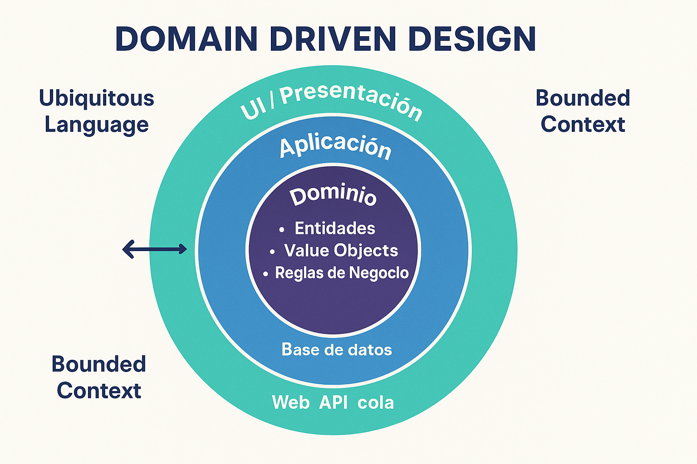

<style>
img {
  max-width: 65% !important;
  max-height: 45vh !important;
  object-fit: contain !important;
  height: auto !important;
}
section {
  font-size: 24px;
}
</style>


<!--
IMÁGENES GENERADAS:
- clase-07-ddd-arquitectura.png: Arquitectura Domain Driven Design con capas y bloques de construcción
-->

# Clase 7: Domain Driven Design (DDD)
## Diseño guiado por el dominio

**IF0100 - Lenguaje de Programación OO II**
*4° Semestre - Ingeniería Informática*

---

## Objetivos de la Clase

Al finalizar esta clase, el estudiante será capaz de:

1. **Comprender** los fundamentos de Domain Driven Design
2. **Distinguir** entre Entities, Value Objects y Aggregates
3. **Aplicar** el patrón Repository para persistencia
4. **Identificar** Bounded Contexts en un sistema
5. **Implementar** una arquitectura en capas con DDD

**Duración:** 90 minutos

---

## Agenda

1. ¿Qué es DDD? (10 min)
2. Ubiquitous Language (10 min)
3. Entities vs Value Objects (15 min)
4. Aggregates y Aggregate Roots (15 min)
5. Repositories y Services (15 min)
6. Arquitectura en Capas (15 min)
7. Ejemplo práctico: Sistema de Pedidos (10 min)

---

## 1. ¿Qué es DDD?

### Domain Driven Design

> **DDD** es un enfoque de diseño de software que se centra en modelar el software según el dominio del negocio, utilizando un lenguaje común (Ubiquitous Language) entre desarrolladores y expertos del dominio.

```
┌─────────────────────────────────────────────────────────────┐
│              DOMAIN DRIVEN DESIGN (Eric Evans, 2003)        │
├─────────────────────────────────────────────────────────────┤
│                                                             │
│   PROBLEMA QUE RESUELVE:                                    │
│                                                             │
│   Desarrolladores ↔ Expertos de Negocio                    │
│         ↓                    ↓                              │
│   "UserController"     "El cliente tiene un pedido"        │
│   "Tabla Pedidos"      "en estado pendiente de pago"       │
│   "DTO OrderDTO"                                          │
│                                                             │
│   ❌ No se entienden                                      │
│   ❌ Modelo técnico ≠ Modelo mental del negocio            │
│   ❌ Software no refleja el dominio                        │
│                                                             │
│   SOLUCIÓN DDD:                                             │
│   • Mismo lenguaje (técnicos y negocio)                    │
│   • Modelo profundo del dominio                            │
│   • Software = expresión del dominio                       │
│                                                             │
└─────────────────────────────────────────────────────────────┘
```

---

## Cuándo usar DDD

### No es para todos los proyectos

```
┌─────────────────────────────────────────────────────────────┐
│              ¿CUÁNDO USAR DDD?                              │
├─────────────────────────────────────────────────────────────┤
│                                                             │
│   ✅ USAR DDD cuando:                                       │
│                                                             │
│   • Complejidad de negocio es ALTA                          │
│     (reglas complejas, flujos elaborados)                  │
│                                                             │
│   • El dominio es crítico y cambia frecuentemente          │
│                                                             │
│   • Hay expertos de dominio disponibles                    │
│     (personas que conocen el negocio a fondo)              │
│                                                             │
│   • El proyecto es de larga duración                        │
│     (meses/años de desarrollo)                             │
│                                                             │
│   • El software es estratégico para el negocio             │
│                                                             │
├─────────────────────────────────────────────────────────────┤
│                                                             │
│   ❌ NO usar DDD cuando:                                    │
│                                                             │
│   • CRUD simple (poca lógica de negocio)                   │
│   • Proyectos pequeños o de corta duración                 │
│   • No hay acceso a expertos de dominio                    │
│   • Prototipos o MVPs rápidos                              │
│                                                             │
└─────────────────────────────────────────────────────────────┘
```

---

## Componentes de DDD

### Bloques de construcción tácticos

```
┌─────────────────────────────────────────────────────────────┐
│           BLOQUES DE CONSTRUCCIÓN TÁCTICOS DDD              │
├─────────────────────────────────────────────────────────────┤
│                                                             │
│   MODELO DEL DOMINIO                                        │
│   ┌─────────────────────────────────────────────────────┐   │
│   │                                                     │   │
│   │  ┌────────────┐    ┌────────────┐                 │   │
│   │  │  Entity    │    │Value Object│                 │   │
│   │  │ (identidad)│    │ (sin ident)│                 │   │
│   │  └─────┬──────┘    └─────┬──────┘                 │   │
│   │        │                 │                        │   │
│   │        └────────┬────────┘                        │   │
│   │                 ▼                                 │   │
│   │         ┌──────────────┐                         │   │
│   │         │  Aggregate   │                         │   │
│   │         │    Root      │                         │   │
│   │         └──────┬───────┘                         │   │
│   │                │                                  │   │
│   │         ┌──────┴──────┐                         │   │
│   │         ▼             ▼                         │   │
│   │   ┌──────────┐   ┌──────────┐                  │   │
│   │   │Repository│   │  Domain  │                  │   │
│   │   │          │   │ Service  │                  │   │
│   │   └──────────┘   └──────────┘                  │   │
│   │                                                     │   │
│   └─────────────────────────────────────────────────────┘   │
│                                                             │
└─────────────────────────────────────────────────────────────┘
```

---

## 2. Ubiquitous Language

### Lenguaje ubicuo

> **Ubiquitous Language** es un lenguaje compartido y estricto entre desarrolladores y expertos del dominio, usado en todo el ciclo de vida del proyecto.

```
┌─────────────────────────────────────────────────────────────┐
│               UBIQUITOUS LANGUAGE                           │
├─────────────────────────────────────────────────────────────┤
│                                                             │
│   ❌ SIN UBIQUITOUS LANGUAGE:                               │
│                                                             │
│   Desarrollador          Negocio              Base de Datos │
│   ─────────────────────────────────────────────────────    │
│   "UserController"       "El cliente"         "tabla_users" │
│   "OrderDTO"             "hace un pedido"     "orders"      │
│   "save()"               "registra"           "INSERT"      │
│   "status = 1"           "está pendiente"     "status_id"   │
│                                                             │
│   → Tres lenguajes diferentes → Confusión → Bugs           │
│                                                             │
├─────────────────────────────────────────────────────────────┤
│                                                             │
│   ✅ CON UBIQUITOUS LANGUAGE:                               │
│                                                             │
│   Todos usan:                                               │
│   • "Cliente" (no User, no usuario)                        │
│   • "RealizarPedido" (no save, no createOrder)             │
│   • "PedidoPendiente" (no status = 1)                      │
│   • "ConfirmarPago" (no updatePaymentStatus)               │
│                                                             │
│   → Un solo lenguaje → Comprensión compartida → Calidad    │
│                                                             │
└─────────────────────────────────────────────────────────────┘
```

---

## Ejemplo: Lenguaje Ubicuo

### Tienda en línea

```csharp
// ❌ ANTES: Lenguaje técnico
public class OrderController 
{
    public IActionResult CreateOrder(OrderDTO dto) 
    {
        var order = new Order {
            CustomerId = dto.CustomerId,
            Items = dto.Items,
            Status = 1  // ¿Qué es 1?
        };
        _db.Orders.Add(order);
        _db.SaveChanges();
        return Ok(order.Id);
    }
}

// ✅ DESPUÉS: Ubiquitous Language
public class RealizarPedidoHandler 
{
    public PedidoRealizado Handle(RealizarPedidoCommand command) 
    {
        var cliente = _clientes.Obtener(command.ClienteId);
        var pedido = cliente.RealizarPedido(command.Items);
        _pedidos.Guardar(pedido);
        return new PedidoRealizado(pedido.Id);
    }
}

// Lenguaje del negocio en el código:
// - Cliente (no User)
// - RealizarPedido (no CreateOrder)
// - PedidoRealizado (no OrderCreated)
```

---

## 3. Entities vs Value Objects

### Distinguiendo objetos del dominio

```
┌─────────────────────────────────────────────────────────────┐
│              ENTITIES vs VALUE OBJECTS                      │
├─────────────────────────────────────────────────────────────┤
│                                                             │
│   ┌─────────────────────┐    ┌─────────────────────┐       │
│   │      ENTITY         │    │    VALUE OBJECT     │       │
│   │                     │    │                     │       │
│   │ Definida por:       │    │ Definida por:       │       │
│   │ IDENTIDAD           │    │ ATRIBUTOS           │       │
│   │                     │    │                     │       │
│   │ • Tiene ID único    │    │ • Sin identidad     │       │
│   │ • Mutable           │    │ • Inmutable         │       │
│   │ • Seguimos la       │    │ • Reemplazable      │       │
│   │   misma instancia   │    │ • Comparación por   │       │
│   │   aunque cambien    │    │   valor             │       │
│   │   atributos         │    │                     │       │
│   │                     │    │                     │       │
│   └─────────────────────┘    └─────────────────────┘       │
│                                                             │
│   EJEMPLO Entity:         EJEMPLO Value Object:            │
│   • Cliente (mismo ID     • Dinero (100 USD = 100 USD)     │
│     aunque cambie email)  • Dirección (calle, ciudad)      │
│   • Pedido (mismo ID      • Email (texto@dominio.com)      │
│     aunque cambie estado) • Color (RGB)                    │
│                                                             │
└─────────────────────────────────────────────────────────────┘
```

---

## Entity en C#

### Implementación

```csharp
// ENTITY: Cliente
// Tiene identidad única que persiste durante todo su ciclo de vida

public class Cliente
{
    // Identidad - Lo define como Entity
    public ClienteId Id { get; private set; }
    
    // Atributos - Pueden cambiar
    public string Nombre { get; private set; }
    public Email Email { get; private set; }
    public Direccion Direccion { get; private set; }
    public DateTime FechaRegistro { get; private set; }
    
    // Constructor para crear
    public Cliente(ClienteId id, string nombre, Email email)
    {
        Id = id ?? throw new ArgumentNullException(nameof(id));
        Nombre = !string.IsNullOrWhiteSpace(nombre) ? nombre 
            : throw new ArgumentException("Nombre requerido");
        Email = email ?? throw new ArgumentNullException(nameof(email));
        FechaRegistro = DateTime.UtcNow;
    }
    
    // Comportamientos del dominio
    public void CambiarEmail(Email nuevoEmail)
    {
        Email = nuevoEmail;
        // Evento de dominio: EmailCambiado
    }
    
    public void ActualizarDireccion(Direccion nuevaDireccion)
    {
        Direccion = nuevaDireccion;
    }
    
    // Equals basado en identidad
    public override bool Equals(object obj)
    {
        if (obj is not Cliente other) return false;
        return Id.Equals(other.Id);
    }
    
    public override int GetHashCode() => Id.GetHashCode();
}
```

---

## Value Object en C#

### Implementación inmutable

```csharp
// VALUE OBJECT: Dinero
// Definido completamente por sus atributos

public class Dinero : IEquatable<Dinero>
{
    public decimal Monto { get; }
    public string Moneda { get; }  // USD, EUR, COP
    
    public Dinero(decimal monto, string moneda)
    {
        if (monto < 0) throw new ArgumentException("Monto no puede ser negativo");
        Monto = monto;
        Moneda = !string.IsNullOrEmpty(moneda) ? moneda 
            : throw new ArgumentException("Moneda requerida");
    }
    
    // Inmutable: operaciones retornan nuevas instancias
    public Dinero Sumar(Dinero otro)
    {
        if (Moneda != otro.Moneda)
            throw new InvalidOperationException("No se pueden sumar monedas diferentes");
        return new Dinero(Monto + otro.Monto, Moneda);
    }
    
    public Dinero AplicarDescuento(decimal porcentaje)
    {
        var descuento = Monto * (porcentaje / 100);
        return new Dinero(Monto - descuento, Moneda);
    }
    
    // Comparación por valor (todos los atributos)
    public bool Equals(Dinero otro)
    {
        if (otro is null) return false;
        return Monto == otro.Monto && Moneda == otro.Moneda;
    }
    
    public override bool Equals(object obj) => Equals(obj as Dinero);
    public override int GetHashCode() => HashCode.Combine(Monto, Moneda);
    
    // Factory methods
    public static Dinero Pesos(decimal monto) => new Dinero(monto, "COP");
    public static Dinero Dolares(decimal monto) => new Dinero(monto, "USD");
}

// Uso
var precio = Dinero.Pesos(50000);
var descuento = precio.AplicarDescuento(10);  // 45000 COP
```

---

## Value Object: Dirección

### Otro ejemplo clásico

```csharp
public class Direccion : IEquatable<Direccion>
{
    public string Calle { get; }
    public string Ciudad { get; }
    public string CodigoPostal { get; }
    public string Pais { get; }
    
    public Direccion(string calle, string ciudad, string codigoPostal, string pais)
    {
        Calle = calle;
        Ciudad = ciudad;
        CodigoPostal = codigoPostal;
        Pais = pais;
    }
    
    // Value Objects son inmutables
    // Si cambia algo, se crea una nueva instancia
    public Direccion CambiarCalle(string nuevaCalle)
    {
        return new Direccion(nuevaCalle, Ciudad, CodigoPostal, Pais);
    }
    
    public bool Equals(Direccion otro)
    {
        if (otro is null) return false;
        return Calle == otro.Calle &&
               Ciudad == otro.Ciudad &&
               CodigoPostal == otro.CodigoPostal &&
               Pais == otro.Pais;
    }
    
    public override string ToString()
    {
        return $"{Calle}, {Ciudad}, {CodigoPostal}, {Pais}";
    }
}

// Uso
var direccion1 = new Direccion("Calle 123", "Medellín", "050001", "Colombia");
var direccion2 = new Direccion("Calle 123", "Medellín", "050001", "Colombia");

Console.WriteLine(direccion1 == direccion2);  // True (mismo valor)
// No importa si son instancias diferentes
```

---

## 4. Aggregates y Aggregate Roots

### Agrupación coherente de objetos

```
┌─────────────────────────────────────────────────────────────┐
│                    AGGREGATE PATTERN                        │
├─────────────────────────────────────────────────────────────┤
│                                                             │
│   AGGREGATE = Grupo de Entities y Value Objects que        │
│   se tratan como una unidad para cambios de datos          │
│                                                             │
│   ┌─────────────────────────────────────────────────────┐   │
│   │              AGGREGATE: Pedido                      │   │
│   │                                                     │   │
│   │  ┌─────────────────────────────────────────────┐   │   │
│   │  │       AGGREGATE ROOT: Pedido                │   │   │
│   │  │       (Entity - tiene ID)                   │   │   │
│   │  │                                             │   │   │
│   │  │  Id: PedidoId                               │   │   │
│   │  │  Fecha: DateTime                            │   │   │
│   │  │  Estado: EstadoPedido                       │   │   │
│   │  │  Total: Dinero                              │   │   │
│   │  │  ClienteId: ClienteId  ← Referencia externa │   │   │
│   │  │                                             │   │   │
│   │  └─────────────────────────────────────────────┘   │   │
│   │            │                                      │   │
│   │            ▼                                      │   │
│   │  ┌─────────────────────────────────────────────┐   │   │
│   │  │   ENTITIES INTERNAS: LíneaPedido            │   │   │
│   │  │   (solo accesibles vía Pedido)              │   │   │
│   │  │                                             │   │   │
│   │  │  • LíneaPedido 1: Producto X, Cantidad 2   │   │   │
│   │  │  • LíneaPedido 2: Producto Y, Cantidad 1   │   │   │
│   │  │                                             │   │   │
│   │  └─────────────────────────────────────────────┘   │   │
│   │                                                     │   │
│   │  FRONTERA DEL AGGREGATE: Solo el Root es           │   │
│   │  accesible desde fuera. Las líneas se acceden      │   │
│   │  mediante el pedido.                               │   │
│   │                                                     │   │
│   └─────────────────────────────────────────────────────┘   │
│                                                             │
└─────────────────────────────────────────────────────────────┘
```

---

## Reglas de Aggregates

### Invariantes y consistencia

```
┌─────────────────────────────────────────────────────────────┐
│           REGLAS DE LOS AGGREGATES                          │
├─────────────────────────────────────────────────────────────┤
│                                                             │
│  1️⃣ SOLO EL AGGREGATE ROOT ES ACCESIBLE DESDE FUERA         │
│                                                             │
│     // ✅ Correcto
│     var pedido = repositorio.Obtener(pedidoId);
│     pedido.AgregarProducto(producto, cantidad);
│     
│     // ❌ Incorrecto (rompe encapsulamiento)
│     var linea = pedido.Lineas[0];  // Acceso directo
│     linea.Cantidad = 100;          // Modificación externa
│                                                             │
│  2️⃣ LAS REFERENCIAS ENTRE AGGREGATES SON POR ID             │
│                                                             │
│     public class Pedido {
│         public ClienteId ClienteId { get; }  // ✅ Por ID
│         // NO: public Cliente Cliente { get; }  // ❌ Objeto completo
│     }
│                                                             │
│  3️⃣ UNA TRANSACCIÓN MODIFICA UN SOLO AGGREGATE              │
│                                                             │
│     • Si modificas un Pedido, no modificas el Cliente       │
│       en la misma transacción                              │
│     • Mantiene consistencia y reduce locking               │
│                                                             │
└─────────────────────────────────────────────────────────────┘
```

---

## Implementación Aggregate Pedido

```csharp
// AGGREGATE ROOT
public class Pedido
{
    public PedidoId Id { get; private set; }
    public ClienteId ClienteId { get; private set; }
    public DateTime Fecha { get; private set; }
    public EstadoPedido Estado { get; private set; }
    public Direccion DireccionEntrega { get; private set; }
    
    // Colección interna - solo modificable mediante métodos del Aggregate
    private readonly List<LineaPedido> _lineas;
    public IReadOnlyCollection<LineaPedido> Lineas => _lineas.AsReadOnly();
    
    // Constructor (solo para crear nuevos pedidos)
    public Pedido(PedidoId id, ClienteId clienteId, Direccion direccion)
    {
        Id = id;
        ClienteId = clienteId;
        DireccionEntrega = direccion;
        Fecha = DateTime.UtcNow;
        Estado = EstadoPedido.Pendiente;
        _lineas = new List<LineaPedido>();
    }
    
    // Comportamiento del dominio
    public void AgregarProducto(ProductoId productoId, string nombreProducto, 
                                 int cantidad, Dinero precioUnitario)
    {
        if (Estado != EstadoPedido.Pendiente)
            throw new InvalidOperationException("Solo se pueden modificar pedidos pendientes");
        
        if (cantidad <= 0)
            throw new ArgumentException("Cantidad debe ser positiva");
        
        var linea = new LineaPedido(productoId, nombreProducto, cantidad, precioUnitario);
        _lineas.Add(linea);
    }
    
    public Dinero CalcularTotal()
    {
        return _lineas.Aggregate(
            Dinero.Pesos(0), 
            (total, linea) => total.Sumar(linea.Subtotal)
        );
    }
    
    public void Confirmar()
    {
        if (_lineas.Count == 0)
            throw new InvalidOperationException("No se puede confirmar pedido vacío");
        
        Estado = EstadoPedido.Confirmado;
    }
}
```

---

## LineaPedido (Entity dentro del Aggregate)

```csharp
// ENTITY INTERNA: Solo accesible a través del Pedido
public class LineaPedido
{
    public ProductoId ProductoId { get; private set; }
    public string NombreProducto { get; private set; }
    public int Cantidad { get; private set; }
    public Dinero PrecioUnitario { get; private set; }
    
    public Dinero Subtotal => PrecioUnitario.Multiplicar(Cantidad);
    
    public LineaPedido(ProductoId productoId, string nombreProducto, 
                       int cantidad, Dinero precioUnitario)
    {
        ProductoId = productoId;
        NombreProducto = nombreProducto;
        Cantidad = cantidad;
        PrecioUnitario = precioUnitario;
    }
}

public enum EstadoPedido
{
    Pendiente,
    Confirmado,
    Pagado,
    Enviado,
    Entregado,
    Cancelado
}
```

---

## 5. Repositories y Services

### Persistencia y lógica de dominio

```
┌─────────────────────────────────────────────────────────────┐
│               REPOSITORIES vs DOMAIN SERVICES               │
├─────────────────────────────────────────────────────────────┤
│                                                             │
│   ┌─────────────────────┐    ┌─────────────────────┐       │
│   │    REPOSITORY       │    │   DOMAIN SERVICE    │       │
│   │                     │    │                     │       │
│   │ Persistencia de     │    │ Lógica de negocio   │       │
│   │ Aggregates          │    │ que no pertenece a  │       │
│   │                     │    │ ninguna Entity      │       │
│   │ • Guardar(aggregate)│    │                     │       │
│   │ • Obtener(id)       │    │ • Calcular impuestos│       │
│   │ • Buscar(criterios) │    │ • Validar reglas    │       │
│   │ • Eliminar(aggregate)│   │   complejas         │       │
│   │                     │    │ • Coordinar entre   │       │
│   │ Interfaz en         │    │   aggregates        │       │
│   │ Domain,             │    │                     │       │
│   │ Implementación en   │    │ Stateless           │       │
│   │ Infrastructure      │    │ (sin estado)        │       │
│   └─────────────────────┘    └─────────────────────┘       │
│                                                             │
│   EJEMPLO Repository:       EJEMPLO Domain Service:        │
│   IPedidoRepository         CalculadoraDescuentos          │
│   IClienteRepository        ProcesadorPagos                │
│                                                             │
└─────────────────────────────────────────────────────────────┘
```

---

## Repository Pattern

### Abstracción de persistencia

```csharp
// INTERFAZ EN DOMAIN (Capa de Dominio)
// El dominio no sabe CÓMO se persiste, solo QUÉ operaciones existen

public interface IPedidoRepository
{
    Task<Pedido> ObtenerAsync(PedidoId id);
    Task<IEnumerable<Pedido>> ObtenerPorClienteAsync(ClienteId clienteId);
    Task<IEnumerable<Pedido>> ObtenerPendientesAsync();
    Task GuardarAsync(Pedido pedido);
    Task EliminarAsync(PedidoId id);
}

// IMPLEMENTACIÓN EN INFRASTRUCTURE (Capa de Infraestructura)
// Aquí se usa Entity Framework, Dapper, ADO.NET, etc.

public class PedidoRepository : IPedidoRepository
{
    private readonly AppDbContext _context;
    
    public PedidoRepository(AppDbContext context)
    {
        _context = context;
    }
    
    public async Task<Pedido> ObtenerAsync(PedidoId id)
    {
        return await _context.Pedidos
            .Include(p => p.Lineas)
            .FirstOrDefaultAsync(p => p.Id == id);
    }
    
    public async Task GuardarAsync(Pedido pedido)
    {
        _context.Pedidos.Update(pedido);
        await _context.SaveChangesAsync();
    }
    
    // ... otros métodos
}
```

---

## Domain Service

### Lógica que cruza aggregates

```csharp
// DOMAIN SERVICE: Lógica de negocio que involucra múltiples aggregates
// No tiene estado propio

public class ProcesadorPedidos
{
    private readonly IPedidoRepository _pedidoRepo;
    private readonly IInventarioService _inventario;
    private readonly IProcesadorPagos _pagos;
    
    public ProcesadorPedidos(
        IPedidoRepository pedidoRepo,
        IInventarioService inventario,
        IProcesadorPagos pagos)
    {
        _pedidoRepo = pedidoRepo;
        _inventario = inventario;
        _pagos = pagos;
    }
    
    public async Task<ResultadoProcesamiento> ProcesarPedido(PedidoId pedidoId)
    {
        var pedido = await _pedidoRepo.ObtenerAsync(pedidoId);
        if (pedido == null)
            return ResultadoProcesamiento.Error("Pedido no encontrado");
        
        // 1. Verificar inventario
        foreach (var linea in pedido.Lineas)
        {
            var disponible = await _inventario.VerificarDisponibilidad(
                linea.ProductoId, linea.Cantidad);
            
            if (!disponible)
                return ResultadoProcesamiento.Error(
                    $"Producto {linea.NombreProducto} sin stock");
        }
        
        // 2. Procesar pago
        var total = pedido.CalcularTotal();
        var pagoResult = await _pagos.Procesar(pedido.ClienteId, total);
        
        if (!pagoResult.Exitoso)
            return ResultadoProcesamiento.Error("Pago rechazado");
        
        // 3. Confirmar pedido
        pedido.Confirmar();
        await _pedidoRepo.GuardarAsync(pedido);
        
        // 4. Reservar inventario
        foreach (var linea in pedido.Lineas)
        {
            await _inventario.Reservar(linea.ProductoId, linea.Cantidad);
        }
        
        return ResultadoProcesamiento.Exito(pedidoId);
    }
}
```

---

## 6. Arquitectura en Capas

### Capas de DDD



```
┌─────────────────────────────────────────────────────────────┐
│                 ARQUITECTURA EN CAPAS DDD                   │
├─────────────────────────────────────────────────────────────┤
│                                                             │
│  ┌───────────────────────────────────────────────────────┐ │
│  │                   PRESENTATION                         │ │
│  │              (Controllers, Views, API)                 │ │
│  │                                                      │ │
│  │   • ASP.NET Controllers                              │ │
│  │   • DTOs (Data Transfer Objects)                     │ │
│  │   • Validación de entrada                            │ │
│  └───────────────────────┬───────────────────────────────┘ │
│                          │                                  │
│  ┌───────────────────────▼───────────────────────────────┐ │
│  │                  APPLICATION                           │ │
│  │         (Casos de uso, Servicios de aplicación)        │ │
│  │                                                      │ │
│  │   • Commands/Queries (CQRS opcional)                 │ │
│  │   • Application Services                             │ │
│  │   • Mapeo DTO ↔ Domain                               │ │
│  └───────────────────────┬───────────────────────────────┘ │
│                          │                                  │
│  ┌───────────────────────▼───────────────────────────────┐ │
│  │                     DOMAIN                             │ │
│  │      (Entities, Value Objects, Aggregates, Services)   │ │
│  │                                                      │ │
│  │   • Lógica de negocio pura                           │ │
│  │   • No depende de frameworks externos                │ │
│  │   • Interfaces de Repositories                       │ │
│  └───────────────────────┬───────────────────────────────┘ │
│                          │                                  │
│  ┌───────────────────────▼───────────────────────────────┐ │
│  │                 INFRASTRUCTURE                         │ │
│  │   (Persistencia, External Services, Logging)           │ │
│  │                                                      │ │
│  │   • EF Core / ADO.NET                                │ │
│  │   • Implementación de Repositories                   │ │
│  │   • Servicios externos (email, SMS, etc.)            │ │
│  └───────────────────────────────────────────────────────┘ │
│                                                             │
│  ↓ Flujo de dependencias (Domain no depende de nadie)      │
│                                                             │
└─────────────────────────────────────────────────────────────┘
```

---

## Reglas de Dependencia

### Dependency Rule

```
┌─────────────────────────────────────────────────────────────┐
│              REGLA DE DEPENDENCIA                           │
├─────────────────────────────────────────────────────────────┤
│                                                             │
│   "Las dependencias apuntan siempre hacia el centro"       │
│                                                             │
│   Presentation ───────────────────────────────┐            │
│        ↓                                       │            │
│   Application ────────────────────────────────┤            │
│        ↓                                       │ Solo usa    │
│   Domain ◄────────────────────────────────────┤ interfaces  │
│        ↓                                       │            │
│   Infrastructure ─────────────────────────────┘            │
│                                                             │
│   ━━━━━━━━━━━━━━━━━━━━━━━━━━━━━━━━━━━━━━━━━━━━━━━━━━━━━    │
│                                                             │
│   ❌ PROHIBIDO:                                            │
│   • Domain referencia Application                         │
│   • Domain referencia Infrastructure                      │
│   • Application referencia Presentation                   │
│                                                             │
│   ✅ PERMITIDO:                                            │
│   • Presentation referencia Application                   │
│   • Application referencia Domain                         │
│   • Infrastructure implementa interfaces de Domain        │
│   • Infrastructure usa Application (inyección)            │
│                                                             │
└─────────────────────────────────────────────────────────────┘
```

---

## 7. Ejemplo Práctico

### Sistema completo: Tienda en Línea

```csharp
// ==================== DOMAIN ====================

// Value Objects
public record ProductoId(Guid Value);
public record PedidoId(Guid Value);
public record ClienteId(Guid Value);

// Entity
public class Producto
{
    public ProductoId Id { get; private set; }
    public string Nombre { get; private set; }
    public string Descripcion { get; private set; }
    public Dinero Precio { get; private set; }
    public int StockDisponible { get; private set; }
    
    public void ReducirStock(int cantidad)
    {
        if (cantidad > StockDisponible)
            throw new InvalidOperationException("Stock insuficiente");
        StockDisponible -= cantidad;
    }
}

// Aggregate Root (visto anteriormente)
public class Pedido { /* ... */ }

// Repository Interface
public interface IProductoRepository 
{
    Task<Producto> ObtenerAsync(ProductoId id);
}
```

---

## Ejemplo: Application Layer

```csharp
// ==================== APPLICATION ====================

// Command (para operaciones que modifican datos)
public class RealizarPedidoCommand
{
    public ClienteId ClienteId { get; set; }
    public List<ItemPedidoDto> Items { get; set; }
    public DireccionDto DireccionEntrega { get; set; }
}

public class ItemPedidoDto
{
    public ProductoId ProductoId { get; set; }
    public int Cantidad { get; set; }
}

// Command Handler
public class RealizarPedidoHandler
{
    private readonly IPedidoRepository _pedidoRepo;
    private readonly IProductoRepository _productoRepo;
    
    public RealizarPedidoHandler(
        IPedidoRepository pedidoRepo, 
        IProductoRepository productoRepo)
    {
        _pedidoRepo = pedidoRepo;
        _productoRepo = productoRepo;
    }
    
    public async Task<PedidoId> Handle(RealizarPedidoCommand command)
    {
        // Crear pedido
        var pedidoId = new PedidoId(Guid.NewGuid());
        var direccion = new Direccion(
            command.DireccionEntrega.Calle,
            command.DireccionEntrega.Ciudad,
            command.DireccionEntrega.CodigoPostal,
            command.DireccionEntrega.Pais
        );
        
        var pedido = new Pedido(pedidoId, command.ClienteId, direccion);
        
        // Agregar productos
        foreach (var item in command.Items)
        {
            var producto = await _productoRepo.ObtenerAsync(item.ProductoId);
            if (producto == null)
                throw new ArgumentException($"Producto {item.ProductoId} no existe");
            
            pedido.AgregarProducto(
                producto.Id, 
                producto.Nombre, 
                item.Cantidad, 
                producto.Precio
            );
        }
        
        // Guardar
        await _pedidoRepo.GuardarAsync(pedido);
        return pedidoId;
    }
}
```

---

## Ejemplo: Presentation Layer

```csharp
// ==================== PRESENTATION ====================

[ApiController]
[Route("api/[controller]")]
public class PedidosController : ControllerBase
{
    private readonly RealizarPedidoHandler _realizarPedidoHandler;
    
    public PedidosController(RealizarPedidoHandler realizarPedidoHandler)
    {
        _realizarPedidoHandler = realizarPedidoHandler;
    }
    
    [HttpPost]
    public async Task<ActionResult> CrearPedido([FromBody] CrearPedidoRequest request)
    {
        // Mapear Request → Command
        var command = new RealizarPedidoCommand
        {
            ClienteId = new ClienteId(request.ClienteId),
            Items = request.Items.Select(i => new ItemPedidoDto
            {
                ProductoId = new ProductoId(i.ProductoId),
                Cantidad = i.Cantidad
            }).ToList(),
            DireccionEntrega = new DireccionDto
            {
                Calle = request.Direccion.Calle,
                Ciudad = request.Direccion.Ciudad,
                CodigoPostal = request.Direccion.CodigoPostal,
                Pais = request.Direccion.Pais
            }
        };
        
        // Ejecutar
        var pedidoId = await _realizarPedidoHandler.Handle(command);
        
        return CreatedAtAction(nameof(ObtenerPedido), 
            new { id = pedidoId.Value }, 
            new { Id = pedidoId.Value });
    }
}
```

---

## Resumen de DDD

| Concepto | Descripción |
|----------|-------------|
| **Ubiquitous Language** | Lenguaje compartido entre técnicos y negocio |
| **Entity** | Objeto con identidad única |
| **Value Object** | Objeto definido por sus atributos, inmutable |
| **Aggregate** | Grupo de objetos tratados como unidad |
| **Aggregate Root** | Único punto de entrada al aggregate |
| **Repository** | Abstracción de persistencia |
| **Domain Service** | Lógica de negocio que cruza aggregates |
| **Bounded Context** | Límite del dominio (un microservicio, un módulo) |

---

## Cuándo NO usar DDD

### Evitar over-engineering

```
❌ NO usar DDD para:

• CRUD simple sin lógica de negocio
  "Solo guardar y leer datos"

• Proyectos de corta duración (< 2 meses)
  "El overhead no se justifica"

• Sin acceso a expertos de dominio
  "No hay quién defina el lenguaje ubicuo"

• Cuando la tecnología es más importante que el negocio
  "Proyectos de investigación tecnológica"

• Sistemas de reportes simples
  "Solo consultas a base de datos"

✅ Alternativas más simples:
• Transaction Script
• Active Record
• Simple CRUD con validaciones
```

---

## Ejercicio Práctico

### Diseñar modelo DDD para Biblioteca

```
EJERCICIO: Modelar dominio de Biblioteca

Requisitos:
- Usuarios pueden solicitar préstamos
- Cada libro tiene ejemplares físicos
- Un usuario puede tener máximo 3 préstamos activos
- Los préstamos tienen fecha de devolución
- Multa de $1000 por día de retraso
- El bibliotecario puede renovar préstamos

TAREAS:
1. Identificar Entities y Value Objects
2. Definir Aggregates y sus roots
3. Crear Repository interfaces
4. Identificar posibles Domain Services

EJEMPLOS:
- ¿Es Usuario un Entity o Value Object?
- ¿Cuál es el Aggregate Root: Prestamo o Libro?
- ¿Dónde va la lógica de la multa?
```

---

## Recursos Adicionales

### Libros y referencias

- **"Domain-Driven Design"** - Eric Evans (El libro azul)
- **"Implementing Domain-Driven Design"** - Vaughn Vernon (El libro rojo)
- **"Patterns, Principles, and Practices of DDD"** - Scott Millett

### Online
- DDD Community: https://dddcommunity.org/
- Microsoft: https://docs.microsoft.com/dotnet/architecture/microservices/microservice-ddd-cqrs-patterns/

---

## Resumen Unidad 2

### TDD, BDD, DDD

```
┌─────────────────────────────────────────────────────────────┐
│                  RESUMEN UNIDAD 2                           │
├─────────────────────────────────────────────────────────────┤
│                                                             │
│  TDD (Test Driven Development)                              │
│  ─────────────────────────────────                          │
│  • Escribir pruebas ANTES del código                        │
│  • Ciclo Red-Green-Refactor                                 │
│  • xUnit para .NET                                          │
│  • Pruebas unitarias como especificación                    │
│                                                             │
│  BDD (Behavior Driven Development)                          │
│  ───────────────────────────────────                        │
│  • Lenguaje compartido con negocio                          │
│  • Gherkin (Given-When-Then)                                │
│  • SpecFlow para .NET                                       │
│  • Especificaciones ejecutables                             │
│                                                             │
│  DDD (Domain Driven Design)                                 │
│  ───────────────────────────                                │
│  • Modelar según el dominio                                 │
│  • Entities, Value Objects, Aggregates                      │
│  • Repositories, Domain Services                            │
│  • Arquitectura en capas                                    │
│                                                             │
└─────────────────────────────────────────────────────────────┘
```

---

## Evaluación 2 (15%) - Semana 7

### Laboratorio + Sustentación

```
FORMATO:
- Desarrollar sistema con TDD/BDD
- Pruebas unitarias con xUnit
- Al menos 2 escenarios SpecFlow
- Implementar mínimo 1 Aggregate con DDD

SUSTENTACIÓN:
- Explicar decisiones de diseño
- Mostrar cobertura de pruebas
- Justificar uso de Entities vs Value Objects

TRABAJO EN PAREJAS
```

---

## Próxima Unidad

### Unidad 3: Desarrollo Web

```
CLASES 8-11: DESARROLLO WEB CON ASP.NET

• Clase 8: Introducción a ASP.NET Core
• Clase 9: HTML5 y Bootstrap
• Clase 10: MVC y Razor Pages
• Clase 11: Formularios, validación y sesiones

TECNOLOGÍAS:
- ASP.NET Core 8
- HTML5 semántico
- Bootstrap 5
- Razor syntax
```

---

# ¡Gracias!
## ¿Preguntas?

**"El software es una representación del dominio del negocio"**

**UNAULA - Ingeniería Informática - 2026-I**
