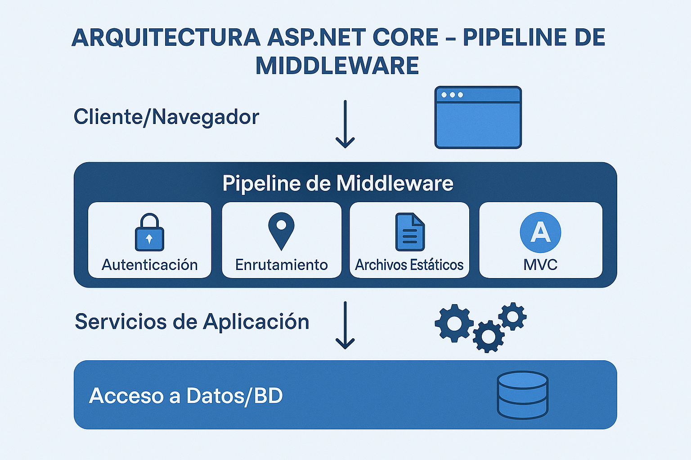

<!--
IMÁGENES GENERADAS:
- clase-08-aspnet-core.png: Arquitectura ASP.NET Core con middleware pipeline y MVC
-->

# Clase 8: Introducción a ASP.NET Core
## Desarrollo web moderno con C#

**IF0100 - Lenguaje de Programación OO II**
*4° Semestre - Ingeniería Informática*



---

## Objetivos de la Clase

Al finalizar esta clase, el estudiante será capaz de:

1. **Comprender** la arquitectura de ASP.NET Core
2. **Diferenciar** entre MVC, Razor Pages y Web API
3. **Crear** una aplicación web desde cero
4. **Configurar** el pipeline de middleware
5. **Implementar** inyección de dependencias básica

**Duración:** 90 minutos

---

## Agenda

1. ¿Qué es ASP.NET Core? (15 min)
2. Arquitectura y componentes (15 min)
3. Crear primera aplicación (20 min)
4. Middleware y Pipeline (15 min)
5. Inyección de dependencias (15 min)
6. Estructura de proyecto (10 min)

---

## 1. ¿Qué es ASP.NET Core?

### Framework web de Microsoft

```
┌─────────────────────────────────────────────────────────────┐
│                   ASP.NET CORE                              │
├─────────────────────────────────────────────────────────────┤
│                                                             │
│  > Framework open-source para construir aplicaciones web    │
│    modernas, cloud-ready y multiplataforma                  │
│                                                             │
│  CARACTERÍSTICAS PRINCIPALES:                               │
│                                                             │
│  🚀 Alto rendimiento     • Más rápido que Node.js, Java    │
│  🌐 Multiplataforma      • Windows, Linux, macOS           │
│  📦 Modular              • Solo incluyes lo que necesitas  │
│  ☁️ Cloud-ready          • Docker, Kubernetes, Azure        │
│  🔧 Unificado            • MVC, Razor Pages, Web API, gRPC │
│  📱 Full Stack           • Backend + Frontend integration  │
│                                                             │
│  HISTORIA:                                                  │
│  ASP.NET (2002) → ASP.NET MVC (2009) →                     │
│  ASP.NET Core (2016) → ASP.NET Core 8 (2024)               │
│                                                             │
│  Versión actual: ASP.NET Core 8.0 (LTS)                    │
│                                                             │
└─────────────────────────────────────────────────────────────┘
```

---

## Modelos de Programación

### Diferentes enfoques para diferentes necesidades

```
┌─────────────────────────────────────────────────────────────┐
│            MODELOS DE PROGRAMACIÓN ASP.NET CORE             │
├─────────────────────────────────────────────────────────────┤
│                                                             │
│  ┌─────────────────┐  ┌─────────────────┐  ┌─────────────┐ │
│  │      MVC        │  │   Razor Pages   │  │   Web API   │ │
│  │                 │  │                 │  │             │ │
│  │ Model-View-     │  │ Páginas con     │  │ Servicios   │ │
│  │ Controller      │  │ código C#       │  │ REST/gRPC   │ │
│  │                 │  │ embebido        │  │             │ │
│  │ • Aplicaciones  │  │ • Sitios        │  │ • SPAs      │ │
│  │   tradicionales │  │   contenido     │  │ • Mobile    │ │
│  │ • Separación    │  │ • Formularios   │  │ • APIs      │ │
│  │   de concerns   │  │   simples       │  │   públicas  │ │
│  │                 │  │ • Sitios        │  │             │ │
│  │                 │  │   pequeños      │  │             │ │
│  └─────────────────┘  └─────────────────┘  └─────────────┘ │
│                                                             │
│  + Blazor (C# en el navegador con WebAssembly)             │
│                                                             │
└─────────────────────────────────────────────────────────────┘
```

---

## MVC vs Razor Pages

### ¿Cuál elegir?

| Característica | MVC | Razor Pages |
|----------------|-----|-------------|
| **Estructura** | Controllers + Views | Páginas con modelo |
| **URL** | `/Controller/Action` | `/Page/Handler` |
| **Mejor para** | Apps complejas | Sitios con formularios |
| **Separación** | Más estricta | Más flexible |
| **Testing** | Más fácil | Un poco más difícil |

```
MVC:                              Razor Pages:
Controllers/                      Pages/
├── HomeController.cs             ├── Index.cshtml
│   └── Action: Index()           │   └── @page
│       └── return View();        │       └── @model IndexModel
│                                 │           └── OnGet()
Views/                            ├── Privacy.cshtml
├── Home/                         │   └── @page
│   └── Index.cshtml              └── Contacto.cshtml
│       └── @model ViewModel          └── @page
```

**En este curso usaremos MVC (más demandado laboralmente)**

---

## 2. Arquitectura ASP.NET Core

### Componentes principales

```
┌─────────────────────────────────────────────────────────────┐
│                ARQUITECTURA ASP.NET CORE                    │
├─────────────────────────────────────────────────────────────┤
│                                                             │
│  ┌───────────────────────────────────────────────────────┐ │
│  │              APLICACIÓN WEB                           │ │
│  │  ┌─────────┐  ┌─────────┐  ┌─────────┐  ┌─────────┐  │ │
│  │  │Controllers│ │  Views  │  │ Models  │  │Services│  │ │
│  │  │         │  │ (.cshtml)│  │         │  │        │  │ │
│  │  └────┬────┘  └─────────┘  └─────────┘  └────┬─────┘  │ │
│  │       │                                      │        │ │
│  │       └────────────────┬─────────────────────┘        │ │
│  │                        │                              │ │
│  │              ┌─────────▼──────────┐                   │ │
│  │              │   Routing System   │                   │ │
│  │              │   (enrutamiento)   │                   │ │
│  │              └─────────┬──────────┘                   │ │
│  └────────────────────────┼──────────────────────────────┘ │
│                           │                                 │
│  ┌────────────────────────▼──────────────────────────────┐ │
│  │              MIDDLEWARE PIPELINE                       │ │
│  │  ┌───┐ ┌───┐ ┌───┐ ┌───┐ ┌───┐ ┌───┐ ┌───┐         │ │
│  │  │Log│→│Aut│→│Rou│→│CORS│→│MVC│→│Sta│→│End│         │ │
│  │  │   │ │   │ │   │ │   │ │   │ │tic│ │   │         │ │
│  │  └───┘ └───┘ └───┘ └───┘ └───┘ └───┘ └───┘         │ │
│  └────────────────────────────────────────────────────────┘ │
│                           │                                 │
│  ┌────────────────────────▼──────────────────────────────┐ │
│  │              HOST (Kestrel / IIS)                      │ │
│  └────────────────────────────────────────────────────────┘ │
│                                                             │
└─────────────────────────────────────────────────────────────┘
```

---

## Flujo de una Petición HTTP

### Request → Response

```
┌─────────────────────────────────────────────────────────────┐
│              CICLO DE VIDA DE UNA PETICIÓN                  │
├─────────────────────────────────────────────────────────────┤
│                                                             │
│   NAVEGADOR                                                 │
│      │                                                      │
│      │ GET /Clientes/Index                                  │
│      ▼                                                      │
│   ┌─────────────────────────────────────────────────────┐   │
│   │              SERVIDOR WEB (Kestrel)                  │   │
│   │                                                     │   │
│   │  1. Middleware de Autenticación                     │   │
│   │     → ¿Usuario autenticado?                         │   │
│   │                                                     │   │
│   │  2. Routing                                         │   │
│   │     → /Clientes/Index → ClientesController.Index   │   │
│   │                                                     │   │
│   │  3. Model Binding                                   │   │
│   │     → Convertir parámetros URL a tipos C#          │   │
│   │                                                     │   │
│   │  4. Controller Action                               │   │
│   │     → ClientesController.Index()                    │   │
│   │     → Consultar servicio/repositorio                │   │
│   │     → Obtener lista de clientes                     │   │
│   │                                                     │   │
│   │  5. View Rendering                                  │   │
│   │     → Pasar modelo a View (lista de clientes)      │   │
│   │     → Renderizar HTML con Razor                    │   │
│   │                                                     │   │
│   │  6. Response                                        │   │
│   │     → HTML generado                                 │   │
│   └─────────────────────────────────────────────────────┘   │
│      │                                                      │
│      │ HTML                                                 │
│      ▼                                                      │
│   NAVEGADOR muestra página                                  │
│                                                             │
└─────────────────────────────────────────────────────────────┘
```

---

## 3. Crear Primera Aplicación

### Pasos iniciales

```bash
# Crear proyecto MVC
dotnet new mvc -n MiPrimeraWeb
cd MiPrimeraWeb

# O con Visual Studio:
# 1. File → New → Project
# 2. ASP.NET Core Web App (Model-View-Controller)
# 3. .NET 8.0, HTTPS, No Docker

# Estructura creada:
MiPrimeraWeb/
├── Controllers/           ← Controladores
│   └── HomeController.cs
├── Models/                ← Modelos de datos
│   └── ErrorViewModel.cs
├── Views/                 ← Vistas Razor
│   ├── Home/
│   │   ├── Index.cshtml
│   │   └── Privacy.cshtml
│   ├── Shared/
│   │   ├── _Layout.cshtml
│   │   └── _ValidationScriptsPartial.cshtml
│   ├── _ViewImports.cshtml
│   └── _ViewStart.cshtml
├── wwwroot/               ← Archivos estáticos
│   ├── css/
│   ├── js/
│   └── lib/               ← Bootstrap, jQuery
├── appsettings.json       ← Configuración
├── Program.cs             ← Punto de entrada
└── MiPrimeraWeb.csproj
```

---

## Program.cs Explicado

### Punto de entrada de la aplicación

```csharp
// Program.cs - Configuración de la aplicación

var builder = WebApplication.CreateBuilder(args);

// ╔═══════════════════════════════════════════════════════════════╗
// ║  SERVICES: Registrar servicios para Inyección de Dependencias ║
// ╚═══════════════════════════════════════════════════════════════╝

// Agregar soporte para Controllers y Views (MVC)
builder.Services.AddControllersWithViews();

// Otros servicios comunes:
// builder.Services.AddDbContext<AppDbContext>();      // Base de datos
// builder.Services.AddIdentity<Usuario, Rol>();       // Autenticación
// builder.Services.AddScoped<IClienteService, ClienteService>(); // Custom

var app = builder.Build();

// ╔═══════════════════════════════════════════════════════════════╗
// ║  MIDDLEWARE PIPELINE: Configurar el pipeline de procesamiento ║
// ╚═══════════════════════════════════════════════════════════════╝

// Configurar middleware según el ambiente
if (!app.Environment.IsDevelopment())
{
    app.UseExceptionHandler("/Home/Error");
    app.UseHsts();  // HTTP Strict Transport Security
}

app.UseHttpsRedirection();    // Redirigir HTTP a HTTPS
app.UseStaticFiles();         // Servir archivos de wwwroot
app.UseRouting();             // Habilitar routing
// app.UseAuthentication();   // Habilitar autenticación
// app.UseAuthorization();    // Habilitar autorización

// Configurar rutas
app.MapControllerRoute(
    name: "default",
    pattern: "{controller=Home}/{action=Index}/{id?}");
    // Ej: /Clientes/Detalle/5
    //     /Home/Index (default)

app.Run();  // Iniciar aplicación
```

---

## Mi Primer Controller

### HomeController.cs

```csharp
using Microsoft.AspNetCore.Mvc;
using MiPrimeraWeb.Models;
using System.Diagnostics;

namespace MiPrimeraWeb.Controllers
{
    // Controller base proporciona funcionalidad MVC
    public class HomeController : Controller
    {
        // GET: /Home/Index (o simplemente /)
        public IActionResult Index()
        {
            // View() busca Views/Home/Index.cshtml
            return View();
        }

        // GET: /Home/Privacy
        public IActionResult Privacy()
        {
            return View();
        }

        // GET: /Home/Saludo?nombre=Juan
        public IActionResult Saludo(string nombre)
        {
            // Pasar datos a la vista usando ViewBag
            ViewBag.Nombre = nombre ?? "Visitante";
            ViewBag.Hora = DateTime.Now.ToString("HH:mm");
            
            return View();
        }

        // Manejo de errores
        [ResponseCache(Duration = 0, Location = ResponseCacheLocation.None, NoStore = true)]
        public IActionResult Error()
        {
            return View(new ErrorViewModel 
            { 
                RequestId = Activity.Current?.Id ?? HttpContext.TraceIdentifier 
            });
        }
    }
}
```

---

## Mi Primera Vista

### Views/Home/Saludo.cshtml

```html
@* Vista Razor para acción Saludo *@
@* Modelo no tipado, usamos ViewBag *@

@{
    // Código C# embebido
    ViewData["Title"] = "Saludo Personalizado";
    var mensaje = DateTime.Now.Hour < 12 ? "Buenos días" : "Buenas tardes";
}

<div class="text-center">
    <h1 class="display-4">@mensaje, @ViewBag.Nombre!</h1>
    <p class="lead">Son las @ViewBag.Hora</p>
    
    @if (DateTime.Now.Hour < 12)
    {
        <div class="alert alert-info">
            🌅 Es hora de empezar el día con energía
        </div>
    }
    else
    {
        <div class="alert alert-warning">
            ☀️ La tarde avanza, ¡sigue así!
        </div>
    }
    
    <a asp-controller="Home" asp-action="Index" class="btn btn-primary">
        Volver al Inicio
    </a>
</div>

@* Ejecutar: https://localhost:5001/Home/Saludo?nombre=María *@
```

---

## Sintaxis Razor

### C# en HTML

```html
@* RAZOR: Sintaxis para mezclar C# con HTML *@

@* 1. Expresiones implícitas *@
<h1>Hola @Model.Nombre</h1>
<p>Fecha: @DateTime.Now.ToShortDateString()</p>

@* 2. Bloques de código *@
@{
    var titulo = "Bienvenido";
    var hora = DateTime.Now.Hour;
}

@* 3. Estructuras de control *@
@if (hora < 12)
{
    <p>Buenos días</p>
}
else if (hora < 18)
{
    <p>Buenas tardes</p>
}
else
{
    <p>Buenas noches</p>
}

@* 4. Bucles *@
<ul>
@foreach (var item in Model.Lista)
{
    <li>@item.Nombre - @item.Precio.ToString("C")</li>
}
</ul>

@* 5. Comentarios Razor (no aparecen en HTML) *@
@* Este comentario no se ve en el navegador *@

@* 6. Escapar @ *@
<p>Email: usuario@@dominio.com</p>
```

---

## 4. Middleware y Pipeline

### Configuración del pipeline

```
┌─────────────────────────────────────────────────────────────┐
│                MIDDLEWARE PIPELINE                          │
├─────────────────────────────────────────────────────────────┤
│                                                             │
│   El orden de los middleware es CRÍTICO                     │
│                                                             │
│   ❌ ORDEN INCORRECTO:                                      │
│   app.UseAuthentication();  // Primero intenta autenticar   │
│   app.UseRouting();         // Pero aún no hay routing!     │
│                                                             │
│   ✅ ORDEN CORRECTO:                                        │
│   app.UseExceptionHandler();  // 1. Capturar errores        │
│   app.UseHttpsRedirection();  // 2. Redirigir a HTTPS       │
│   app.UseCors();              // 3. CORS antes de auth      │
│   app.UseStaticFiles();       // 4. Archivos estáticos      │
│   app.UseRouting();           // 5. Routing                 │
│   app.UseAuthentication();    // 6. Quién eres?            │
│   app.UseAuthorization();     // 7. Qué puedes hacer?      │
│   app.MapControllers();       // 8. Endpoints               │
│                                                             │
│   REQUEST → Middleware1 → Middleware2 → ... → Endpoint     │
│                ↓               ↓                           │
│   RESPONSE ← ... ← Middleware2 ← Middleware1               │
│                                                             │
│   (El response pasa por los middleware en orden inverso)   │
│                                                             │
└─────────────────────────────────────────────────────────────┘
```

---

## Crear Middleware Personalizado

### Logging de peticiones

```csharp
// Middleware personalizado
public class RequestTimingMiddleware
{
    private readonly RequestDelegate _next;
    private readonly ILogger<RequestTimingMiddleware> _logger;

    public RequestTimingMiddleware(
        RequestDelegate next, 
        ILogger<RequestTimingMiddleware> logger)
    {
        _next = next;
        _logger = logger;
    }

    public async Task InvokeAsync(HttpContext context)
    {
        var stopwatch = Stopwatch.StartNew();
        _logger.LogInformation(
            "→ Request {Method} {Path} started", 
            context.Request.Method,
            context.Request.Path);

        await _next(context);  // Pasar al siguiente middleware

        stopwatch.Stop();
        _logger.LogInformation(
            "← Request {Method} {Path} completed in {ElapsedMs}ms - Status {StatusCode}",
            context.Request.Method,
            context.Request.Path,
            stopwatch.ElapsedMilliseconds,
            context.Response.StatusCode);
    }
}

// Registro en Program.cs
app.UseMiddleware<RequestTimingMiddleware>();
```

---

## 5. Inyección de Dependencias

### Principio fundamental de ASP.NET Core

```
┌─────────────────────────────────────────────────────────────┐
│           INYECCIÓN DE DEPENDENCIAS (DI)                    │
├─────────────────────────────────────────────────────────────┤
│                                                             │
│  PROBLEMA: Acoplamiento directo                             │
│  ─────────────────────────────────                          │
│  public class PedidoController : Controller                 │
│  {                                                          │
│      private PedidoRepository _repo = new PedidoRepository();│
│      // ❌ Acoplado a implementación concreta               │
│      // ❌ Difícil de probar                                │
│      // ❌ No se puede cambiar implementación               │
│  }                                                          │
│                                                             │
│  SOLUCIÓN: Inyección de dependencias                        │
│  ───────────────────────────────────                        │
│  public class PedidoController : Controller                 │
│  {                                                          │
│      private readonly IPedidoRepository _repo;              │
│                                                             │
│      public PedidoController(IPedidoRepository repo)        │
│      {                                                      │
│          _repo = repo;  // ← Inyectado por el framework     │
│      }                                                      │
│      // ✅ Desacoplado                                      │
│      // ✅ Fácil de probar (mocks)                          │
│      // ✅ Configurable en un solo lugar                    │
│  }                                                          │
│                                                             │
└─────────────────────────────────────────────────────────────┘
```

---

## Ciclo de Vida de Servicios

### Scoped, Transient, Singleton

```csharp
// Registro de servicios en Program.cs

// TRANSIENT: Nueva instancia cada vez que se solicita
// Útil para: Servicios ligeros, stateless
builder.Services.AddTransient<IEmailService, EmailService>();

// SCOPED: Una instancia por petición HTTP
// Útil para: DbContext, Unit of Work, repositorios
builder.Services.AddScoped<IClienteRepository, ClienteRepository>();
builder.Services.AddScoped<IClienteService, ClienteService>();

// SINGLETON: Una instancia para toda la aplicación
// Útil para: Configuración, caché, logging
builder.Services.AddSingleton<ICacheService, CacheService>();

// EJEMPLO COMPLETO:
public interface IClienteService
{
    Task<List<Cliente>> ObtenerTodos();
    Task<Cliente> ObtenerPorId(int id);
}

public class ClienteService : IClienteService
{
    private readonly IClienteRepository _repository;
    
    // Inyección automática por el constructor
    public ClienteService(IClienteRepository repository)
    {
        _repository = repository;
    }
    
    public Task<List<Cliente>> ObtenerTodos() => _repository.GetAll();
    public Task<Cliente> ObtenerPorId(int id) => _repository.GetById(id);
}

// Registro
builder.Services.AddScoped<IClienteRepository, ClienteRepository>();
builder.Services.AddScoped<IClienteService, ClienteService>();
```

---

## 6. Estructura de Proyecto

### Organización recomendada

```
MiAplicacionWeb/
│
├── src/
│   └── MiAplicacionWeb/
│       ├── Controllers/              ← Controladores MVC
│       │   ├── HomeController.cs
│       │   ├── ClientesController.cs
│       │   └── ProductosController.cs
│       │
│       ├── Models/                   ← Modelos de dominio y ViewModels
│       │   ├── Entities/             ← Entidades del dominio
│       │   │   ├── Cliente.cs
│       │   │   └── Producto.cs
│       │   └── ViewModels/           ← Modelos para vistas
│       │       ├── ClienteViewModel.cs
│       │       └── ProductoViewModel.cs
│       │
│       ├── Views/                    ← Vistas Razor
│       │   ├── Clientes/
│       │   │   ├── Index.cshtml
│       │   │   ├── Crear.cshtml
│       │   │   └── Editar.cshtml
│       │   ├── Productos/
│       │   └── Shared/
│       │       └── _Layout.cshtml
│       │
│       ├── Services/                 ← Lógica de negocio
│       │   ├── Interfaces/
│       │   │   └── IClienteService.cs
│       │   └── Implementations/
│       │       └── ClienteService.cs
│       │
│       ├── Data/                     ← Acceso a datos
│       │   ├── AppDbContext.cs
│       │   └── Repositories/
│       │
│       ├── wwwroot/                  ← Archivos estáticos
│       │   ├── css/
│       │   ├── js/
│       │   └── images/
│       │
│       ├── Program.cs
│       └── appsettings.json
│
└── tests/
    └── MiAplicacionWeb.Tests/
```

---

## Resumen de la Clase

| Concepto | Descripción |
|----------|-------------|
| **ASP.NET Core** | Framework web multiplataforma de Microsoft |
| **MVC** | Model-View-Controller, patrón de diseño |
| **Controller** | Recibe peticiones, orquesta lógica |
| **View** | Presentación con sintaxis Razor |
| **Middleware** | Pipeline de procesamiento de peticiones |
| **DI** | Inyección de dependencias para desacoplamiento |
| **Transient** | Nueva instancia cada vez |
| **Scoped** | Una instancia por petición HTTP |
| **Singleton** | Una instancia global |

---

## Ejercicio Práctico

### Crear página de información

```
EJERCICIO EN CLASE:

1. Crear nuevo Controller "InformacionController"
   - Acción "HoraActual" que muestre hora del servidor
   - Accion "DatosServidor" que muestre:
     * Nombre del servidor
     * Framework (.NET 8)
     * Ambiente (Development/Production)

2. Crear las vistas correspondientes
   - Usar Razor para mostrar datos dinámicos
   - Aplicar clases de Bootstrap para estilos

3. Configurar enlace en el menú de navegación
   - Editar Views/Shared/_Layout.cshtml
   - Agregar enlace al menú

4. Probar inyección de dependencias
   - Crear interfaz IServicioHora
   - Implementar ServicioHoraReal
   - Inyectar en el controller
```

---

## Próxima Clase

### Clase 9: HTML5 y Bootstrap

```
CONTENIDO PRÓXIMA CLASE:

• HTML5 semántico
  - Estructura: header, nav, main, section, footer
  - Formularios modernos
  
• Bootstrap 5
  - Sistema de grillas (Grid)
  - Componentes: navbar, cards, modals
  - Utilidades: spacing, colors, display
  
• Responsive Design
  - Mobile-first
  - Breakpoints
  
• Integración ASP.NET + Bootstrap
  - Layouts compartidos
  - Partial views
  - Tag Helpers de Bootstrap
```

---

# ¡Gracias!
## ¿Preguntas?

**"ASP.NET Core: Un framework, infinitas posibilidades"**

**UNAULA - Ingeniería Informática - 2026-I**
