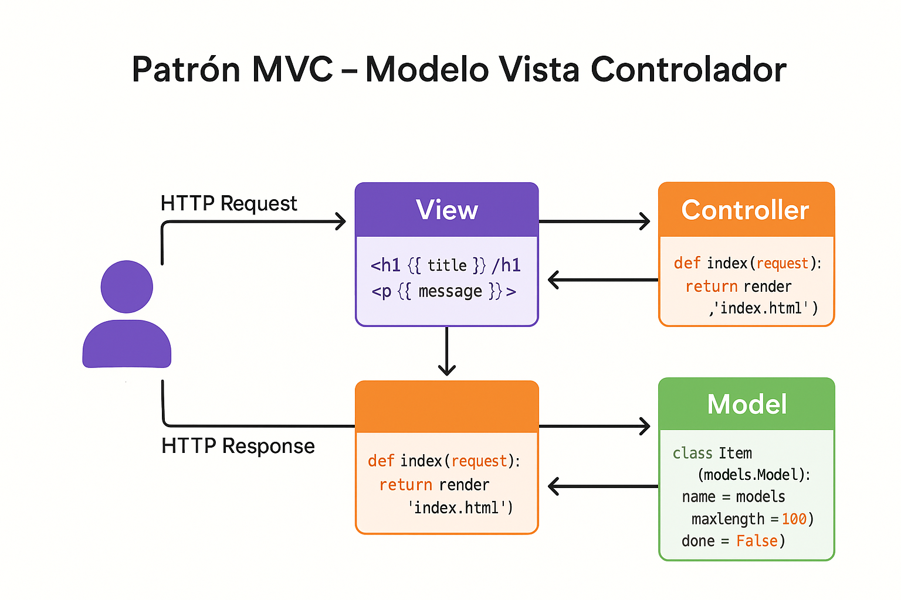

---

marp: true
theme: default
paginate: true
| header: 'IF0100 - Lenguaje de Programación OO II | Unidad 3' |
footer: 'UNAULA - Ingeniería Informática - 2026-I'

  section {
    font-size: 24px;
  }

---
# Clase 10: MVC y Razor Pages
<style>
img {
  max-width: 70% !important;
  max-height: 50vh !important;
  object-fit: contain !important;
  height: auto !important;
  display: block !important;
  margin: 0 auto !important;
}
section {
  font-size: 20px;
  overflow: hidden;
}
section h1 {
  font-size: 1.8em;
}
section h2 {
  font-size: 1.4em;
}
section h3 {
  font-size: 1.2em;
}
section ul, section ol {
  font-size: 0.9em;
  margin-left: 1em;
}
section li {
  margin-bottom: 0.3em;
}
section pre {
  font-size: 0.7em;
  max-height: 60vh;
  overflow-y: auto;
}
section code {
  font-size: 0.85em;
}
section p {
  margin: 0.5em 0;
}
/* Estilos para tablas responsivas */
section table {
  width: 100%;
  max-width: 100%;
  font-size: 0.85em;
  border-collapse: collapse;
  margin: 0.5em auto;
  table-layout: auto;
}
section th {
  background-color: #1e40af;
  color: white;
  padding: 0.4em 0.6em;
  text-align: left;
  font-size: 0.9em;
  border: 1px solid #ddd;
}
section td {
  padding: 0.4em 0.6em;
  border: 1px solid #ddd;
  vertical-align: top;
  word-wrap: break-word;
  font-size: 0.85em;
}
section tbody tr:nth-child(even) {
  background-color: #f8f9fa;
}
section tbody tr:hover {
  background-color: #e9ecef;
}
/* Asegurar que el contenido no desborde */
section {
  padding: 1em 2em;
  box-sizing: border-box;
}
/* Responsividad para tablas anchas */
@media screen and (max-width: 1280px) {
  section table {
    font-size: 0.75em;
  }
  section th, section td {
    padding: 0.3em 0.4em;
  }
}
</style>

---
# Clase 10: MVC y Razor Pages
## Patrón Model-View-Controller en profundidad

<!--
IMÁGENES GENERADAS:
- clase-10-mvc.png: Patrón Model-View-Controller con flujo de datos
-->

**IF0100 - Lenguaje de Programación OO II**
*4° Semestre - Ingeniería Informática*

{: style="max-width: 80%; max-height: 500px; display: block; margin: 0 auto;"}

---

## Objetivos de la Clase

Al finalizar esta clase, el estudiante será capaz de:

1. **Comprender** el patrón MVC en detalle
2. **Implementar** Routing personalizado
3. **Aplicar** Model Binding y Validación
4. **Crear** Razor Pages para casos específicos
5. **Utilizar** Tag Helpers eficientemente

**Duración:** 90 minutos

---

## Agenda

1. Patrón MVC en profundidad (15 min)
2. Routing avanzado (15 min)
3. Model Binding (15 min)
4. Razor Pages (15 min)
5. Tag Helpers (15 min)
6. ViewComponents y Partial Views (15 min)

---
## 1. Patrón MVC en Profundidad
---
## 1. Patrón MVC en Profundidad
### Separación de responsabilidades
---
## 1. Patrón MVC en Profundidad (Continuación)

```
┌─────────────────────────────────────────────────────────────┐
│              PATRÓN MODEL-VIEW-CONTROLLER                   │
├─────────────────────────────────────────────────────────────┤
│                                                             │
│   REQUEST                                                   │
│      │                                                      │
│      ▼                                                      │
│  ┌─────────────┐    Manipula datos    ┌─────────────┐      │
│  │ CONTROLLER  │◄────────────────────►│    MODEL    │      │
│  │             │                      │             │      │
│  │ • Recibe    │                      │ • Entidades │      │
│  │   petición  │                      │ • Lógica    │      │
│  │ • Valida    │                      │ • Acceso BD │      │
│  │ • Orquesta  │                      │ • Reglas    │      │
│  │   flujo     │                      │             │      │
│  └──────┬──────┘                      └─────────────┘      │
│         │                                                   │
│         │ Selecciona y pasa datos                           │
│         ▼                                                   │
│  ┌─────────────┐                                            │
│  │    VIEW     │                                            │
│  │             │                                            │
│  │ • Presenta  │                                            │
│  │   datos     │                                            │
│  │ • HTML/CSS  │                                            │
│  │ • Razor     │                                            │
│  └──────┬──────┘                                            │
│         │                                                   │
│         ▼                                                   │
│   RESPONSE (HTML)                                           │
│                                                             │
│   REGLA: Controller NO debe tener HTML                      │
│          View NO debe tener lógica de negocio               │
│          Model NO debe depender de UI                       │
│                                                             │
└─────────────────────────────────────────────────────────────┘
```
---
## Flujo MVC Detallado
---
## Flujo MVC Detallado
---
### Ejemplo: Crear Estudiante

```
┌─────────────────────────────────────────────────────────────┐
│           FLUJO: CREAR ESTUDIANTE                           │
├─────────────────────────────────────────────────────────────┤
│                                                             │
│  1. MOSTRAR FORMULARIO (GET /Estudiantes/Crear)            │
│                                                             │
│     Navegador ──GET /Estudiantes/Crear──► Controller       │
│                                                  │         │
│                                                  ▼         │
│     Controller.EstudiantesController.Crear()     │         │
│     {                                            │         │
│         return View();  // ViewBag.Title = "..." │         │
│     }                                            │         │
│         │                                        │         │
│         ▼                                        │         │
│     View: Views/Estudiantes/Crear.cshtml ◄───────┘         │
│     (formulario vacío)                                      │
│         │                                                   │
│         └──HTML──► Navegador (muestra formulario)          │
│                                                             │
├─────────────────────────────────────────────────────────────┤
│                                                             │
│  2. PROCESAR FORMULARIO (POST /Estudiantes/Crear)          │
│                                                             │
│     Navegador ──POST datos──► Controller                   │
│                                          │                  │
│                                          ▼                  │
│     [HttpPost]                                              │
│     Controller.Crear(EstudianteViewModel model)             │
│     {                                                       │
│         if (ModelState.IsValid)  // Validación automática   │
│         {                                                   │
│             var estudiante = Mapear(model);                 │
│             _service.Guardar(estudiante);  // Model         │
│             return RedirectToAction("Index");               │
│         }                                                   │
│         return View(model);  // Muestra errores             │
│     }                                                       │
│                                                             │
└─────────────────────────────────────────────────────────────┘
```
---
## Controller Completo
---
## Controller Completo
---
### CRUD de Estudiantes

```csharp
public class EstudiantesController : Controller
{
    private readonly IEstudianteService _service;
    private readonly ICarreraService _carreraService;
    private readonly ILogger<EstudiantesController> _logger;

    // Inyección de dependencias
    public EstudiantesController(
        IEstudianteService service,
        ICarreraService carreraService,
        ILogger<EstudiantesController> logger)
    {
        _service = service;
        _carreraService = carreraService;
        _logger = logger;
    }

    // GET: /Estudiantes (o /Estudiantes/Index)
    public async Task<IActionResult> Index(string busqueda, int? pagina)
    {
        _logger.LogInformation("Accediendo a lista de estudiantes");
        
---
### CRUD de Estudiantes

*(continuación...)*

        var estudiantes = await _service.ObtenerTodosAsync();
        
        // Filtrar si hay búsqueda
        if (!string.IsNullOrEmpty(busqueda))
        {
            estudiantes = estudiantes.Where(e => 
| e.Nombre.Contains(busqueda) |  |  |
                e.Codigo.Contains(busqueda));
        }
        
        // Paginación
        int tamanoPagina = 10;
        int numeroPagina = pagina ?? 1;
        
        return View(await estudiantes
            .ToPagedListAsync(numeroPagina, tamanoPagina));
    }

    // GET: /Estudiantes/Detalles/5
    public async Task<IActionResult> Detalles(int? id)
    {
        if (id == null)
            return BadRequest("ID requerido");
        
---
### CRUD de Estudiantes

*(continuación...)*

        var estudiante = await _service.ObtenerPorIdAsync(id.Value);
        
        if (estudiante == null)
            return NotFound();  // 404
        
        return View(estudiante);
    }
}
```
---

---
## Controller: Crear y Editar

```csharp
public class EstudiantesController : Controller
{
    // GET: /Estudiantes/Crear
    [HttpGet]
    public async Task<IActionResult> Crear()
    {
        // Preparar ViewModel con datos necesarios
        var viewModel = new EstudianteViewModel
        {
            Carreras = await _carreraService.ObtenerSelectListAsync(),
            FechaIngreso = DateTime.Today
        };
        
        return View(viewModel);
    }

    // POST: /Estudiantes/Crear
    [HttpPost]
    [ValidateAntiForgeryToken]  // Protección CSRF
    public async Task<IActionResult> Crear(EstudianteViewModel viewModel)
    {
        // Validación automática del ModelState
        if (!ModelState.IsValid)
        {
            // Recargar datos necesarios para la vista
            viewModel.Carreras = await _carreraService.ObtenerSelectListAsync();
            return View(viewModel);  // Muestra vista con errores
        }
        
---
## Controller: Crear y Editar

*(continuación...)*

        try
        {
            var estudiante = MapearAEntidad(viewModel);
            await _service.CrearAsync(estudiante);
            
            TempData["Mensaje"] = "Estudiante creado exitosamente";
            return RedirectToAction(nameof(Index));
        }
        catch (Exception ex)
        {
            _logger.LogError(ex, "Error al crear estudiante");
            ModelState.AddModelError("", "Ocurrió un error al guardar");
            viewModel.Carreras = await _carreraService.ObtenerSelectListAsync();
            return View(viewModel);
        }
    }

    // GET: /Estudiantes/Editar/5
    [HttpGet]
    public async Task<IActionResult> Editar(int id)
    {
        var estudiante = await _service.ObtenerPorIdAsync(id);
        if (estudiante == null)
            return NotFound();
        
---
## Controller: Crear y Editar

*(continuación...)*

        var viewModel = MapearAViewModel(estudiante);
        viewModel.Carreras = await _carreraService.ObtenerSelectListAsync();
        
        return View(viewModel);
    }
}
```

---

## 2. Routing Avanzado

### Configuración personalizada

```csharp
// Program.cs - Configuración de rutas

app.MapControllerRoute(
    name: "default",
    pattern: "{controller=Home}/{action=Index}/{id?}");

// Rutas personalizadas
app.MapControllerRoute(
    name: "estudiantesPorCarrera",
    pattern: "carreras/{carreraId}/estudiantes",
    defaults: new { controller = "Estudiantes", action = "PorCarrera" });

app.MapControllerRoute(
    name: "busqueda",
    pattern: "buscar/{termino}",
    defaults: new { controller = "Estudiantes", action = "Buscar" });

// Restricciones
app.MapControllerRoute(
    name: "estudiantePorId",
    pattern: "estudiante/{id:int}",  // Solo acepta enteros
    defaults: new { controller = "Estudiantes", action = "Detalles" });
```

---
### Route, HttpGet, HttpPost


```csharp
[Route("api/[controller]")]  // Ruta base: /api/Estudiantes
public class EstudiantesController : Controller
{
    // GET: /api/Estudiantes
    [HttpGet]
    public async Task<IActionResult> GetAll() { }

    // GET: /api/Estudiantes/5
    [HttpGet("{id:int}")]
    public async Task<IActionResult> GetById(int id) { }

    // GET: /api/Estudiantes/buscar/termino
    [HttpGet("buscar/{termino}")]
    public async Task<IActionResult> Buscar(string termino) { }

    // GET: /api/Estudiantes/por-carrera/ingenieria
    [HttpGet("por-carrera/{nombreCarrera}")]
    public async Task<IActionResult> PorCarrera(string nombreCarrera) { }

    // POST: /api/Estudiantes
    [HttpPost]
    public async Task<IActionResult> Crear([FromBody] EstudianteDto dto) { }

---
### Route, HttpGet, HttpPost

*(continuación...)*

    // PUT: /api/Estudiantes/5
    [HttpPut("{id:int}")]
    public async Task<IActionResult> Actualizar(int id, [FromBody] EstudianteDto dto) { }

    // DELETE: /api/Estudiantes/5
    [HttpDelete("{id:int}")]
    public async Task<IActionResult> Eliminar(int id) { }
}
```

---
### Conversión automática de datos


```
┌─────────────────────────────────────────────────────────────┐
│                   MODEL BINDING                             │
├─────────────────────────────────────────────────────────────┤
│                                                             │
│   FUENTES DE DATOS (por orden de prioridad):                │
│                                                             │
│   1. Form values  ← POST form-data                          │
│   2. Route values ← /controller/action/{id}                 │
│   3. Query string ← ?nombre=valor&edad=20                   │
│   4. Header       ← Content-Type, Authorization             │
│                                                             │
│   EJEMPLOS:                                                 │
│                                                             │
│   URL: /Estudiantes/Detalles/5?id=10&formato=pdf           │
│        │      │        │  │    │      │                     │
│        │      │        │  │    │      └── Query string      │
│        │      │        │  │    └───────── Query string      │
│        │      │        │  └────────────── Route value       │
│        │      │        └───────────────── Route value       │
│        │      └────────────────────────── Route value       │
│        └───────────────────────────────── Route value       │
│                                                             │
└─────────────────────────────────────────────────────────────┘
```

---
### Conversión automática de datos

*(continuación...)*

---
## Model Binding en Acción

```csharp
public class EstudiantesController : Controller
{
    // Model Binding desde Query String
    // GET: /Estudiantes?nombre=Juan&edad=20
    public IActionResult Buscar(string nombre, int? edad)
    {
        // nombre = "Juan" (desde QueryString)
        // edad = 20 (desde QueryString, nullable)
    }

    // Model Binding desde Route
    // GET: /Estudiantes/Detalles/5
    public IActionResult Detalles(int id)  // id = 5 (desde Route)
    {
        // ...
    }

    // Model Binding desde Form (POST)
    [HttpPost]
    public IActionResult Crear(EstudianteViewModel model)
    {
        // ASP.NET mapea automáticamente campos del form
        // a propiedades del ViewModel
    }

---
## Model Binding en Acción

*(continuación...)*

    // Binding específico con atributos
    public IActionResult Ejemplo(
        [FromQuery] string busqueda,     // Solo desde QueryString
        [FromRoute] int id,              // Solo desde Route
        [FromForm] string comentario,    // Solo desde Form
        [FromHeader] string userAgent,   // Desde Headers
        [FromBody] DatosJson datos)      // Desde Body (JSON)
    {
        // ...
    }
}
```

---
## ViewModels
---
## ViewModels
---
### Separar modelo de dominio de la vista

```csharp
// Modelo de Dominio (Entity)
public class Estudiante
{
    public int Id { get; set; }
    public string Codigo { get; set; }
    public string Nombre { get; set; }
    public string Apellido { get; set; }
    public DateTime FechaNacimiento { get; set; }
    public int CarreraId { get; set; }
    public Carrera Carrera { get; set; }
    public DateTime FechaRegistro { get; set; }
    public bool Activo { get; set; }
}

// ViewModel para la vista Crear/Editar
public class EstudianteViewModel
{
    public int? Id { get; set; }  // Nullable para crear
    
---
### Separar modelo de dominio de la vista

*(continuación...)*

    [Required(ErrorMessage = "El código es obligatorio")]
    [StringLength(10, ErrorMessage = "Máximo 10 caracteres")]
    [Display(Name = "Código Estudiantil")]
    public string Codigo { get; set; }
    
    [Required]
    [Display(Name = "Nombre")]
    public string Nombre { get; set; }
    
    [Required]
    [Display(Name = "Apellido")]
    public string Apellido { get; set; }
    
    [Required]
    [DataType(DataType.Date)]
    [Display(Name = "Fecha de Nacimiento")]
    public DateTime FechaNacimiento { get; set; }
    
    [Required]
    [Display(Name = "Carrera")]
    public int CarreraId { get; set; }
    
    // Propiedad auxiliar para dropdown
    public SelectList Carreras { get; set; }
    
---
### Separar modelo de dominio de la vista

*(continuación...)*

    // Propiedad calculada para mostrar
    public string NombreCompleto => $"{Nombre} {Apellido}";
}
```
---
### Alternativa a MVC para páginas simples


```
┌─────────────────────────────────────────────────────────────┐
│              MVC vs RAZOR PAGES                             │
├─────────────────────────────────────────────────────────────┤
│                                                             │
│   MVC:                                             Razor:   │
│   ─────                                            ─────    │
│                                                             │
│   Controllers/                                     Pages/   │
│   ├── HomeController.cs                            ├── Index.cshtml│
│   │   └── Action: Index()                          │   └── @page│
│   └── AccountController.cs                         │   └── @model IndexModel│
│                                                    │       └── OnGet()│
│   Views/                                           ├── Privacy.cshtml│
│   ├── Home/                                        └── Contacto.cshtml│
│   │   └── Index.cshtml                                      │
│   └── Account/                                              │
│       └── Login.cshtml                                      │
│                                                             │
│   • Separación Controller/View                     • Todo en uno│
│   • Múltiples acciones por controller              • Una página = un modelo│
│   • URLs: /Controller/Action                       • URLs: /Page│
│   • Ideal para aplicaciones complejas              • Ideal para formularios│
│                                                    • Sitios de contenido│
│                                                             │
│   EN ASP.NET CORE: Ambos pueden coexistir                   │
│                                                             │
└─────────────────────────────────────────────────────────────┘
```

---
### Alternativa a MVC para páginas simples

*(continuación...)*

---
## Estructura Razor Page
---
## Estructura Razor Page
---
### Page + PageModel

```html
@* Pages/Estudiantes/Crear.cshtml *@
@page "{id:int?}"  @* Ruta opcional con parámetro *@
@model CrearModel
@{
    ViewData["Title"] = "Crear Estudiante";
}

<h1>Crear Estudiante</h1>

<form method="post">
    <div class="form-group">
        <label asp-for="Estudiante.Nombre"></label>
        <input asp-for="Estudiante.Nombre" class="form-control" />
        <span asp-validation-for="Estudiante.Nombre" class="text-danger"></span>
    </div>
    
    <button type="submit" class="btn btn-primary">Guardar</button>
    <a asp-page="Index" class="btn btn-secondary">Cancelar</a>
</form>

@section Scripts {
    @{await Html.RenderPartialAsync("_ValidationScriptsPartial");}
}
```

---
### Page + PageModel

*(continuación...)*

```csharp
// Pages/Estudiantes/Crear.cshtml.cs
public class CrearModel : PageModel
{
    private readonly IEstudianteService _service;

    public CrearModel(IEstudianteService service)
    {
        _service = service;
    }

    [BindProperty]  // Liga automáticamente con el form
    public EstudianteViewModel Estudiante { get; set; }

    // GET: /Estudiantes/Crear
    public void OnGet()
    {
        Estudiante = new EstudianteViewModel();
    }

    // POST: /Estudiantes/Crear
    public async Task<IActionResult> OnPostAsync()
    {
        if (!ModelState.IsValid)
            return Page();  // Muestra la misma página con errores
        
---
### Page + PageModel

*(continuación...)*

        await _service.CrearAsync(Estudiante);
        return RedirectToPage("Index");
    }
}
```
---
## Handlers en Razor Pages
---
### Múltiples acciones por página

```csharp
public class DetallesModel : PageModel
{
    private readonly IEstudianteService _service;

    public DetallesModel(IEstudianteService service)
    {
        _service = service;
    }

    public Estudiante Estudiante { get; set; }

    // GET: /Estudiantes/Detalles/5
    public async Task<IActionResult> OnGetAsync(int id)
    {
        Estudiante = await _service.ObtenerPorIdAsync(id);
        
        if (Estudiante == null)
            return NotFound();
        
        return Page();
    }

    // POST: /Estudiantes/Detalles/5?handler=Activar
    public async Task<IActionResult> OnPostActivarAsync(int id)
    {
        await _service.ActivarAsync(id);
        return RedirectToPage(new { id });
    }

---
### Múltiples acciones por página

*(continuación...)*

    // POST: /Estudiantes/Detalles/5?handler=Desactivar
    public async Task<IActionResult> OnPostDesactivarAsync(int id)
    {
        await _service.DesactivarAsync(id);
        return RedirectToPage(new { id });
    }
}
```

```html
<!-- En la vista -->
<form method="post" asp-page-handler="Activar">
    <button type="submit">Activar</button>
</form>

<form method="post" asp-page-handler="Desactivar">
    <button type="submit">Desactivar</button>
</form>
```
---
## 5. Tag Helpers
---
## 5. Tag Helpers
### HTML semántico con funcionalidad ASP.NET

```
┌─────────────────────────────────────────────────────────────┐
│                  TAG HELPERS                                │
├─────────────────────────────────────────────────────────────┤
│                                                             │
│   Son clases C# que generan HTML dinámicamente              │
│   Sintaxis: asp-[atributo]="valor"                         │
│                                                             │
│   HTML Helpers (antiguo):            Tag Helpers (nuevo):   │
│   @Html.ActionLink("Texto", "Action")  <a asp-action="Action">│
│                                                             │
│   PRINCIPALES TAG HELPERS:                                  │
│                                                             │
│   ┌─────────────────────────────────────────────────────┐   │
│   │ ANCHOR (Enlaces)                                    │   │
│   │ <a asp-controller="Estudiantes"                     │   │
│   │    asp-action="Detalles"                            │   │
│   │    asp-route-id="@item.Id">                         │   │
│   │    Ver detalles                                     │   │
│   │ </a>                                                │   │
│   └─────────────────────────────────────────────────────┘   │
│                                                             │
│   ┌─────────────────────────────────────────────────────┐   │
│   │ FORM (Formularios)                                  │   │
│   │ <form asp-controller="Estudiantes"                  │   │
│   │       asp-action="Crear"                            │   │
│   │       method="post">                                │   │
│   └─────────────────────────────────────────────────────┘   │
│                                                             │
│   ┌─────────────────────────────────────────────────────┐   │
│   │ INPUT (Campos de entrada)                           │   │
│   │ <input asp-for="Nombre" class="form-control" />     │   │
│   │                                                     │   │
│   │ Genera: id="Nombre', name="Nombre"                  │   │
│   │         value="@Model.Nombre"                       │   │
│   │         + atributos de validación                   │   │
│   └─────────────────────────────────────────────────────┘   │
│                                                             │
└─────────────────────────────────────────────────────────────┘
```
---
### Ejemplos prácticos


```html
<!-- LABEL -->
<label asp-for="Estudiante.Nombre"></label>
<!-- Genera: <label for="Estudiante_Nombre">Nombre</label> -->

<!-- SELECT (Dropdown) -->
<select asp-for="CarreraId" asp-items="Model.Carreras" class="form-select">
    <option value="">Seleccione...</option>
</select>

<!-- TEXTAREA -->
<textarea asp-for="Observaciones" class="form-control" rows="4"></textarea>

<!-- VALIDATION MESSAGE -->
<span asp-validation-for="Email" class="text-danger"></span>

<!-- VALIDATION SUMMARY -->
<div asp-validation-summary="All" class="text-danger"></div>

<!-- PARTIAL -->
<partial name="_ListaEstudiantes" model="Model.Estudiantes" />

<!-- COMPONENT -->
@await Component.InvokeAsync("MenuCarreras")

---
### Ejemplos prácticos

*(continuación...)*

<!-- ENVIRONMENT (condicional por ambiente) -->
<environment include="Development">
    <script src="~/js/debug.js"></script>
</environment>
<environment exclude="Development">
    <script src="~/js/prod.min.js"></script>
</environment>

<!-- LINK (para CSS) -->
<link rel="stylesheet" asp-href-include="~/css/*.css" />
```

---
### Reutilización de UI


```
┌─────────────────────────────────────────────────────────────┐
│           PARTIAL VIEW vs VIEW COMPONENT                    │
├─────────────────────────────────────────────────────────────┤
│                                                             │
│   PARTIAL VIEW                        VIEW COMPONENT        │
│   ─────────────                       ──────────────        │
│                                                             │
│   • "Vista parcial"                   • "Mini-controller"   │
│   • Solo presentación                 • Tiene lógica        │
│   • Recibe modelo del padre           • Carga sus datos     │
│   • Simplifica vistas grandes         • Reutilizable        │
│                                                             │
│   EJEMPLO:                            EJEMPLO:              │
│   _ListaEstudiantes.cshtml            MenuCarreras          │
│   _FormularioBusqueda.cshtml          WidgetEstadisticas    │
│   _Paginacion.cshtml                  CarruselNoticias      │
│                                                             │
│   USO:                                USO:                  │
│   <partial name="_Lista"              @await Component      │
│          model="Model.Lista" />       .InvokeAsync("Menu")  │
│                                                             │
└─────────────────────────────────────────────────────────────┘
```

---
### Reutilización de UI

*(continuación...)*

---
## Crear ViewComponent
---
### Componente reutilizable

```csharp
// ViewComponents/MenuCarrerasViewComponent.cs
public class MenuCarrerasViewComponent : ViewComponent
{
    private readonly ICarreraService _carreraService;

    public MenuCarrerasViewComponent(ICarreraService carreraService)
    {
        _carreraService = carreraService;
    }

    public async Task<IViewComponentResult> InvokeAsync(int? carreraSeleccionadaId)
    {
        var carreras = await _carreraService.ObtenerTodasAsync();
        
        var viewModel = new MenuCarrerasViewModel
        {
            Carreras = carreras,
            CarreraSeleccionadaId = carreraSeleccionadaId
        };
        
        return View(viewModel);
    }
}

---
### Componente reutilizable

*(continuación...)*

// Vista del componente:
// Views/Shared/Components/MenuCarreras/Default.cshtml
@model MenuCarrerasViewModel

<ul class="navbar-nav">
    @foreach (var carrera in Model.Carreras)
    {
        <li class="nav-item">
            <a class="nav-link @(carrera.Id == Model.CarreraSeleccionadaId ? "active" : "")" 
               asp-controller="Carreras" 
               asp-action="Detalles" 
               asp-route-id="@carrera.Id">
                @carrera.Nombre
            </a>
        </li>
    }
</ul>
```
---

## Resumen de la Clase

| Concepto | Descripción |
| ---------- | ------------- |
| **MVC** | Separación Model-View-Controller |
| **Routing** | Mapeo URLs a acciones |
| **Model Binding** | Conversión automática datos HTTP a objetos C# |
| **ViewModel** | Modelo específico para vistas |
| **Razor Pages** | Alternativa a MVC para páginas simples |
| **Tag Helpers** | Atributos asp-* para generar HTML dinámico |
| **ViewComponent** | Componente UI con lógica propia |
| **Partial View** | Vista reutilizable sin lógica |

---

## Ejercicio Práctico

### Implementar CRUD completo

```
EJERCICIO:

Crear CRUD de "Cursos" con:

1. Controller CursosController con:
   - Index (lista con paginación y búsqueda)
   - Detalles (vista individual)
   - Crear (GET y POST)
   - Editar (GET y POST)
   - Eliminar (GET y POST/DELETE)

2. ViewModels:
   - CursoViewModel para Crear/Editar
   - CursoListViewModel para Index

3. Vistas con Bootstrap:
   - Tabla responsiva en Index
   - Formulario estilizado en Crear/Editar
   - Modal de confirmación para Eliminar

4. Razor Page alternativa:
   - Crear versión Razor Page de "Detalles"

5. ViewComponent:
   - Crear componente "ContadorCursosPorCarrera"
```

---

## Próxima Clase

### Clase 11: Formularios, Validación y Sesiones

```
CONTENIDO PRÓXIMA CLASE:

• Validación de datos
  - Data Annotations
  - Validación cliente y servidor
  - Validaciones personalizadas

• TempData y ViewBag
  - Pasar datos entre acciones
  - Mensajes flash

• Sesiones y Cookies
  - HttpContext.Session
  - CookieOptions
  - Almacenamiento temporal

• Upload de archivos
  - IFormFile
  - Validación de archivos
  - Almacenamiento
```

---

# ¡Gracias!
## ¿Preguntas?

**"MVC: Separación de responsabilidades para código mantenible"**

**UNAULA - Ingeniería Informática - 2026-I**
