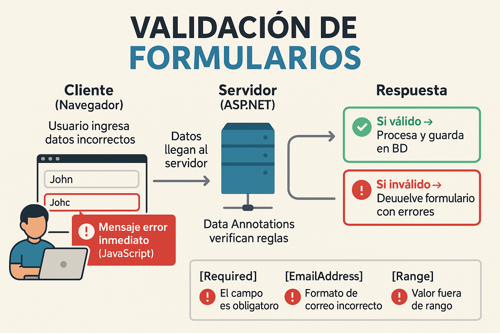

<style>
section {
  font-size: 20px;
  overflow: hidden;
}
img {
  max-width: 70% !important;
  max-height: 50vh !important;
  object-fit: contain !important;
  height: auto !important;
  display: block !important;
  margin: 0 auto !important;
}
section h1 { font-size: 1.8em; }
section h2 { font-size: 1.4em; }
section h3 { font-size: 1.2em; }
section ul, section ol { font-size: 0.9em; margin-left: 1em; }
section li { margin-bottom: 0.3em; }
section pre { font-size: 0.7em; max-height: 60vh; overflow-y: auto; }
section code { font-size: 0.85em; }
section p { margin: 0.5em 0; }
section table { width: 100%; font-size: 0.85em; border-collapse: collapse; margin: 0.5em auto; }
section th { background-color: #1e40af; color: white; padding: 0.4em 0.6em; text-align: left; font-size: 0.9em; border: 1px solid #ddd; }
section td { padding: 0.4em 0.6em; border: 1px solid #ddd; vertical-align: top; word-wrap: break-word; font-size: 0.85em; }
section tbody tr:nth-child(even) { background-color: #f8f9fa; }
section tbody tr:hover { background-color: #e9ecef; }
</style>

---

# Formularios, Validación y Sesiones

<!--
IMÁGENES GENERADAS:
- clase-11-validacion-formularios.png: Validación de formularios en ASP.NET con Data Annotations
-->

**IF0100 - Lenguaje de Programación OO II**
*4° Semestre - Ingeniería Informática*

---

## Objetivos de la Clase

Al finalizar esta clase, el estudiante será capaz de:

1. **Implementar** validación de datos con Data Annotations
2. **Configurar** validación en cliente y servidor
3. **Utilizar** TempData, ViewBag y ViewData
4. **Gestionar** sesiones y cookies
5. **Implementar** upload de archivos

**Duración:** 90 minutos

---

## Agenda

1. Validación con Data Annotations (20 min)
2. Validación cliente vs servidor (10 min)
3. TempData y mensajes flash (10 min)
4. Sesiones y Cookies (15 min)
5. Upload de archivos (15 min)
6. Ejercicio integrador (20 min)

---
## 1. Validación con Data Annotations
### Atributos de validación en .NET

```csharp
using System.ComponentModel.DataAnnotations;

public class EstudianteViewModel
{
    // VALIDACIÓN BÁSICA
    
    [Required(ErrorMessage = "El código es obligatorio")]
    [StringLength(10, MinimumLength = 5, 
        ErrorMessage = "El código debe tener entre 5 y 10 caracteres")]
    [Display(Name = "Código Estudiantil")]
    public string Codigo { get; set; }
    
    [Required]
    [StringLength(50)]
    public string Nombre { get; set; }
    
    [Required]
    [StringLength(50)]
    public string Apellido { get; set; }
    
    // VALIDACIÓN DE EMAIL
    [Required]
    [EmailAddress(ErrorMessage = "El formato del email no es válido")]
    [Display(Name = "Correo Electrónico")]
    public string Email { get; set; }
    
---


    // VALIDACIÓN NUMÉRICA
    [Range(18, 100, ErrorMessage = "La edad debe estar entre 18 y 100 años")]
    public int Edad { get; set; }
    
    [Range(0.0, 5.0, ErrorMessage = "El promedio debe estar entre 0.0 y 5.0")]
    [DisplayFormat(DataFormatString = "{0:F2}")]
    public double Promedio { get; set; }
    
    // VALIDACIÓN DE PATRÓN (Regex)
    [Required]
    [RegularExpression(@"^\d{10}$", 
        ErrorMessage = "El teléfono debe tener 10 dígitos numéricos")]
    [Display(Name = "Teléfono Celular")]
    public string Telefono { get; set; }
    
    // VALIDACIÓN DE FECHAS
    [DataType(DataType.Date)]
    [Display(Name = "Fecha de Nacimiento")]
    [FechaPasada(ErrorMessage = "La fecha debe ser en el pasado")]  // Custom
    public DateTime FechaNacimiento { get; set; }
    
    // COMPARACIÓN
    [Required]
    [DataType(DataType.Password)]
    public string Password { get; set; }
    
---


    [DataType(DataType.Password)]
    [Compare("Password", ErrorMessage = "Las contraseñas no coinciden")]
    [Display(Name = "Confirmar Contraseña")]
    public string ConfirmarPassword { get; set; }
}
```
---
## Data Annotations Disponibles
### Lista completa de atributos

{: style="max-width: 80%; max-height: 500px; display: block; margin: 0 auto;"}

```
┌─────────────────────────────────────────────────────────────┐
│           DATA ANNOTATIONS DE VALIDACIÓN                    │
├─────────────────────────────────────────────────────────────┤
│                                                             │
│  VALIDACIÓN DE REQUERIMIENTO                                │
│  • [Required]              - Campo obligatorio             │
│  • [Required(ErrorMessage="...")] - Con mensaje personal   │
│                                                             │
│  VALIDACIÓN DE LONGITUD                                     │
│  • [StringLength(50)]      - Máximo 50 caracteres          │
│  • [StringLength(50, MinimumLength=5)] - Min y max         │
│  • [MinLength(5)]          - Mínimo 5 caracteres           │
│  • [MaxLength(100)]        - Máximo 100 caracteres         │
│                                                             │
│  VALIDACIÓN NUMÉRICA                                        │
│  • [Range(0, 100)]         - Entre 0 y 100                 │
│  • [Range(0.0, 5.0)]       - Decimales                     │
│                                                             │
│  VALIDACIÓN DE FORMATO                                      │
│  • [EmailAddress]          - Formato email                 │
│  • [Phone]                 - Formato teléfono              │
│  • [Url]                   - Formato URL                   │
│  • [CreditCard]            - Formato tarjeta de crédito    │
│  • [RegularExpression(@"...")] - Patrón regex              │
│                                                             │
│  VALIDACIÓN DE COMPARACIÓN                                  │
│  • [Compare("OtraPropiedad")] - Debe coincidir con otra    │
│                                                             │
│  VALIDACIÓN PERSONALIZADA                                   │
│  • Crear clase que herede de ValidationAttribute           │
│                                                             │
└─────────────────────────────────────────────────────────────┘
```
---
## Validación Personalizada

### Crear atributo custom

```csharp
// Validación personalizada: Fecha debe ser en el pasado
public class FechaPasadaAttribute : ValidationAttribute
{
    protected override ValidationResult IsValid(object value, 
        ValidationContext validationContext)
    {
        if (value is DateTime fecha)
        {
            if (fecha >= DateTime.Today)
            {
                return new ValidationResult(ErrorMessage ?? 
                    "La fecha debe ser en el pasado");
            }
        }
        return ValidationResult.Success;
    }
}

---


// Uso
public class EstudianteViewModel
{
    [FechaPasada(ErrorMessage = "La fecha de nacimiento debe ser en el pasado")]
    public DateTime FechaNacimiento { get; set; }
}

// Otra validación: Mayor de edad
public class MayorDeEdadAttribute : ValidationAttribute
{
    private readonly int _edadMinima;
    
    public MayorDeEdadAttribute(int edadMinima = 18)
    {
        _edadMinima = edadMinima;
    }
    
    protected override ValidationResult IsValid(object value, 
        ValidationContext validationContext)
    {
        if (value is DateTime fechaNacimiento)
        {
            var edad = DateTime.Today.Year - fechaNacimiento.Year;
            if (fechaNacimiento.Date > DateTime.Today.AddYears(-edad))
                edad--;
            
---


            if (edad < _edadMinima)
            {
                return new ValidationResult(
                    $"Debe tener al menos {_edadMinima} años");
            }
        }
        return ValidationResult.Success;
    }
}
```
---
### ModelState.IsValid


```csharp
[HttpPost]
public async Task<IActionResult> Crear(EstudianteViewModel model)
{
    // Validación automática basada en Data Annotations
    if (!ModelState.IsValid)
    {
        // Si hay errores, retornar la vista con el modelo
        // Los errores se mostrarán automáticamente
        return View(model);
    }
    
    // Validación de negocio adicional
    var existe = await _service.ExisteCodigoAsync(model.Codigo);
    if (existe)
    {
        ModelState.AddModelError("Codigo", 
            "Ya existe un estudiante con este código");
        return View(model);
    }
    
---


    // Guardar
    await _service.CrearAsync(model);
    return RedirectToAction(nameof(Index));
}
```

---
## 2. Validación Cliente vs Servidor
### Doble validación

```
┌─────────────────────────────────────────────────────────────┐
│              VALIDACIÓN CLIENTE vs SERVIDOR                 │
├─────────────────────────────────────────────────────────────┤
│                                                             │
│   NAVEGADOR                    SERVIDOR                     │
│      │                            │                         │
│      │  1. Usuario escribe        │                         │
│      │     datos en formulario    │                         │
│      │                            │                         │
│      │  2. JavaScript valida      │                         │
│      │     (jQuery Validation)    │                         │
│      │                            │                         │
│      │◄─ 3. Si es inválido,       │                         │
│      │     muestra error sin      │                         │
│      │     enviar al servidor     │                         │
│      │                            │                         │
│      │  4. Si pasa validación     │                         │
│      │     cliente, envía POST    │                         │
│      ├────────────────────────────►                         │
│      │                            │ 5. ModelState valida    │
│      │                            │    (Data Annotations)   │
│      │                            │                         │
│      │◄─────────────────────────── 6. Si inválido, retorna  │
│      │                            │    vista con errores    │
│      │                            │                         │
│      │                            │ 7. Si válido, procesa   │
│      │                            │    y guarda             │
│      │                            │                         │
│                                                             │
│   ⚠️ IMPORTANTE:                                             │
│   • Validación cliente = UX mejor (rápida)                  │
│   • Validación servidor = Seguridad (obligatoria)           │
│   • Nunca confíe solo en validación cliente                 │
│                                                             │
└─────────────────────────────────────────────────────────────┘
```
---
### jQuery Validation


```html
<!-- Views/Shared/_ValidationScriptsPartial.cshtml -->

<script src="~/lib/jquery/dist/jquery.min.js"></script>
<script src="~/lib/jquery-validation/dist/jquery.validate.min.js"></script>
<script src="~/lib/jquery-validation-unobtrusive/jquery.validate.unobtrusive.min.js">
</script>

<!-- En la vista -->
<form asp-action="Crear" method="post">
    <div class="form-group">
        <label asp-for="Email"></label>
        <input asp-for="Email" class="form-control" />
        <span asp-validation-for="Email" class="text-danger"></span>
    </div>
    
    <button type="submit" class="btn btn-primary">Guardar</button>
</form>

@section Scripts {
    @{await Html.RenderPartialAsync("_ValidationScriptsPartial");}
}
```

---
### jQuery Validation


```javascript
// jQuery Validation genera automáticamente:
// - Validación de campos required
// - Validación de email con regex
// - Validación de rango numérico
// - Mensajes de error en español (con configuración)
```

---
### Pasar datos entre acciones


```
┌─────────────────────────────────────────────────────────────┐
│              FORMAS DE PASAR DATOS EN MVC                   │
├─────────────────────────────────────────────────────────────┤
│                                                             │
│   ViewData / ViewBag                                        │
│   ─────────────────                                         │
│   • Alcance: Una sola petición (request)                   │
│   • Uso: Controller → View                                  │
│   • Ejemplo: ViewBag.Mensaje = "Hola"                       │
│                                                             │
│   TempData                                                  │
│   ────────                                                  │
│   • Alcance: Persiste hasta la siguiente petición          │
│   • Uso: Controller → Redirect → Controller/View           │
│   • Ejemplo: TempData["Mensaje"] = "Guardado"               │
│                                                             │
│   Sesión (Session)                                          │
│   ─────────────────                                         │
│   • Alcance: Múltiples peticiones del mismo usuario        │
│   • Uso: Datos persistentes durante la sesión              │
│   • Ejemplo: Session["UsuarioId"] = 123                     │
│                                                             │
└─────────────────────────────────────────────────────────────┘
```

---

TempData es ideal para redireccionamientos con datos transitorios.

```csharp
[HttpPost]
public async Task<IActionResult> Crear(EstudianteViewModel model)
{
    if (!ModelState.IsValid)
        return View(model);
    
    await _service.CrearAsync(model);
    
    // Mensaje que persistirá después del Redirect
    TempData["MensajeExito"] = "Estudiante creado exitosamente";
    TempData["TipoMensaje"] = "success";  // Para Bootstrap alert
    
    return RedirectToAction(nameof(Index));
}

[HttpPost]
public async Task<IActionResult> Eliminar(int id)
{
    try
    {
        await _service.EliminarAsync(id);
        TempData["MensajeExito"] = "Estudiante eliminado correctamente";
        TempData["TipoMensaje"] = "success";
    }
    catch (Exception ex)
    {
        TempData["MensajeError"] = "No se pudo eliminar el estudiante";
        TempData["TipoMensaje"] = "danger";
    }
    
---
### Mensajes de confirmación


    return RedirectToAction(nameof(Index));
}
```

```html
<!-- Views/Estudiantes/Index.cshtml - Mostrar mensajes -->
@{
    var mensaje = TempData["MensajeExito"] ?? TempData["MensajeError"];
    var tipo = TempData["TipoMensaje"] ?? "info";
}

@if (mensaje != null)
{
    <div class="alert alert-@tipo alert-dismissible fade show" role="alert">
        @mensaje
        <button type="button" class="btn-close" data-bs-dismiss="alert"></button>
    </div>
}

<!-- O usando Partial View -->
<partial name="_Mensajes" />
```
---

## 4. Sesiones y Cookies

### Configuración de sesiones

```csharp
// Program.cs - Configurar servicio de sesiones

// Agregar servicio de sesiones
builder.Services.AddDistributedMemoryCache();  // Almacenamiento en memoria
builder.Services.AddSession(options =>
{
    options.IdleTimeout = TimeSpan.FromMinutes(30);  // Tiempo de expiración
    options.Cookie.HttpOnly = true;  // Solo accesible por HTTP
    options.Cookie.IsEssential = true;  // Necesaria para GDPR
});

var app = builder.Build();

// Usar sesiones (antes de MapControllers)
app.UseSession();
app.MapControllers();
```

---
## Usando Sesiones
---
### Almacenar y recuperar datos

```csharp
public class AccountController : Controller
{
    // Guardar en sesión
    public IActionResult Login(LoginViewModel model)
    {
        // Validar credenciales...
        
        // Guardar en sesión
        HttpContext.Session.SetInt32("UsuarioId", usuario.Id);
        HttpContext.Session.SetString("UsuarioNombre", usuario.Nombre);
        HttpContext.Session.SetString("UsuarioEmail", usuario.Email);
        
        // Guardar objeto completo (serializado)
        var usuarioJson = JsonSerializer.Serialize(usuario);
        HttpContext.Session.SetString("UsuarioCompleto", usuarioJson);
        
        return RedirectToAction("Index", "Home");
    }
    
    // Leer de sesión
    public IActionResult Perfil()
    {
        var usuarioId = HttpContext.Session.GetInt32("UsuarioId");
        var usuarioNombre = HttpContext.Session.GetString("UsuarioNombre");
        
---


        if (usuarioId == null)
        {
            return RedirectToAction("Login");
        }
        
        // Recuperar objeto
        var usuarioJson = HttpContext.Session.GetString("UsuarioCompleto");
        var usuario = JsonSerializer.Deserialize<Usuario>(usuarioJson);
        
        return View(usuario);
    }
    
    // Cerrar sesión
    public IActionResult Logout()
    {
        HttpContext.Session.Clear();  // Limpiar toda la sesión
        return RedirectToAction("Index", "Home");
    }
}
```
---
### Manipulación directa


```csharp
public class PreferenciasController : Controller
{
    // Establecer cookie
    public IActionResult SetTema(string tema)
    {
        // Cookie simple
        Response.Cookies.Append("Tema", tema, new CookieOptions
        {
            Expires = DateTime.Now.AddDays(30),  // Expira en 30 días
            HttpOnly = false,  // Accesible por JavaScript
            Secure = true,     // Solo HTTPS
            SameSite = SameSiteMode.Strict
        });
        
        return RedirectToAction("Index");
    }
    
    // Leer cookie
    public IActionResult Index()
    {
        var tema = Request.Cookies["Tema"] ?? "claro";
        ViewBag.Tema = tema;
        return View();
    }
    
---


    // Eliminar cookie
    public IActionResult EliminarTema()
    {
        Response.Cookies.Delete("Tema");
        return RedirectToAction("Index");
    }
}
```

---
## 5. Upload de Archivos
---
### IFormFile

```html
<!-- Vista con formulario para subir archivo -->
<form asp-action="SubirFoto" method="post" enctype="multipart/form-data">
    <div class="mb-3">
        <label class="form-label">Foto del Estudiante</label>
        <input type="file" name="archivo" class="form-control" 
               accept=".jpg,.jpeg,.png" />
        <div class="form-text">Formatos permitidos: JPG, PNG (máx. 2MB)</div>
    </div>
    <button type="submit" class="btn btn-primary">Subir</button>
</form>
```

```csharp
[HttpPost]
public async Task<IActionResult> SubirFoto(IFormFile archivo, int estudianteId)
{
| if (archivo == null |  | archivo.Length == 0) |
    {
        ModelState.AddModelError("", "No se seleccionó ningún archivo");
        return View();
    }
    
---


    // Validaciones
    var extensionesPermitidas = new[] { ".jpg", ".jpeg", ".png" };
    var extension = Path.GetExtension(archivo.FileName).ToLowerInvariant();
    
    if (!extensionesPermitidas.Contains(extension))
    {
        ModelState.AddModelError("", "Formato de archivo no válido");
        return View();
    }
    
    if (archivo.Length > 2 * 1024 * 1024)  // 2MB
    {
        ModelState.AddModelError("", "El archivo es demasiado grande (máx. 2MB)");
        return View();
    }
    
    // Generar nombre único
    var nombreArchivo = $"{estudianteId}_{Guid.NewGuid()}{extension}";
    var rutaCarpeta = Path.Combine(_environment.WebRootPath, "uploads", "fotos");
    var rutaCompleta = Path.Combine(rutaCarpeta, nombreArchivo);
    
    // Crear carpeta si no existe
    if (!Directory.Exists(rutaCarpeta))
        Directory.CreateDirectory(rutaCarpeta);
    
---


    // Guardar archivo
    using (var stream = new FileStream(rutaCompleta, FileMode.Create))
    {
        await archivo.CopyToAsync(stream);
    }
    
    // Guardar ruta en base de datos
    await _service.ActualizarFotoAsync(estudianteId, $"/uploads/fotos/{nombreArchivo}");
    
    TempData["Mensaje"] = "Foto subida correctamente";
    return RedirectToAction("Detalles", new { id = estudianteId });
}
```
---
### Subir varios archivos


```html
<form asp-action="SubirDocumentos" method="post" enctype="multipart/form-data">
    <input type="file" name="archivos" multiple class="form-control" />
    <button type="submit" class="btn btn-primary">Subir Documentos</button>
</form>
```

```csharp
[HttpPost]
public async Task<IActionResult> SubirDocumentos(List<IFormFile> archivos)
{
    foreach (var archivo in archivos)
    {
        if (archivo.Length > 0)
        {
            var nombre = Path.GetFileName(archivo.FileName);
            var ruta = Path.Combine(_environment.WebRootPath, "uploads", nombre);
            
            using (var stream = new FileStream(ruta, FileMode.Create))
            {
                await archivo.CopyToAsync(stream);
            }
        }
    }
    
---


    TempData["Mensaje"] = $"{archivos.Count} archivos subidos";
    return RedirectToAction("Index");
}
```

---
### Sistema de registro completo


```
EJERCICIO: Formulario de Inscripción

Crear sistema de inscripción de estudiantes con:

1. ViewModel con validaciones:
   - Código: requerido, 5-10 caracteres, único
   - Nombre: requerido, máx 50 caracteres
   - Email: requerido, formato válido
   - FechaNacimiento: requerido, mayor de 15 años
   - Carrera: seleccionar de dropdown
   - Foto: opcional, solo JPG/PNG, máx 1MB

2. Controller con:
   - GET: mostrar formulario
   - POST: validar, guardar, mostrar mensaje éxito
   - Validación de código único

3. Vista con:
   - Formulario Bootstrap estilizado
   - Validación cliente activada
   - Vista previa de foto seleccionada (JS)
   - Mensajes de error específicos por campo

---


4. Sesión:
   - Guardar último estudiante registrado
   - Mostrar en barra superior "Último registro: [Nombre]"

5. Funcionalidades extra:
   - Exportar lista a Excel (simulado)
   - Filtrar por carrera (session)
```

---

## Validación Remota (AJAX)

### Validación en tiempo real

```javascript
// Validación remota del email (disponible en servidor)
$('#Email').on('blur', function() {
    const email = $(this).val();

    $.ajax({
        url: '/Account/VerificarEmail',
        type: 'GET',
        data: { email: email },
        success: function(response) {
            if (response.existe) {
                // Mostrar error
                $('#Email').addClass('is-invalid');
                $('#Email-error').text('Este email ya está registrado');
            } else {
                // Limpiar error
                $('#Email').removeClass('is-invalid');
                $('#Email-error').text('');
            }
        }
    });
});

// En el Controller
[AcceptVerbs]
public class AccountController : Controller
{
    [HttpGet]
    public IActionResult VerificarEmail(string email)
    {
        var existe = _service.EmailExiste(email);
        return Json(new { existe });
    }
}
```

---

## Protección CSRF

### Seguridad contra ataques

```
┌─────────────────────────────────────────────────────────────┐
│              PROTECCIÓN CSRF EN ASP.NET CORE                   │
├─────────────────────────────────────────────────────────────┤
│                                                             │
│  CSRF = Cross-Site Request Forgery                             │
│  Ataque: Sitio malicioso envía formulario con credenciales │
│  del usuario autenticado a su servidor                            │
│                                                             │
│  SOLUCIÓN: Token antifals                                    │
│  • Servidor genera token único                                │
│  • Cliente debe enviar token con cada POST                       │
│  • Servidor valida que el token sea correcto                    │
│                                                             │
│  IMPLEMENTACIÓN AUTOMÁTICA:                                  │
│  • [ValidateAntiForgeryToken] en Controller                      │
│  • @Html.AntiForgeryToken() en form                        │
│  • Token generado automáticamente y válido por sesión           │
│                                                             │
│  EN FORMULARIO:                                               │
│  <form method="post">                                       │
│      @Html.AntiForgeryToken()  ← Token oculto           │
│      <input name="_codigo" />                               │
│  </form>                                                     │
│                                                             │
│  EN AJAX:                                                     │
│  $.ajax({                                                   │
│      url: '/estudiantes/eliminar',                            │
│      type: 'POST',                                         │
│      headers: {                                             │
│          "RequestVerificationToken": $('input[name="__RequestVerificationToken"]').val()│
│      }                                                       │
│  })                                                           │
│                                                             │
└─────────────────────────────────────────────────────────────┘
```

---

## Tipos de Almacenamiento de Sesión

### Configuración para diferentes escalas

```csharp
// Program.cs - Diferentes opciones de almacenamiento

// 1. EN MEMORIA (Development - default)
builder.Services.AddDistributedMemoryCache();
builder.Services.AddSession();

// 2. SQL SERVER (Production - escalable)
builder.Services.AddDistributedSqlServerCache(options =>
{
    options.ConnectionString = Configuration.GetConnectionString("SessionCache");
    options.SchemaName = "dbo";
    options.TableName = "SessionData";
    options.ExpireTimeSpan = TimeSpan.FromMinutes(30);
});

// 3. REDIS (Production - distribuido)
builder.Services.AddStackExchangeRedis(options =>
{
    options.Configuration = Configuration.GetConnectionString("Redis");
    options.InstanceName = "MiApp_Session";
});

// 4. NCache (Enterprise - caching distribuido)
builder.Services.AddNCacheDistributedCache(options =>
{
    options.CacheName = "demoCache";
    options.ApplicationID = "MiApp";
    options.ReloadConfigOnExpire = true;
});
```

---

## Upload con ProgressBar

### Visualización de progreso

```html
<!-- Vista con upload de archivos con progreso -->
<form id="uploadForm" enctype="multipart/form-data">
    <div class="mb-3">
        <label class="form-label">Seleccionar archivos</label>
        <input type="file" id="archivos" name="archivos"
               multiple class="form-control"
               accept=".jpg,.jpeg,.png,.pdf" />
    </div>

    <!-- Barra de progreso -->
    <div class="progress mb-3" id="uploadProgress" style="display: none;">
        <div class="progress-bar progress-bar-striped progress-bar-animated"
             role="progressbar" style="width: 0%">
            0%
        </div>
    </div>

    <button type="submit" class="btn btn-primary">
        <span id="uploadText">Subir</span>
        <span id="uploadSpinner" class="spinner-border spinner-border-sm ms-2" style="display: none;"></span>
    </button>
</form>

<div id="resultados"></div>
```

```javascript
// JavaScript: Upload con AJAX y barra de progreso
$('#uploadForm').on('submit', function(e) {
    e.preventDefault();

    var formData = new FormData(this);
    var archivos = $('#archivos')[0].files;

    if (archivos.length === 0) {
        mostrarError('Seleccione al menos un archivo');
        return;
    }

    // Agregar cada archivo al formData
    for (var i = 0; i < archivos.length; i++) {
        formData.append('archivos', archivos[i]);
    }

    $('#uploadProgress').show();
    $('#uploadText').text('Subiendo...');
    $('#uploadSpinner').show();
    $('button[type="submit"]').prop('disabled', true);

    $.ajax({
        url: '/Documentos/SubirArchivos',
        type: 'POST',
        data: formData,
        contentType: false,
        processData: false,
        xhr: function() {
            var xhr = new window.XMLHttpRequest();

            // Evento de progreso
            xhr.upload.addEventListener('progress', function(e) {
                if (e.lengthComputable) {
                    var porcentaje = Math.ceil((e.loaded / e.total) * 100);
                    $('#uploadProgress .progress-bar')
                        .css('width', porcentaje + '%')
                        .text(porcentaje + '%');
                }
            });

            return xhr;
        },
        success: function(response) {
            $('#resultados').html(
                '<div class="alert alert-success">' +
                '<i class="fas fa-check-circle"></i> ' + response.mensaje +
                '</div>'
            );
        },
        error: function(xhr, status, error) {
            mostrarError('Error al subir archivos: ' + error);
        },
        complete: function() {
            $('#uploadProgress').delay(2000).fadeOut();
            $('#uploadText').text('Subir');
            $('#uploadSpinner').hide();
            $('button[type="submit"]').prop('disabled', false);
            $('#uploadForm')[0].reset();
        }
    });
});

function mostrarError(mensaje) {
    $('#resultados').html(
        '<div class="alert alert-danger">' + mensaje + '</div>'
    );
}
```

---

## Resumen de la Clase

| Concepto | Descripción |
| ---------- | ------------- |
| **Data Annotations** | Atributos para validación de modelos |
| **ModelState** | Estado de validación en servidor |
| **jQuery Validation** | Validación en cliente |
| **TempData** | Datos persistentes hasta siguiente petición |
| **Session** | Datos persistentes durante sesión de usuario |
| **Cookies** | Almacenamiento en navegador |
| **IFormFile** | Manejo de archivos subidos |
| **Remote Validation** | Validación AJAX en tiempo real |
| **CSRF Protection** | Token antifals para seguridad |
| **Distributed Cache** | Sesión escalable (Redis, SQL Server) |

---

## Unidad 3 Completada ✅

### Resumen Unidad 3: Desarrollo Web

```
CLASES CREADAS:

Clase 8: Introducción a ASP.NET Core
  • Arquitectura, middleware, DI
  
Clase 9: HTML5 y Bootstrap
  • Semántica HTML5, componentes Bootstrap
  
Clase 10: MVC y Razor Pages
  • Patrón MVC, Routing, Tag Helpers
  
Clase 11: Formularios, Validación y Sesiones
  • Data Annotations, TempData, Session, Upload
```

---

## Próxima Unidad

### Unidad 4: Manejo de Persistencia

```
CLASES 12-14: ADO.NET Y PERSISTENCIA

• Clase 12: Introducción a ADO.NET
  - SqlConnection, SqlCommand, SqlDataReader
  - CRUD básico
  
• Clase 13: Entity Framework Core
  - DbContext, DbSet
  - Migrations
  - LINQ to Entities
  
• Clase 14: Persistencia en archivos
  - Lectura/escritura de archivos
  - JSON, XML
  - CSV
```

---

# ¡Gracias!
## ¿Preguntas?

**Unidad 3 completada: 4/4 clases ✅**

**UNAULA - Ingeniería Informática - 2026-I**


---

## 💻 Actividad Práctica: Sistema de Login con Validación

### Objetivo
Implementar un sistema de login completo con validación de formularios y gestión de sesiones en ASP.NET Core.

---
### Parte 1: Modelo de Usuario (15 minutos)

```csharp
// Models/Usuario.cs
using System.ComponentModel.DataAnnotations;

namespace WebApp.Models
{
    public class Usuario
    {
        [Key]
        public int Id { get; set; }

        [Required(ErrorMessage = "El email es obligatorio")]
        [EmailAddress(ErrorMessage = "Email no válido")]
        [Display(Name = "Correo Electrónico")]
        public string Email { get; set; }

        [Required(ErrorMessage = "La contraseña es obligatoria")]
        [MinLength(6, ErrorMessage = "Mínimo 6 caracteres")]
        [DataType(DataType.Password)]
        [Display(Name = "Contraseña")]
        public string Password { get; set; }

---


        [Required(ErrorMessage = "El nombre es obligatorio")]
        [StringLength(100, MinimumLength = 2)]
        public string Nombre { get; set; }

        public bool EstaActivo { get; set; } = true;
        public DateTime FechaRegistro { get; set; } = DateTime.Now;
    }

    public class LoginViewModel
    {
        [Required(ErrorMessage = "Email requerido")]
        [EmailAddress]
        public string Email { get; set; }

        [Required(ErrorMessage = "Contraseña requerida")]
        [DataType(DataType.Password)]
        public string Password { get; set; }

        [Display(Name = "Recordarme")]
        public bool RememberMe { get; set; }
    }
}
```

---

Creación del modelo de usuario para el ejercicio.

```csharp
// Controllers/AccountController.cs
using Microsoft.AspNetCore.Mvc;
using Microsoft.AspNetCore.Http;
using WebApp.Models;

namespace WebApp.Controllers
{
    public class AccountController : Controller
    {
        // Simulación de BD (en producción usar Entity Framework)
        private static List<Usuario> _usuarios = new()
        {
            new Usuario 
            { 
                Id = 1, 
                Email = "admin@unaula.edu.co", 
                Password = "123456",  // En producción: hashear!
                Nombre = "Administrador" 
            }
        };

---
### Parte 2: Controlador con Sesiones (30 minutos)


        [HttpGet]
        public IActionResult Login()
        {
            // Si ya está autenticado, redirigir
            if (HttpContext.Session.GetInt32("UserId") != null)
                return RedirectToAction("Index", "Home");

            return View();
        }

        [HttpPost]
        [ValidateAntiForgeryToken]
        public IActionResult Login(LoginViewModel model)
        {
            if (!ModelState.IsValid)
                return View(model);

            // Buscar usuario
            var usuario = _usuarios.FirstOrDefault(u => 
                u.Email == model.Email && 
                u.Password == model.Password &&
                u.EstaActivo);

---


            if (usuario == null)
            {
                ModelState.AddModelError("", "Email o contraseña incorrectos");
                return View(model);
            }

            // Crear sesión
            HttpContext.Session.SetInt32("UserId", usuario.Id);
            HttpContext.Session.SetString("UserName", usuario.Nombre);
            HttpContext.Session.SetString("UserEmail", usuario.Email);

            // Cookie persistente si "Recordarme"
            if (model.RememberMe)
            {
                Response.Cookies.Append("UserEmail", usuario.Email, new CookieOptions
                {
                    Expires = DateTimeOffset.Now.AddDays(30),
                    HttpOnly = true,
                    Secure = true
                });
            }

---


            TempData["SuccessMessage"] = $"Bienvenido, {usuario.Nombre}!";
            return RedirectToAction("Dashboard");
        }

        [HttpPost]
        public IActionResult Logout()
        {
            HttpContext.Session.Clear();
            Response.Cookies.Delete("UserEmail");
            
            TempData["InfoMessage"] = "Sesión cerrada correctamente";
            return RedirectToAction("Login");
        }

        public IActionResult Dashboard()
        {
            // Verificar autenticación
            var userId = HttpContext.Session.GetInt32("UserId");
            if (userId == null)
                return RedirectToAction("Login");

            ViewBag.UserName = HttpContext.Session.GetString("UserName");
            ViewBag.UserEmail = HttpContext.Session.GetString("UserEmail");

---


            return View();
        }

        [HttpGet]
        public IActionResult Register()
        {
            return View();
        }

        [HttpPost]
        [ValidateAntiForgeryToken]
        public IActionResult Register(Usuario model)
        {
            if (!ModelState.IsValid)
                return View(model);

            // Verificar si el email ya existe
            if (_usuarios.Any(u => u.Email == model.Email))
            {
                ModelState.AddModelError("Email", "Este email ya está registrado");
                return View(model);
            }

---


            // En producción: hashear password con BCrypt o PBKDF2
            model.Id = _usuarios.Max(u => u.Id) + 1;
            _usuarios.Add(model);

            TempData["SuccessMessage"] = "Registro exitoso. Ya puedes iniciar sesión.";
            return RedirectToAction("Login");
        }
    }
}
```

---
### Parte 3: Vista de Login (20 minutos)

```html
@* Views/Account/Login.cshtml *@
@model LoginViewModel

@{
    ViewData["Title"] = "Iniciar Sesión";
}

<div class="container mt-5">
    <div class="row justify-content-center">
        <div class="col-md-6">
            <div class="card shadow">
                <div class="card-header bg-primary text-white">
                    <h3 class="mb-0">
                        <i class="fas fa-sign-in-alt"></i> Iniciar Sesión
                    </h3>
                </div>
                <div class="card-body">
                    @if (TempData["SuccessMessage"] != null)
                    {
                        <div class="alert alert-success alert-dismissible">
                            <button type="button" class="btn-close" data-bs-dismiss="alert"></button>
                            @TempData["SuccessMessage"]
                        </div>
                    }

---


                    <form asp-action="Login" method="post">
                        <div asp-validation-summary="ModelOnly" class="alert alert-danger"></div>

                        <div class="mb-3">
                            <label asp-for="Email" class="form-label"></label>
                            <div class="input-group">
                                <span class="input-group-text">
                                    <i class="fas fa-envelope"></i>
                                </span>
                                <input asp-for="Email" 
                                       class="form-control" 
                                       placeholder="correo@ejemplo.com"
                                       autofocus />
                            </div>
                            <span asp-validation-for="Email" class="text-danger"></span>
                        </div>

                        <div class="mb-3">
                            <label asp-for="Password" class="form-label"></label>
                            <div class="input-group">
                                <span class="input-group-text">
                                    <i class="fas fa-lock"></i>
                                </span>
                                <input asp-for="Password" 
                                       class="form-control" 
                                       placeholder="••••••" />
                                <button class="btn btn-outline-secondary" 
                                        type="button" 
                                        onclick="togglePassword()">
                                    <i class="fas fa-eye" id="toggleIcon"></i>
                                </button>
                            </div>
                            <span asp-validation-for="Password" class="text-danger"></span>
                        </div>

---


                        <div class="mb-3 form-check">
                            <input asp-for="RememberMe" class="form-check-input" />
                            <label asp-for="RememberMe" class="form-check-label"></label>
                        </div>

                        <div class="d-grid gap-2">
                            <button type="submit" class="btn btn-primary btn-lg">
                                <i class="fas fa-sign-in-alt"></i> Ingresar
                            </button>
                        </div>

                        <hr class="my-4">

                        <div class="text-center">
                            <p>¿No tienes cuenta? 
                                <a asp-action="Register">Regístrate aquí</a>
                            </p>
                            <a href="#">¿Olvidaste tu contraseña?</a>
                        </div>
                    </form>
                </div>
            </div>
        </div>
    </div>
</div>

---


@section Scripts {
    <partial name="_ValidationScriptsPartial" />
    
    <script>
        function togglePassword() {
            const passwordInput = document.querySelector('input[name="Password"]');
            const toggleIcon = document.getElementById('toggleIcon');
            
            if (passwordInput.type === 'password') {
                passwordInput.type = 'text';
                toggleIcon.classList.remove('fa-eye');
                toggleIcon.classList.add('fa-eye-slash');
            } else {
                passwordInput.type = 'password';
                toggleIcon.classList.remove('fa-eye-slash');
                toggleIcon.classList.add('fa-eye');
            }
        }

        // Validación en tiempo real
        document.querySelector('input[name="Email"]').addEventListener('blur', function() {
            const email = this.value;
            const emailRegex = /^[^\s@]+@[^\s@]+\.[^\s@]+$/;
            
---


            if (!emailRegex.test(email)) {
                this.classList.add('is-invalid');
            } else {
                this.classList.remove('is-invalid');
                this.classList.add('is-valid');
            }
        });
    </script>
}
```

---
### Parte 4: Configurar Sesiones en Program.cs (10 minutos)

```csharp
// Program.cs
var builder = WebApplication.CreateBuilder(args);

// Agregar servicios de sesión
builder.Services.AddDistributedMemoryCache();
builder.Services.AddSession(options =>
{
    options.IdleTimeout = TimeSpan.FromMinutes(30);
    options.Cookie.HttpOnly = true;
    options.Cookie.IsEssential = true;
    options.Cookie.SecurePolicy = CookieSecurePolicy.Always;
});

builder.Services.AddControllersWithViews();

var app = builder.Build();

if (!app.Environment.IsDevelopment())
{
    app.UseExceptionHandler("/Home/Error");
    app.UseHsts();
}

---


app.UseHttpsRedirection();
app.UseStaticFiles();
app.UseRouting();

// ¡IMPORTANTE! UseSession debe ir antes de UseAuthorization
app.UseSession();
app.UseAuthorization();

app.MapControllerRoute(
    name: "default",
    pattern: "{controller=Home}/{action=Index}/{id?}");

app.Run();
```

---
### Parte 5: Crear Filtro de Autorización Personalizado (15 minutos)

```csharp
// Filters/SessionAuthorizationFilter.cs
using Microsoft.AspNetCore.Mvc;
using Microsoft.AspNetCore.Mvc.Filters;

namespace WebApp.Filters
{
    public class SessionAuthorizationFilter : Attribute, IAuthorizationFilter
    {
        public void OnAuthorization(AuthorizationFilterContext context)
        {
            var userId = context.HttpContext.Session.GetInt32("UserId");
            
            if (userId == null)
            {
                context.Result = new RedirectToActionResult("Login", "Account", null);
            }
        }
    }
}
```

---


**Uso en controladores:**
```csharp
[SessionAuthorizationFilter]
public class AdminController : Controller
{
    // Todas las acciones requieren sesión activa
    public IActionResult Index()
    {
        return View();
    }
}
```

---

### Tareas del Estudiante

1. **Implementar el código completo** (90 minutos)
2. **Agregar validación adicional:**
   - Password: mínimo 1 mayúscula, 1 número
   - Email: solo dominios @unaula.edu.co
3. **Agregar funcionalidad "Recuperar contraseña"**
4. **Implementar contador de intentos fallidos** (bloquear después de 3)
5. **Mostrar último login en Dashboard**

---

### Criterios de Evaluación

| Criterio | Puntos |
|----------|--------|
| Validación de formularios funcional | 20 |
| Sesiones implementadas correctamente | 25 |
| UI responsiva y atractiva | 15 |
| Seguridad (anti-CSRF, HttpOnly cookies) | 20 |
| Código limpio y documentado | 10 |
| Funcionalidades extra | 10 |
| **TOTAL** | **100** |

---
