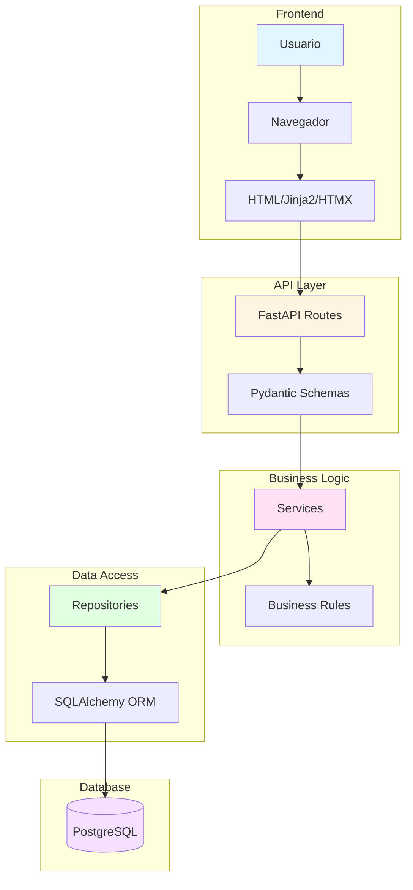
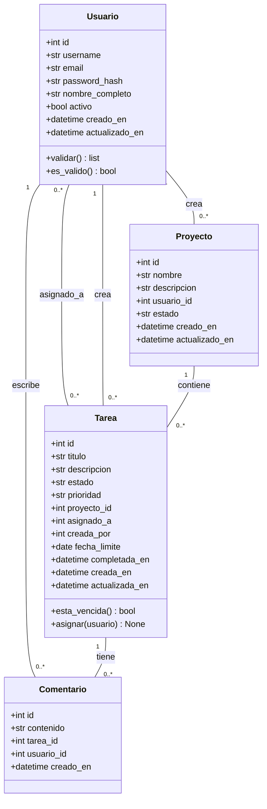
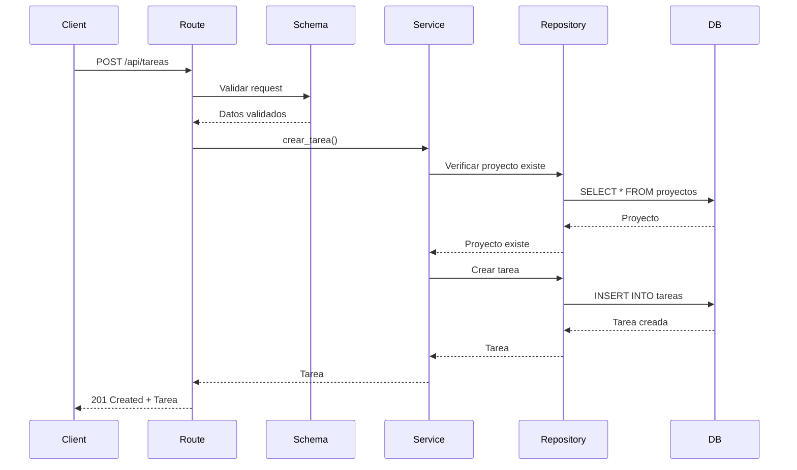
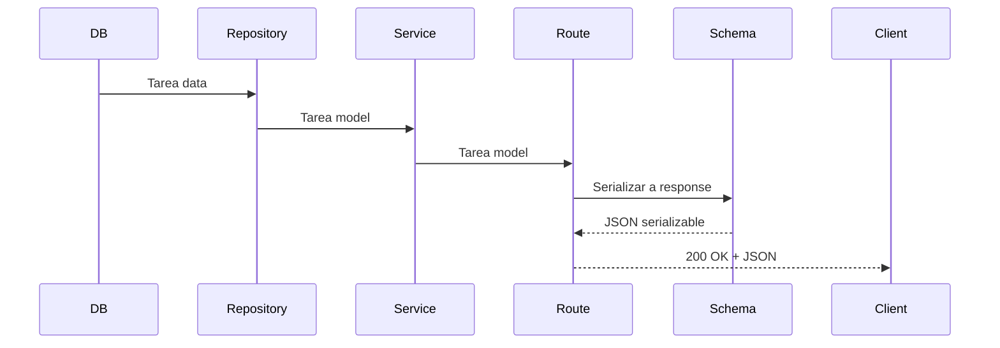

# Arquitectura del Sistema - TaskFlow

**Curso:** IF0100 - POO II
**Institucion:** UNAULA
**Semestre:** 2026-I

---

## Tabla de Contenidos

1. [Vision General](#vision-general)
2. [Arquitectura de Capas](#arquitectura-de-capas)
3. [Modelos de Dominio](#modelos-de-dominio)
4. [Repositorios](#repositorios)
5. [Servicios](#servicios)
6. [API REST](#api-rest)
7. [Frontend](#frontend)
8. [Base de Datos](#base-de-datos)
9. [Patrones de Diseno](#patrones-de-diseno)
10. [Flujo de Datos](#flujo-de-datos)

---

## Vision General

### Diagrama de Arquitectura



### Stack Tecnologico

| Capa | Tecnologia | Proposito |
|------|-----------|-----------|
| **Presentacion** | Jinja2 + HTMX + Bootstrap 5 | UI interactiva sin JS complejo |
| **API** | FastAPI | REST API moderna con validacion automatica |
| **Dominio** | Python dataclasses | Modelos de negocio puros |
| **Acceso a Datos** | SQLAlchemy 2.0 | ORM y consultas |
| **Base de Datos** | PostgreSQL 15+ | Persistencia relacional |
| **Testing** | pytest + httpx | Tests unitarios y de integracion |

---

## Arquitectura de Capas

### Descripcion de Capas

```
+----------------------------------------------------------+
|                     PRESENTATION LAYER                    |
|  (FastAPI Routes + Pydantic Schemas + Jinja2 Templates)  |
+----------------------------------------------------------+
                            |
+----------------------------------------------------------+
|                      BUSINESS LOGIC LAYER                 |
|                  (Services con logica de negocio)        |
+----------------------------------------------------------+
                            |
+----------------------------------------------------------+
|                       DOMAIN LAYER                        |
|             (Models: entidades de dominio puras)         |
+----------------------------------------------------------+
                            |
+----------------------------------------------------------+
|                    DATA ACCESS LAYER                      |
|                (Repositories con SQLAlchemy)              |
+----------------------------------------------------------+
                            |
+----------------------------------------------------------+
|                      DATABASE LAYER                       |
|                     (PostgreSQL tables)                   |
+----------------------------------------------------------+
```

### Responsabilidades por Capa

| Capa | Responsabilidad | Tecnologias |
|------|----------------|-------------|
| **Presentation** | - Manejo de requests HTTP<br>- Validacion de entrada<br>- Renderizado de respuestas<br>- Templates HTML | FastAPI<br>Pydantic<br>Jinja2<br>HTMX |
| **Business Logic** | - Reglas de negocio<br>- Orquestacion de operaciones<br>- Transacciones<br>- Manejo de excepciones | Python<br>Servicios |
| **Domain** | - Entidades de negocio<br>- Value objects<br>- Reglas de dominio<br>- Eventos de dominio | Python<br>Dataclasses |
| **Data Access** | - CRUD basico<br>- Queries complejas<br>- Mapeo ORM<br>- Conexion a BD | SQLAlchemy<br>PostgreSQL |
| **Database** | - Persistencia<br>- Constraints<br>- Indexes<br>- Triggers | PostgreSQL |

---

## Modelos de Dominio

### Diagrama de Entidades



### Usuario (src/taskflow/models/usuario.py)

```python
from dataclasses import dataclass
from datetime import datetime
from typing import Optional

@dataclass
class Usuario:
    """Usuario del sistema TaskFlow."""

    id: Optional[int] = None
    username: str = ""
    email: str = ""
    password_hash: str = ""
    nombre_completo: Optional[str] = None
    activo: bool = True
    creado_en: Optional[datetime] = None
    actualizado_en: Optional[datetime] = None

    def validar(self) -> list[str]:
        """Valida los campos del usuario."""
        errores = []

        if not self.username or len(self.username) < 3:
            errores.append("Username debe tener al menos 3 caracteres")

        if not self.email or "@" not in self.email:
            errores.append("Email inválido")

        return errores

    def es_valido(self) -> bool:
        """Verifica si el usuario es valido."""
        return len(self.validar()) == 0
```

### Tarea (src/taskflow/models/tarea.py)

```python
from dataclasses import dataclass
from datetime import date, datetime
from typing import Optional

@dataclass
class Tarea:
    """Tarea individual dentro de un proyecto."""

    # Estados posibles
    ESTADO_PENDIENTE = "pendiente"
    ESTADO_EN_PROGRESO = "en_progreso"
    ESTADO_COMPLETADA = "completada"
    ESTADO_CANCELADA = "cancelada"

    # Prioridades posibles
    PRIORIDAD_BAJA = "baja"
    PRIORIDAD_MEDIA = "media"
    PRIORIDAD_ALTA = "alta"
    PRIORIDAD_URGENTE = "urgente"

    id: Optional[int] = None
    titulo: str = ""
    descripcion: Optional[str] = None
    estado: str = ESTADO_PENDIENTE
    prioridad: str = PRIORIDAD_MEDIA
    proyecto_id: Optional[int] = None
    asignado_a: Optional[int] = None
    creada_por: Optional[int] = None
    fecha_limite: Optional[date] = None
    completada_en: Optional[datetime] = None
    creada_en: Optional[datetime] = None
    actualizada_en: Optional[datetime] = None

    def esta_vencida(self) -> bool:
        """Verifica si la tarea esta vencida."""
        if self.fecha_limite is None:
            return False
        if self.estado == self.ESTADO_COMPLETADA:
            return False
        return date.today() > self.fecha_limite

    def asignar(self, usuario_id: int) -> None:
        """Asigna la tarea a un usuario."""
        self.asignado_a = usuario_id
        self.actualizada_en = datetime.now()
```

---

## Repositories

### Proposito

Los repositories implementan el patron Repository para abstraer el acceso a datos. Proporcionan una interfaz orientada a colecciones para acceder a entidades de dominio.

### Base Repository (src/taskflow/repositories/base.py)

```python
from typing import Generic, TypeVar, Optional, List
from sqlalchemy.orm import Session

T = TypeVar('T')

class BaseRepository(Generic[T]):
    """Repository base con operaciones CRUD genericas."""

    def __init__(self, session: Session, model: type[T]):
        self.session = session
        self.model = model

    def create(self, entity: T) -> T:
        """Crea una nueva entidad."""
        self.session.add(entity)
        self.session.commit()
        self.session.refresh(entity)
        return entity

    def get_by_id(self, entity_id: int) -> Optional[T]:
        """Obtiene una entidad por ID."""
        return self.session.query(self.model).filter(
            self.model.id == entity_id
        ).first()

    def get_all(self) -> List[T]:
        """Obtiene todas las entidades."""
        return self.session.query(self.model).all()

    def update(self, entity: T) -> T:
        """Actualiza una entidad existente."""
        self.session.commit()
        self.session.refresh(entity)
        return entity

    def delete(self, entity_id: int) -> bool:
        """Elimina una entidad por ID."""
        entity = self.get_by_id(entity_id)
        if entity:
            self.session.delete(entity)
            self.session.commit()
            return True
        return False
```

### UsuarioRepository (src/taskflow/repositories/usuario_repo.py)

```python
from typing import Optional, List
from sqlalchemy.orm import Session
from .base import BaseRepository
from ..models.usuario import Usuario

class UsuarioRepository(BaseRepository[Usuario]):
    """Repository para operaciones de usuario."""

    def get_by_username(self, username: str) -> Optional[Usuario]:
        """Obtiene un usuario por username."""
        return self.session.query(Usuario).filter(
            Usuario.username == username
        ).first()

    def get_by_email(self, email: str) -> Optional[Usuario]:
        """Obtiene un usuario por email."""
        return self.session.query(Usuario).filter(
            Usuario.email == email
        ).first()

    def get_active(self) -> List[Usuario]:
        """Obtiene todos los usuarios activos."""
        return self.session.query(Usuario).filter(
            Usuario.activo == True
        ).all()
```

### TareaRepository (src/taskflow/repositories/tarea_repo.py)

```python
from typing import List, Optional
from sqlalchemy.orm import Session
from .base import BaseRepository
from ..models.tarea import Tarea

class TareaRepository(BaseRepository[Tarea]):
    """Repository para operaciones de tareas."""

    def get_by_proyecto(self, proyecto_id: int) -> List[Tarea]:
        """Obtiene todas las tareas de un proyecto."""
        return self.session.query(Tarea).filter(
            Tarea.proyecto_id == proyecto_id
        ).all()

    def get_by_asignado(self, usuario_id: int) -> List[Tarea]:
        """Obtiene todas las tareas asignadas a un usuario."""
        return self.session.query(Tarea).filter(
            Tarea.asignado_a == usuario_id
        ).all()

    def get_vencidas(self) -> List[Tarea]:
        """Obtiene todas las tareas vencidas no completadas."""
        return self.session.query(Tarea).filter(
            Tarea.fecha_limite < date.today(),
            Tarea.estado != Tarea.ESTADO_COMPLETADA
        ).all()

    def get_by_estado(self, estado: str) -> List[Tarea]:
        """Obtiene todas las tareas por estado."""
        return self.session.query(Tarea).filter(
            Tarea.estado == estado
        ).all()
```

---

## Servicios

### Proposito

Los servicios contienen la logica de negocio y orquestan las operaciones entre repositorios. Implementan reglas de negocio que no pertenecen a una sola entidad.

### UsuarioService (src/taskflow/services/usuario_service.py)

```python
from typing import Optional, List
from ..models.usuario import Usuario
from ..repositories.usuario_repo import UsuarioRepository
from ..api.security import hash_password

class UsuarioService:
    """Servicio de logica de negocio para usuarios."""

    def __init__(self, repo: UsuarioRepository):
        self.repo = repo

    def crear_usuario(
        self,
        username: str,
        email: str,
        password: str,
        nombre_completo: Optional[str] = None
    ) -> Usuario:
        """Crea un nuevo usuario con validaciones."""
        # Verificar que username no exista
        if self.repo.get_by_username(username):
            raise ValueError("Username ya existe")

        # Verificar que email no exista
        if self.repo.get_by_email(email):
            raise ValueError("Email ya existe")

        # Crear usuario
        usuario = Usuario(
            username=username,
            email=email,
            password_hash=hash_password(password),
            nombre_completo=nombre_completo
        )

        # Validar
        errores = usuario.validar()
        if errores:
            raise ValueError(f"Validacion fallida: {', '.join(errores)}")

        # Guardar
        return self.repo.create(usuario)

    def autenticar(
        self,
        username: str,
        password: str
    ) -> Optional[Usuario]:
        """Autentica un usuario."""
        usuario = self.repo.get_by_username(username)
        if not usuario or not usuario.activo:
            return None

        if not verify_password(password, usuario.password_hash):
            return None

        return usuario
```

### TareaService (src/taskflow/services/tarea_service.py)

```python
from typing import List, Optional
from datetime import date
from ..models.tarea import Tarea
from ..repositories.tarea_repo import TareaRepository

class TareaService:
    """Servicio de logica de negocio para tareas."""

    def __init__(self, repo: TareaRepository):
        self.repo = repo

    def crear_tarea(
        self,
        titulo: str,
        proyecto_id: int,
        creada_por: int,
        descripcion: Optional[str] = None,
        prioridad: str = Tarea.PRIORIDAD_MEDIA,
        fecha_limite: Optional[date] = None
    ) -> Tarea:
        """Crea una nueva tarea con validaciones."""
        # Verificar que el titulo no este vacio
        if not titulo or titulo.strip() == "":
            raise ValueError("El titulo es obligatorio")

        # Crear tarea
        tarea = Tarea(
            titulo=titulo,
            descripcion=descripcion,
            proyecto_id=proyecto_id,
            creada_por=creada_por,
            prioridad=prioridad,
            fecha_limite=fecha_limite
        )

        # Guardar
        return self.repo.create(tarea)

    def asignar_tarea(
        self,
        tarea_id: int,
        usuario_id: int
    ) -> Optional[Tarea]:
        """Asigna una tarea a un usuario."""
        tarea = self.repo.get_by_id(tarea_id)
        if not tarea:
            return None

        tarea.asignar(usuario_id)
        return self.repo.update(tarea)

    def completar_tarea(self, tarea_id: int) -> Optional[Tarea]:
        """Marca una tarea como completada."""
        tarea = self.repo.get_by_id(tarea_id)
        if not tarea:
            return None

        tarea.estado = Tarea.ESTADO_COMPLETADA
        tarea.completada_en = datetime.now()
        return self.repo.update(tarea)

    def get_tareas_vencidas(self) -> List[Tarea]:
        """Obtiene todas las tareas vencidas."""
        return self.repo.get_vencidas()

    def get_tareas_urgentes(self) -> List[Tarea]:
        """Obtiene todas las tareas urgentes no completadas."""
        return [
            t for t in self.repo.get_all()
            if t.prioridad == Tarea.PRIORIDAD_URGENTE
            and t.estado != Tarea.ESTADO_COMPLETADA
        ]
```

---

## API REST

### Estructura de Routes

```
src/taskflow/api/routes/
├── __init__.py
├── auth.py        # /api/auth/*    - Autenticacion
├── usuarios.py    # /api/usuarios/* - CRUD usuarios
├── proyectos.py   # /api/proyectos/* - CRUD proyectos
└── tareas.py      # /api/tareas/*   - CRUD tareas
```

### Ejemplo: Auth Routes (src/taskflow/api/routes/auth.py)

```python
from fastapi import APIRouter, HTTPException, Depends
from fastapi.security import OAuth2PasswordRequestForm
from ...schemas.auth import TokenResponse, LoginRequest
from ...services.usuario_service import UsuarioService
from ...api.security import create_access_token
from ...api.dependencies import get_usuario_service

router = APIRouter()

@router.post("/register", response_model=UsuarioResponse)
async def register(
    request: RegistroRequest,
    service: UsuarioService = Depends(get_usuario_service)
):
    """Registra un nuevo usuario."""
    try:
        usuario = service.crear_usuario(
            username=request.username,
            email=request.email,
            password=request.password,
            nombre_completo=request.nombre_completo
        )
        return usuario
    except ValueError as e:
        raise HTTPException(status_code=400, detail=str(e))

@router.post("/login", response_model=TokenResponse)
async def login(
    form_data: OAuth2PasswordRequestForm = Depends(),
    service: UsuarioService = Depends(get_usuario_service)
):
    """Inicia sesion y retorna token JWT."""
    usuario = service.autenticar(
        form_data.username,
        form_data.password
    )
    if not usuario:
        raise HTTPException(
            status_code=401,
            detail="Credenciales invalidas"
        )

    access_token = create_access_token(
        data={"sub": usuario.username}
    )
    return TokenResponse(access_token=access_token)
```

### Pydantic Schemas

Los schemas definen la estructura de request/response y proveen validacion automatica.

**Usuario Schema (src/taskflow/schemas/usuario.py):**

```python
from pydantic import BaseModel, EmailStr, Field
from typing import Optional
from datetime import datetime

class UsuarioBase(BaseModel):
    """Base schema para usuario."""
    username: str = Field(..., min_length=3, max_length=50)
    email: EmailStr
    nombre_completo: Optional[str] = None

class UsuarioCreate(UsuarioBase):
    """Schema para crear usuario."""
    password: str = Field(..., min_length=8)

class UsuarioUpdate(BaseModel):
    """Schema para actualizar usuario."""
    nombre_completo: Optional[str] = None
    email: Optional[EmailStr] = None

class UsuarioResponse(UsuarioBase):
    """Schema para respuesta de usuario."""
    id: int
    activo: bool
    creado_en: datetime

    class Config:
        from_attributes = True
```

---

## Frontend

### Arquitectura de Templates

```
src/taskflow/templates/
├── base.html           # Layout principal (navbar y footer inline)
├── index.html          # Pagina de inicio
├── login.html          # Formulario de login
├── dashboard.html      # Dashboard principal
├── proyectos/          # Templates de proyectos
│   ├── lista.html      # Lista de proyectos
│   ├── detalle.html    # Detalle de proyecto
│   └── form.html       # Formulario de proyecto
├── tareas/             # Templates de tareas
│   ├── lista.html      # Lista de tareas
│   ├── detalle.html    # Detalle de tarea
│   ├── form.html       # Formulario de tarea
│   └── tarjeta.html    # Tarjeta de tarea individual
└── usuarios/           # Templates de usuarios
    ├── registro.html   # Formulario de registro
    └── perfil.html     # Perfil de usuario
```

> **NOTA:** En la implementacion actual, el navbar y footer estan definidos inline en `base.html`, no en archivos separados de componentes.

### Base Template (base.html)

```jinja2
<!DOCTYPE html>
<html lang="es">
<head>
    <meta charset="UTF-8">
    <meta name="viewport" content="width=device-width, initial-scale=1.0">
    <title>TaskFlow</title>

    <!-- Bootstrap 5 CSS -->
    <link href="https://cdn.jsdelivr.net/npm/bootstrap@5.3.3/dist/css/bootstrap.min.css"
          rel="stylesheet">

    <!-- Bootstrap Icons -->
    <link rel="stylesheet"
          href="https://cdn.jsdelivr.net/npm/bootstrap-icons@1.11.1/font/bootstrap-icons.css">

    <!-- HTMX -->
    <script src="https://unpkg.com/htmx.org@1.9.10"></script>

    <style>
        /* Estilos personalizados */
    </style>

    
</head>
<body>
    <!-- Navbar (inline) -->
    <nav class="navbar navbar-expand-lg navbar-dark">
        <!-- Contenido del navbar -->
    </nav>

    <!-- Flash Messages -->
    <div class="container mt-3">
        <!-- Mensajes flash -->
    </div>

    <!-- Contenido principal -->
    <main>
        
    </main>

    <!-- Footer (inline) -->
    <footer>
        <!-- Contenido del footer -->
    </footer>

    <!-- Bootstrap 5 JS Bundle -->
    <script src="https://cdn.jsdelivr.net/npm/bootstrap@5.3.3/dist/js/bootstrap.bundle.min.js"></script>

    <!-- HTMX Extension: Loading States -->
    <script src="https://unpkg.com/htmx.org@1.9.10/dist/ext/loading-states.js"></script>

    
</body>
</html>
```

### HTMX Integration

HTMX permite actualizar partes de la pagina sin recargar completamente:

```jinja2
<!-- Lista de tareas con HTMX -->
<div hx-get="/api/tareas?proyecto_id={{ proyecto.id }}"
     hx-trigger="load, every 5s"
     hx-swap="innerHTML">
    <!-- Cargado via HTMX -->
</div>

<!-- Boton para completar tarea -->
<button hx-post="/api/tareas/{{ tarea.id }}/completar"
        hx-swap="outerHTML"
        class="btn btn-sm btn-success">
    Completar
</button>
```

---

## Base de Datos

### Modelo Relacional

```
+------------------------------------------------+
|                    USUARIOS                     |
+------------------------------------------------+
| id (PK) | username | email | password_hash |... |
+---------+----------+-------+---------------+-----+
          |          |       |
          |          |       | 1
          |          |       |
          | 1        |       |
    +-----+----------+-------+------+
    |              PROYECTOS        |
    |  id | nombre | descripcion |... |
    +-----+--------+-------------+-----+
         |
         | 1
         |
    +----+-------------------+
    |        TAREAS          |
    |  id | titulo | estado |... |
    +----+--------+--------+-----+
         |
         | 1
         |
    +----+-------------------+
    |      COMENTARIOS       |
    |  id | contenido | ...  |
    +------------------------+
```

### Views Utiles

**tareas_con_detalle:** Vista con informacion completa de tareas incluyendo nombres de proyecto y usuarios.

**resumen_proyectos:** Vista con estadisticas de proyectos (conteo de tareas por estado).

---

## Patrones de Diseno

### Repository Pattern

Abstrae el acceso a datos detras de una interfaz orientada a coleccion.

```
Service --> Repository --> Database
         (business)   (data access)
```

### Dependency Injection

FastAPI inyecta dependencias automaticamente:

```python
@router.get("/usuarios/{id}")
async def get_usuario(
    id: int,
    service: UsuarioService = Depends(get_usuario_service)
):
    return service.get_by_id(id)
```

### Factory Pattern

Para crear entidades complejas:

```python
class TareaFactory:
    @staticmethod
    def crear_tarea_urgente(titulo: str, proyecto_id: int) -> Tarea:
        return Tarea(
            titulo=titulo,
            proyecto_id=proyecto_id,
            prioridad=Tarea.PRIORIDAD_URGENTE
        )
```

### Strategy Pattern

Para diferentes estrategias de asignacion de tareas:

```python
class AsignacionStrategy(ABC):
    @abstractmethod
    def asignar(self, tarea: Tarea) -> Optional[int]:
        pass

class RoundRobinAsignacion(AsignacionStrategy):
    def asignar(self, tarea: Tarea) -> Optional[int]:
        # Logica de round-robin
        pass
```

---

## Flujo de Datos

### Request Flow



### Response Flow



---

## Próximos Pasos

1. Revisa la [documentacion de la API](api.md)
2. Explora los [notebooks de aprendizaje](../notebooks/)
3. Comienza a desarrollar!

---

**UNAULA - IF0100 - POO II - 2026-I**
