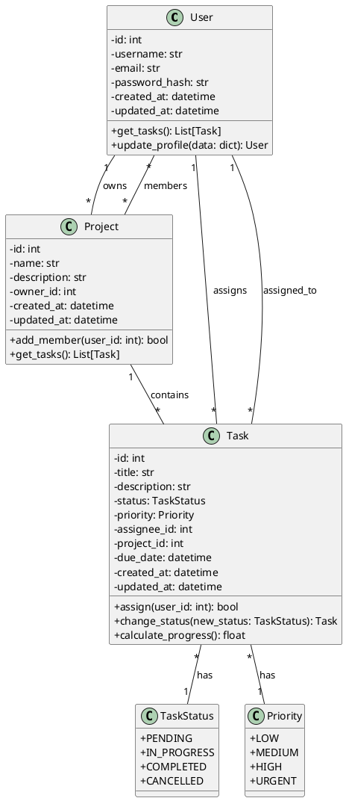
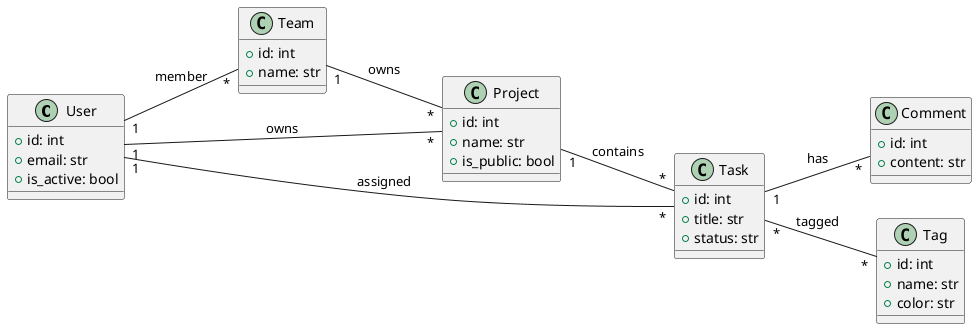
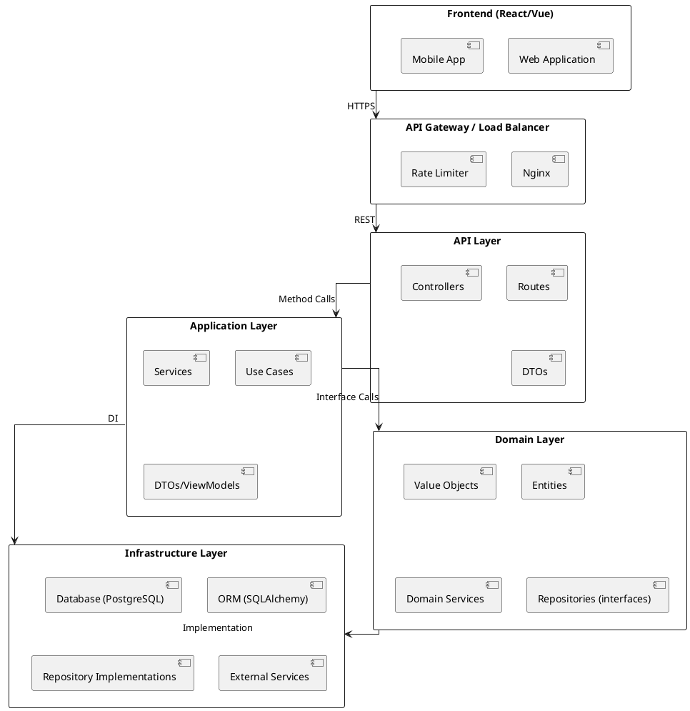
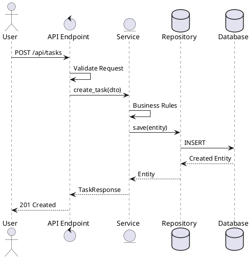

# Sprint 4: Finalización y Documentación

## 1. Información del Sprint

| Campo | Valor |
|-------|-------|
| **Sprint** | 4 |
| **Duración** | 1 semana |
| **Objetivo** | Pulir proyecto y completar documentación |
| **Peso en Evaluación** | 15% del Proyecto Final |

---

## 2. Entregables

| Entregable | Descripción | Formato |
|------------|-------------|---------|
| README.md | Documentación completa del proyecto | Markdown |
| Diagrama de Clases UML | Representación visual del modelo | PlantUML/draw.io |
| Diagrama de Arquitectura | Vista técnica del sistema | PlantUML/draw.io |
| Video de Sustentación | Demo funcional + explicaciones | MP4 (10 min max) |
| Código Refactorizado | Base de código pulida y limpia | Python/FastAPI |

---

## 3. Criterios de Aceptación

- [ ] README.md con secciones de instalación, uso y API
- [ ] Diagrama de clases UML completo y actualizado
- [ ] Diagrama de arquitectura del sistema
- [ ] Video demo funcional mostrando características principales
- [ ] Código pasa linting (sin errores ni warnings)
- [ ] Cobertura de tests > 80%

---

## 4. Requisitos Técnicos

### Documentación
- **Generador de docs**: mkdocs, pdoc, o similar
- **Formato**: Markdown con examples de código

### Diagramas
- **Herramientas recomendadas**: PlantUML, draw.io, Lucidchart, Mermaid
- **Formatos de salida**: PNG/SVG para嵌入, .puml para versionar
- **Estándar**: UML 2.5

### Video
- **Software de grabación**: OBS Studio, Loom, Camtasia, o PowerPoint Recording
- **Resolución**: 1280x720 mínimo
- **Audio**: Claro y legible

---

## 5. Guía de Implementación

### Paso 1: Actualizar README.md

```bash
# Estructura obligatoria del README.md
proyecto/
├── README.md          # Documentación principal
├── docs/              # Documentación adicional
│   ├── architecture/  # Diagramas
│   ├── api/          # Documentación de API
│   └── guides/       # Guías de uso
└── ...
```

### Paso 2: Crear Diagrama de Clases

1. Identificar todas las entidades del dominio
2. Definir atributos y métodos de cada clase
3. Establecer relaciones (herencia, composición, agregación)
4. Validar con el código existente

### Paso 3: Crear Diagrama de Arquitectura

1. Identificar las capas del sistema
2. Definir el flujo de datos entre capas
3. Especificar tecnologías utilizadas en cada capa
4. Documentar puntos de integración

### Paso 4: Refactorizar Código

```bash
# Verificar calidad del código
ruff check .
mypy src/
pytest --cov=src --cov-report=term-missing

# Corrección automática de estilo
ruff check --fix .
```

### Paso 5: Grabar Video Demo

**Estructura del video (10 minutos):**

| Segmento | Duración | Contenido |
|----------|----------|-----------|
| Introducción | 1 min | Nombre del proyecto, objetivo |
| Demo Funcional | 5 min | Showcase de características principales |
| Decisiones Técnicas | 2 min | Stack, arquitectura, patrones |
| Aprendizajes | 1 min | Qué aprendimos, retos |
| Cierre | 1 min | Repositorio, contacto |

### Paso 6: Preparar Sustentación

- Practicar explicación de 10 minutos
- Preparar backup del demo
- Tener listo el código para live coding
- Documentar preguntas frecuentes anticipadas

---

## 6. Contenido del README.md

### Estructura Obligatoria

```markdown
# Proyecto TaskFlow

## Descripción
Breve descripción del proyecto, problema que resuelve y público objetivo.

## Stack Tecnológico
| Componente | Tecnología | Versión |
|------------|------------|---------|
| Backend | Python | 3.11+ |
| Framework | FastAPI | 0.109+ |
| Base de Datos | PostgreSQL | 15+ |
| ORM | SQLAlchemy | 2.0+ |
| Testing | pytest | 7.4+ |

## Instalación

```bash
# Clonar repositorio
git clone https://github.com/usuario/taskflow.git
cd taskflow

# Crear entorno virtual
python -m venv venv
source venv/bin/activate  # Linux/Mac
.\venv\Scripts\activate   # Windows

# Instalar dependencias
pip install -r requirements.txt

# Configurar variables de entorno
cp .env.example .env
# Editar .env con configuración local

# Inicializar base de datos
alembic upgrade head

# Ejecutar servidor de desarrollo
uvicorn app.main:app --reload
```

## Uso

### API Endpoints

| Método | Endpoint | Descripción |
|--------|----------|-------------|
| GET | `/api/v1/tasks` | Listar todas las tareas |
| POST | `/api/v1/tasks` | Crear nueva tarea |
| GET | `/api/v1/tasks/{id}` | Obtener tarea por ID |
| PUT | `/api/v1/tasks/{id}` | Actualizar tarea |
| DELETE | `/api/v1/tasks/{id}` | Eliminar tarea |

### Ejemplo de Request

```bash
curl -X POST "http://localhost:8000/api/v1/tasks" \
  -H "Content-Type: application/json" \
  -d '{
    "title": "Completar documentación",
    "description": "Escribir README del proyecto",
    "status": "pending",
    "priority": "high",
    "project_id": 1
  }'
```

## API Reference

### Modelos

#### Task
| Campo | Tipo | Requerido | Descripción |
|-------|------|-----------|-------------|
| id | int | No | Identificador único |
| title | str | Sí | Título de la tarea |
| description | str | No | Descripción detallada |
| status | str | Sí | pending/in_progress/completed |
| priority | str | Sí | low/medium/high |
| created_at | datetime | No | Fecha de creación |
| updated_at | datetime | No | Fecha de actualización |

### Responses

```json
// Success Response
{
  "success": true,
  "data": {
    "id": 1,
    "title": "Tarea ejemplo",
    "status": "pending"
  }
}

// Error Response
{
  "success": false,
  "error": {
    "code": "TASK_NOT_FOUND",
    "message": "La tarea con ID 1 no existe"
  }
}
```

## Testing

```bash
# Ejecutar todos los tests
pytest -v

# Ejecutar con cobertura
pytest --cov=app --cov-report=html

# Ver reporte de cobertura
open htmlcov/index.html
```

## Diagramas

### Arquitectura


### Diagrama de Clases


## Autores

| Nombre | Rol | Contacto |
|--------|-----|----------|
| Nombre Estudiante 1 | Lead Developer | email@unal.edu.co |
| Nombre Estudiante 2 | Backend Developer | email@unal.edu.co |

## Licencia

Este proyecto está bajo la Licencia MIT.
```

---

## 7. Diagrama de Clases UML

### Entidades Principales



### Relaciones Detalladas



---

## 8. Diagrama de Arquitectura

### Arquitectura por Capas



### Flujo de Datos



### Stack Tecnológico por Capa

| Capa | Tecnología | Propósito |
|------|------------|-----------|
| **Presentation** | React 18, TypeScript, TailwindCSS | UI/UX |
| **API** | FastAPI 0.109, Pydantic v2 | REST API |
| **Application** | Python 3.11+, Services | Casos de uso |
| **Domain** | Entities, Value Objects | Lógica de negocio |
| **Infrastructure** | PostgreSQL 15, SQLAlchemy 2 | Persistencia |
| **Testing** | pytest, pytest-asyncio | Tests unitarios/integración |
| **CI/CD** | GitHub Actions | Automatización |
| **Docs** | MkDocs, PlantUML | Documentación |

---

## 9. Video de Sustentación

### Requisitos Técnicos

| Aspecto | Especificación |
|---------|----------------|
| **Duración** | 10 minutos máximo |
| **Resolución** | 1280x720 (720p) mínimo |
| **Audio** | Claro, sin ruido de fondo |
| **Formato** | MP4, WebM |
| **Tamaño máximo** | 500 MB |

### Estructura del Video

```
00:00 - 00:30    Introducción
                 - Nombre del proyecto
                 - Integrantes
                 - Problema que resuelve

00:30 - 03:00    Demo Funcional
                 - Crear proyecto
                 - Crear tareas
                 - Gestionar estados
                 - Completar flujo

03:00 - 05:00    Decisiones Técnicas
                 - Stack elegido y por qué
                 - Patrones arquitectónicos
                 - Decisiones de diseño

05:00 - 06:00    Aprendizajes
                 - Retos encontrados
                 - Qué haríamos diferente
                 - Principales aprendizajes

06:00 - 07:00    Mejoras Futuras
                 - Features planeados
                 - Refactorizaciones

07:00 - 10:00    Q&A / Cierre
                 - Repositorio
                 - Contacto
                 - Agradecimientos
```

### Tips para Grabación

- **Practicar** el script al menos 3 veces antes de grabar
- **Grabar en secciones** y luego editar
- **Usar un guion** estructurado con timestamps
- **Mantener el ritmo** - no hablar muy lento ni muy rápido
- **Verificar audio** antes de iniciar la grabación completa
- **Tener backup** de la grabación en caso de problemas

---

## 10. Conexión con Clases del Curso

### Conceptos Aplicados

| Unidad | Tema | Aplicación en Proyecto |
|--------|------|------------------------|
| Unidad 0 | Fundamentos Python | Lógica de negocio, servicios |
| Unidad 1 | POO | Entidades, herencia, encapsulamiento |
| Unidad 2 | TDD | Tests unitarios antes del código |
| Unidad 3 | FastAPI | Endpoints REST, dependencias |
| Unidad 4 | Persistencia | SQLAlchemy, modelos de datos |
| Unidad 5 | Patrones | Repository, Service Layer |

### Competencias Evaluadas

- **POO**: Diseño de clases y relaciones
- **TDD**: Calidad de tests y cobertura
- **DDD**: Organización por dominio
- **API REST**: Diseño de endpoints
- **Documentación**: Clarity y completitud
- **Comunicación**: Presentación del video

---

## 11. Evaluación (15% del Proyecto Final)

### Rubrica de Calificación

| Componente | Porcentaje | Criterios |
|------------|------------|-----------|
| **README.md** | 25% | Completo, instalación clara, API documentada, ejemplos |
| **Diagramas** | 25% | UML correcto, arquitectura clara, tecnologías identificadas |
| **Video** | 30% | Demo funcional, explicaciones claras, tiempo respetado |
| **Código Pulido** | 20% | Linting sin errores, cobertura >80%, código limpio |

### Checklist de Calidad

- [ ] README tiene todos los secciones requeridas
- [ ] Instrucciones de instalación funcionan paso a paso
- [ ] API documentada con ejemplos curl/Postman
- [ ] Diagramas son legibles y usan notación UML correcta
- [ ] Video muestra funcionalidad real del sistema
- [ ] Decisiones técnicas explicadas con claridad
- [ ] Código pasa ruff sin warnings
- [ ] Cobertura de tests >= 80%
- [ ] No hay código commented-out
- [ ] Nombres de variables son descriptivos

---

## Recursos Adicionales

### Herramientas Recomendadas

| Categoría | Herramienta | Enlace |
|-----------|-------------|--------|
| Diagramas | draw.io | https://draw.io |
| Diagramas | PlantUML | https://plantuml.com |
| Documentación | MkDocs | https://www.mkdocs.org |
| Grabación | OBS Studio | https://obsproject.com |
| Grabación | Loom | https://www.loom.com |
| Testing | pytest | https://pytest.org |
| Linting | ruff | https://github.com/astral-sh/ruff |

### Referencias de Estilo

- [Google Python Style Guide](https://google.github.io/styleguide/pyguide.html)
- [FastAPI Best Practices](https://fastapi.tiangolo.com/tutorial/first-steps/)
- [SQLAlchemy 2.0 Documentation](https://docs.sqlalchemy.org/en/20/)
- [UML Distilled - Martin Fowler](https://martinfowler.com/books/uml.html)

---

**Nota Importante**: Este sprint es la culminación del proyecto. La calidad de la documentación y presentación refleja el profesionalismo del trabajo realizado durante todo el curso.
